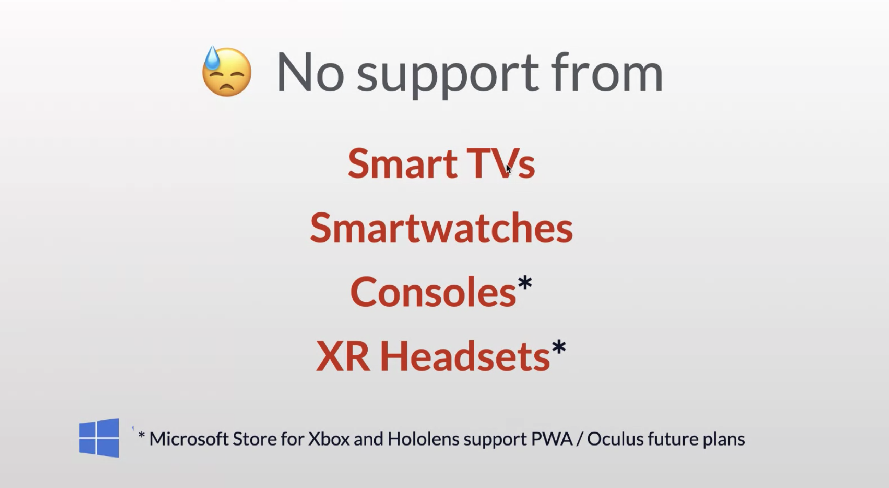

[PWA Course on web.dev](https://web.dev/learn/pwa/foundations/)

Web App > Service Worker > Web Manifest


App Development Approaches

- Native SDKs (Kotlin / Java / ObjectiveC / Flutter / React Native) -> one specific platform
- Web Developmentgoog
- Hybrid Development - Apache Cordova (Native SDK + Web Development) -> app for specific device

PWA is just Web Development:

User can use the web app as a native app


They bring the best of two worlds: native and web

- Web
  - links and discoverability - just copy and paste URL, share content on social networks, use SEO
  - Easy to deploy, put files on the servere, done (vs mobile apps: compile, package, sign, publisher account, QA testing)
  - Easy to update - if a website has a bug, you just change the file on ther server (vs mobile users need to download)
  - Standards and tools - choose what you like (jQuery, React, Bootstrap - YES all of them)
- Native
  - Offline access
  - Installed icon and standalone experience (looks like an app)
  - Push notifications\* (in iOS the app has to be packaged and published on App Store, WebKit team is brinding it to Safari on macOS)
    - no silent notifications (user needs to see the notification)
  - Performance and UX




Oculus will support VR PWA

https://firt.dev/cds

Todo:

- manifest.json (most peaople call it that way) spec calls for `<name>.webmanifest`

```
{
  "name": "Jonatan's Activities, our first PWA",
  "short_name": "Activities" // <- 12 characters is safe
}
```

`display` - with value `standalone` makes the PWA
`start_url` - URL when we open the app, when we install the app from some other place it will be the default

- `./` - for subfolder
- `/` - for root folder in domain
- `?utm_source=pwa` - for analytics

Manifest has to be in the root folder of the origin (domain)
There can be multiple PWAs in the same domain (different folders)

`scope` - everything outside this scope will be treaded as an external link (to another website), it will open inside a browser

- `./` - everything in the same foler

Link the manifest from HTML:

```html
<link rel="manifest" href="app.webmanifest" />
```

## Icons in manifest

```json
  "icons": [
    {
      "src": "icons/icon-1024.png",
      "size": "1024x1024",
      "type": "image/png"
    }
  ]
```

Icons - sizes uses the same sizing syntax from `` tag

Chrome on desktop supports `svgs` as well

Hearth - manifest
Brain - service worker

Chrome requires service worker to install PWA

`theme_color` - use any color from CSS without alpha channel
also add to html:

```
<meta name="theme-color" content="#bb7162" />
```

it also supports media-quries for dark and light modes

if color is too colose to Safari icons then it will be ignored

All service workers installed right now: `chrome://serviceworker-internals/`

SW works for ~20-40s after closing website then it's stopped


