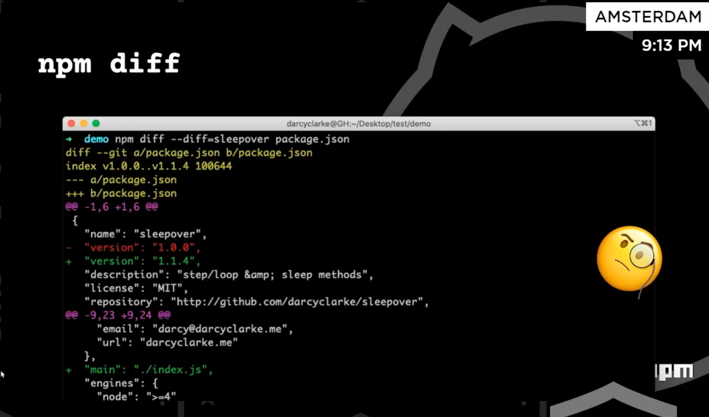
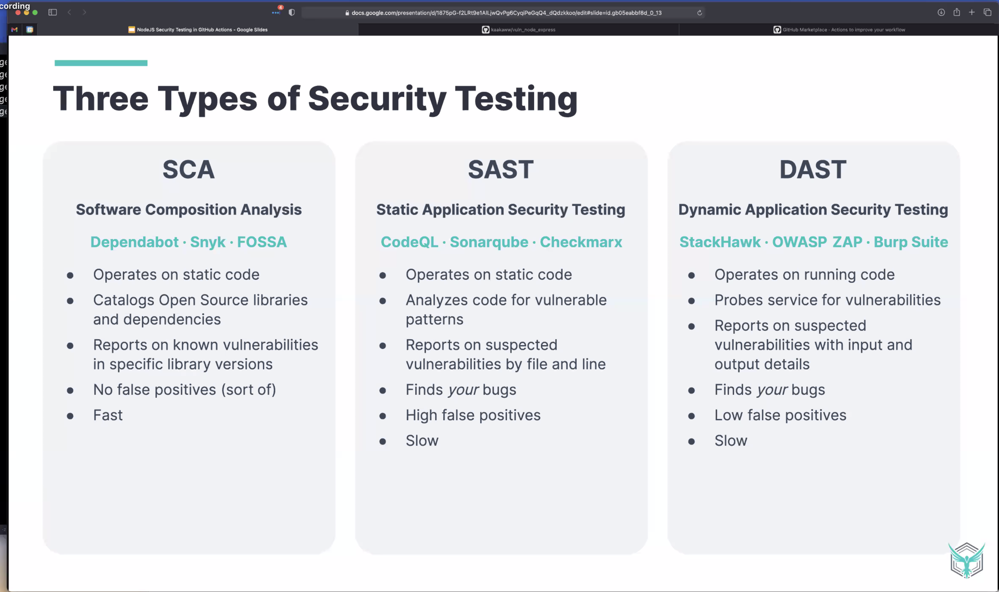
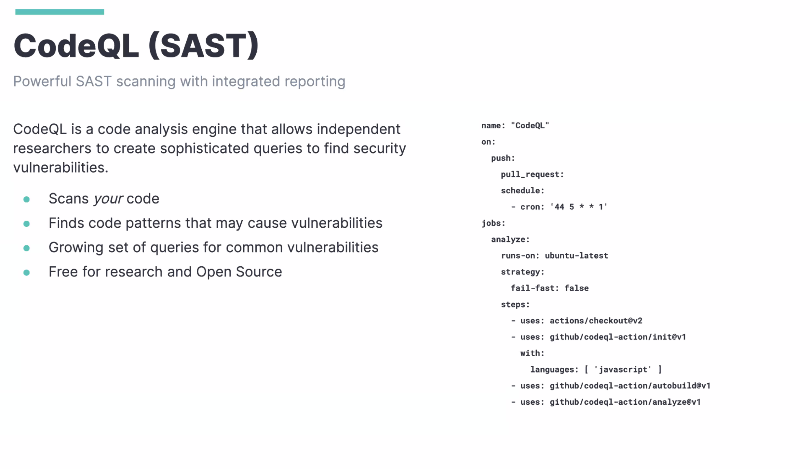

## NPM 7

npm exaplin / npm why

works like yarn - shows why we have dependency installed

npm exec - "guts" of npx
- asking before installing a package

npm audit
- improved, new ui

npm diff
- works like git diff (show package name, version, file) shows difference

- performance (better, but can be worse because installing more dependencies)

workspaces
- only npm install (for now)
- workspace awareness (-ws -w)
  - run command againts defined workspaces (-ws)
  - filter command for what workspace to run command on (-w)

what is comming next
- workspace (q1)
- scoped installs
- registry protocol (q2)
- package overrides
- publish prompts (q3)

npm v6 supported until last node version that ships it

## Testing node apps - security

### Types of security testing

SCA - Software Composition Analysis
  Dependabot / Snyk / FOSSA
  Operates on static code
  Catalogs open source libraries and dependencies
  FAST (!)

> so Static Code Analysis (which I thought SCA was) is only a part of Software Composition Analysis then

SAST - Static Application Security Testing
  CodeQL (Github) / Sonarqube / Checkmarx
  Static code
  Looks on code written by ourselves
  Looks for patters of vulnrabilities
  Can have high rate of false positives
  Slow
DAST - Dynamic Application Security Testing
  Tools: StackHawk / OWASP ZAP
  Running code (server) and probing it
  Can find your vulnrabilities as well as open soure
  Low false positives
  Slow

### GitHub Actions

Yet another CI/CD pipeline engine, twist: it's in your repo
- huge marketplace of actions (like Jenkins plugins)
- basic command: `run`
- Free for 2k minutes

### workflows
Independent yaml files

### actions

actions/checkout@v2
this repo are actions developed by GitHub

### CodeQL

### CodeHawk

Run app

nohup npm run start &
- runs app in background and leave tty (interactive terminal)

pulling secret: ${{ secrets.STACK_HAWK }}

DAST
ISSA