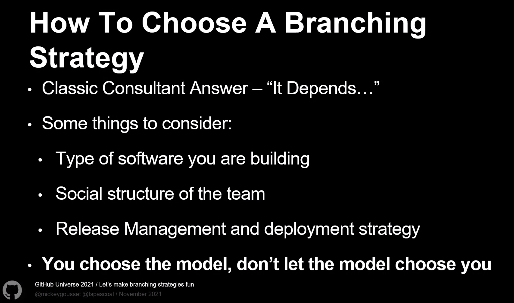
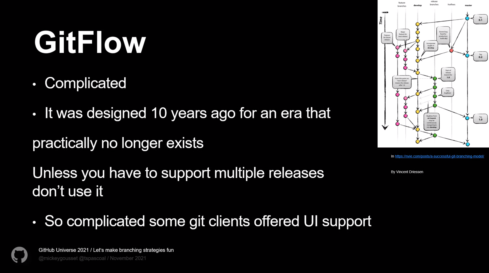
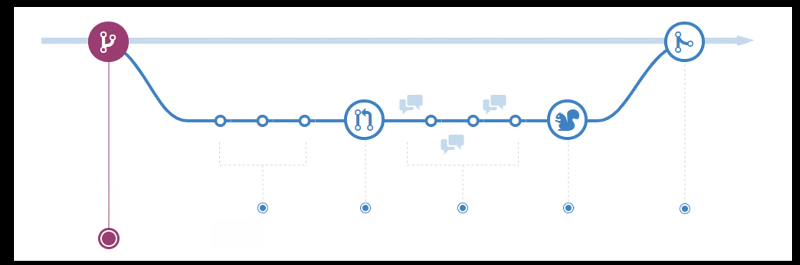

Feature branches

CI integration with no branches
Code integrated into default branch daily

Short lived branches - shorter than sprint duration (days / 1,2 weeks)

How to choose branching strategy

- type of software
- social structure of the team (OSS vs corporate environment - trust)
- release management and deployment strategy

## GitFlow

(some people in comments don't agree :D)

- "too complicated" - so somplicaed, that some git clients offered UI support
- it was designed 10 years ago
- unless you have to support multiple releases don't use it
- when you don't have feature flags

## GitHub flow

- Make branch from main, with descriptive name
- Start adding commits
- Make the branch as short lived as possible

Create Pull Request, this allows having discussion around the code

Ship from the branch, marge into main branch
or ship from main branch - it makes harder when you need to re-deploy to roll back

## proptips

- Integrate early, integrate often
  - The smaller the change, the easier it is to understand the cause if an issue is found
- using feature flags will make your branching model simpler
- ensure your default branch is always deploayable in case of emergency fix
  - Shift Left on Quality, use CI pipelines with automated tests
- it's all about your context
  - choose and adopt a pattern that makes sense for your methodology
  - don't be afraid to adapt/modify the pattern

Branching is easy. It's the merging that is hard.

## More resources:

- https://trunkbaseddevelopment.com/
- https://martinfowler.com/articles/branching-patterns.html
- https://nvie.com/posts/a-successful-git-branching-model/
- https://devblogs.microsoft.com/devops/release-flow-how-we-do-branching-on-the-vsts-team/
- http://scottchacon.com/2011/08/31/github-flow.html
- https://guides.github.com/introduction/flow/

Deployment trains:

- https://medium.com/swlh/release-train-d8ae7c07b2df
- https://codefresh.io/continuous-deployment/infrequent-deployments-release-trains-and-lengthy-sprints/
