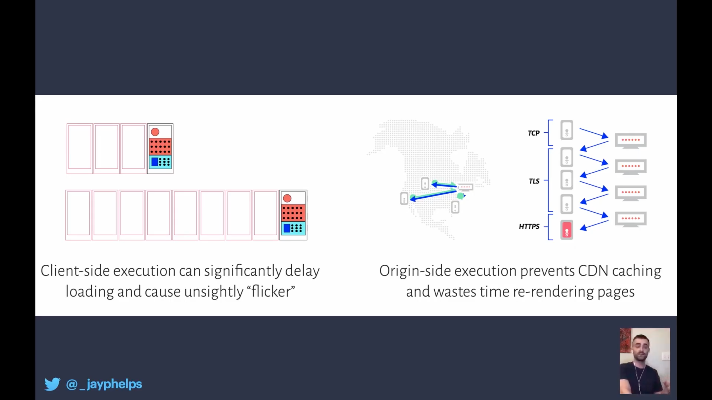

## A11y

table - caption

 not all aria has good support or provides good usability for AT ussers

aria-controls (tooltip)

announcements
  div role="alert"

Accessibility Object Model
  access accessibility through JS
  semantics without markup
  no sprouting (copy-pasting attributes)
  events?

> Because screenreader users already use “swipe up” and “swipe down” gestures to trigger screenreader specific commands, it would be impossible for them to use the same gestures for something else in the app you’re developing.

  non dom objects

  https://hiddedevries.nl/en/blog/2019-07-22-meaning-without-markup-accessibility-object-model
  https://wicg.github.io/aom/explainer.html

## npm

  install from pull request !
  npm install user/project#pull/123

  peer dependencies by default
  npx now confirms before running code

  future
  package overrides

## img

Add breakpoints in next.confi.js
Automatically gets src-set
Supports CDNs
built-in Next Image Optimizer (next-optimized-images)

lazy loading by default
  loading="eager" or priority to disable

Next.js prioritizes CSS and JS over image
  rel="preload"
  priority attribute automatically adds preload

with and height influence the ratio not the size of rendered image!
width influences the srcset, it sets the ratio
  unzised attribute to override

unoptimized flag

## theme

media queries + css variables

https://github.com/juliaqiuxy/theming-demo

## framer

WPF patent - animate between snapshots
  https://patents.google.com/patent/US20100235769A1
  contain: size layout; (any change in layout won't affect other elements)

@transform - doesn't trigger repaint
FLIP
(First, Last, Invert, Play)

three-fiber + framer motion = WOW
(3d transition)
https://codesandbox.io/s/framer-motion-layout-animation-react-three-fiber-ititt
https://codesandbox.io/s/framer-motion-layout-animation-svg-viewbox-qjx0j

(excalidraw)

Problems
  single-threaded
  rendering is the bottleneck (not JS)

https://mattperry.is/writing-code/layout-projection-animate-browser-layout-60fps

## WebAssembly

why bother?
- reuse existing libraries (from other language)
- expressivnes
- runtime properties (go channels and routines, rust memory safety)

## rendering slicing

override just in time
  SSR - performance sucks
  rerender a tiny slice of application

program slicing
  override props at runtime

where to do these things?
client side JS - not good
ssr - not good
at the edge! (CDN)
  cache static assets
  apply slices as fast as possible

Edge slice rerendering

## netlify

[next-on-netlify](https://github.com/netlify/next-on-netlify)
xstate

## blitz

built in auth