# TypeScript

## Podstawy

### Dlaczego bezpieczeństwo typów?

- Zapewnia że aplikacja sama w sobie się nie wywali (błędne dane od usera = 500, jest ok)
- beneficjent: my albo ktoś inny za 0.5 roku
- jeśli kod ma zostać przejęty przez kogoś warto zainwestować w typy
- nie ma nic za darmo: trzeba rozumieć komunikaty błędów
- TS nie jest w stanie wszystkieg wyłapać

TS jest najbardziej popularny, lepsze wsparcie od bibliotek, itd.

- Zastępuje unit testy na badanie struktury danych - skupiamy się na funkcjonalnościach
- Typ to podpowiedź dla innego programisty (przekazujemy nasze intencje)
- Mamy zaufanie do kompilatora (wychwyci nasze błędy)

Ograniczenia TS'a

- nie wszystkie typy da się wychwycić (póki nie uruchomimy, nie znamy danych)
  - nie sprawdzimy poprawności JSONa z serwera
  - jeśli TS miałby to robić, to musiałby dorzucić kod do runtime'u
- race condition
- koercja jest przepuszczona (rzutowanie na stringi działa w TSie)
- dzielenie przez 0 xD (dostajemy Infinity) - JS to przepuszcza

TS nie respektuje semver!

- podnośmy wersję TS'a regularnie (dzięki temu zmiany będą łatwiejsze)

### PROTIPy

`declare` - zadeklarować zmienną / funkcję ale bez inicjowania jej początkowej wartości

w TS playground możemy importować moduły z npm'a! (dokładniej importujemy tylko typyp z `@types`), React (z JSX) też działa

## Rodzaje typowania

### Statyczne vs dynamiczne

Statyczne - zmienna musi mieć przypisany typ i on nie może się zmienić


minus: dłużej się pisze
plus: mamy gwarancję typów, wiemy co się wydarzy bez uruchamiania

Dynamiczne - typ zmiennej może się zmienić, jakiś typ jest ale nie musi taki pozostać

Przy przechodzeniu na TSa:
- mniej bugów
- tańsze utrzymanie
- wolniejsze pisanie, typy trzeba przemyśleć i utrzymać

### Silne vs Słabe

Nie ma precyzyjnej definicji jaka jest różnica

Dla niepoprawnych operacji:
- silne - rzucenie błędu
- słabe - program kontynuuje pracę... jakoś
  - coersion w JSie


JS coś zwróci ale niekonicznie to mas sens, np. dzielenie przez 0

TypeError - podczas wykonywania
SyntaxError - podczas parsowania

np. JS zwróci SyntaxError jak użyjemy 2 razy `let`

Od ES6 JS jest silniej typowany


### Jaki jest TS

TS jest gradual typing - opakowuje JSa, pozwala na stopniową migrację z JSa

TS nie jest językiem strongly-typed


Nie ma definicji co to strong, typy znikają przy kompilacji do JSa, a sam JS jest słabo typowany, mamy typ any

### Polimorfizm

Apparent type ("to appear") - jak kompilator to widzi, co kompilator wie
Actual type - czym faktycznie jest

Kompilator ogranicza dostęp do metod i pól mimo że są one w pamięci (actual type). Nasza adnotacja typu pozwala stworzyć inny apparent type - to tego typu będzie używał kompilator do sprawdzania czy w sposób poprawny odwołujemy się do metod i pól.

Przykład:


> Tutaj zbyszek ma adnotację Human (apparent type), mimo że to instancja klasy TaxiDriver (actual type)
> Jeśli spróbujemy uzyskać dostęp do metody z TaxiDriver, której nie ma na Human kompilator zgłosi błąd bo zawęziliśmy sobie typ

Rozdzielanie na typy actual i apparent to polimorfizm - zmiana z typu węższego na ogólniejszy

Dzięki temu nie musimy przepisywać kodu kiedy trzeba coś zmienić

z SOLID - D: Dependency Inversion Principle

Zamiast moduł (zależność) -> moduł - bezpośrednia zależność, wydzielamy interfejs - jeden moduł go implementuje, a drugi go wymaga, dzięki temu te dwa moduły mniej o sobie wiedzą

TLDR: jeśli nie musimy używać konkretnych metod, pól zastosujmy polimorfizm tak żeby wiedzieć tylko to co jest konieczne do pracy

### Typowanie strukturalne vs nominalne

Co to znaczy że coś jest kompatybilne z danym interfejsem?
Determinuje to typowanie strukturalne lub nominalne. W TSie jest to typowanie **strukturalne**.

Typowanie nominalne: rozróżniamy po **nazwie** klasy / interfejsu, hierarchii dziedziczenia
- dwie klasy o identycznych strukturach NIE SĄ tożsame / kompatybilne
- polimorfizm oparty o klasę bazowę / interfejs
- liczy się że w łańcuszku dziedziczenia jest jakiś wspólny element, struktura samego obiektu jest bez znaczenia
- języki: Java, C#

Typowanie strukturalne: rozróżniamy po zawartości struktury
- dwie identyczne struktury ŚĄ tożsame
- tożsamy jest nawet object literal (czyli obiekt bez typu który zawiera te same pola)
```ts
let ufo = {
  name: "UFO"
}
```
- polimorfizm strukturalny
- języki: TypeScript

PROTIP: jeśli chcemy akceptować typ danych po których będziemy iterować nie musimy ograniczać się do `Array`, zamiast tego możemy użyć `Iterable` - ten typ jest bardziej generyczny i pozwoli na akceptowanie dowolnego iteratora (ES6) - np. (poza array), Set, Map.values(), itp.

## Anotacje vs asercje

Wnioskowanie - kompilator rozkminia w zależności od tego co przypisujemy do zmiennej
```ts
var expr = value; // <- typ od value
```
Anotacja - podajemy przy deklaracji, explicite, **to jest type safe**
```ts
var expr: T = value;
```
Asercja - mniej bezpieczne, nawet niebezpieczne 🙃
> panie kompilatorze, ja wiem lepiej ta zmienna tak naprawdę jest typu X a nie Y

```ts
var expr = value as T;
```

Dlaczego niebezpieczne? Bo może się okazać że wcale nie wiemy lepiej 😅

Dlaczego istnieją asercje? Wnioskowanie typów ma swoje ograniczenia, kompilator ma pewnie domyślne zachowania (wnioskowanie jest implicite).

Asercję stosuje się jako ostateczność

TLDR:
Anotacje są bezpieczne (na tyle na ile definicje typu są precyzyjne)
A z asercjami trzeba bardzo ostrożnie, bo jeśli się pomylimy, to przepuścimy babole do runtime'u

## Namespace

TS ma dwa namespace'y:
-  przestrzeń zmiennych - przetrwają do kompilacji JSa
```ts
var color = "blue";
```
-  przestrzeń typów - one się ulatniają
```ts
type color = "blue";
```

Możliwe jest stworzenie zmiennej i typu **o tej samej nazwie**. TS nie zgłosi tutaj błędu.
Nie można mieszać tych namespaceów ze sobą - TS będzie się zpodziewał albo wyrażenia albo typu

Przykład:
ReturnType ponieważ jest typem, sam spodziewa się że zostanie mu podany typ. Dlatego jeśli podamy coś z JSowego namespace'u zgłosi błąd


`typeof` z wyrażenia zwraca typ

Note: don't use `cast` when describing the usage of `as` - it's **type assertion**. Cast has an effect in runtime (ex. in C float -> int will round up the number)

## Wnioskowanie typów

### Instrukcja vs wyrażenia

**instrukcje** - nie mają typu

rozkaz, zdanie - czasownik "zrób"

**wyrażenie** - mają typ

przedmiot, rzeczownik, jakaś rzecz
wyrażenie można przypisać do zmiennej

Jeśli mówimy o wnioskowaniu typów - chodzi o wnioskowanie typów wyrażeń

np.
```ts
{name: "John Lenno", age: 40}
```

obiekt jest wyrażeniem, stirng "John Lenno" jest osobnym wyrażeniem, liczba 40 jest kolejnym wyrażeniem. Na każdej z tych rzeczy możemy wnioskować typ, zapisać asercję, itp.

### Primitives

`let` - let może się zmienić, więc typ zostanie rozszerzony do `string`
`const` - nie moze się zmienić, więc będzie miał typ taki jaki do niego przypiszemy

```ts
let napis1 = 'napis'; // type: string
const napis2 = 'napis'; // type: "napis"
const prawda = true; // type: true
const falsz = false; // type: false
```

Możemy rozszerzyć typ `const`'a poprzez adnotację:

```ts
const napisRozszerzonyAdnotacja: string = 'napis'; // type: string
```

### Obiekty

Bez asercji albo adnotacji TypeScript nie ma żadnego powodu żeby zawężać typ

Przykład: mamy typy Currency i Payment
```ts
type Currency = "EUR" | "PLN"

type Payment = {
    amount: number
    currency: Currency
}
```

```ts
const payment1 = {
  amount: 1000500100900,
  currency: "EUR" // type: string, nie ma powodu do zawężenia
}

// trzeba mu powiedzieć
const payment2 = {
  amount: 1000500100900, // reszta jest wywnioskowana
  currency: "EUR" as Currency
}
// albo
const payment3: Payment = {
  amount: 1000500100900,
  currency: "EUR" // automatyczne zawężenie do typu Payment
}
```

### Zagnieżdżone obiekty

```ts

type Order = {
    date: Date
    payment: Payment
}

const obj = {
    date: new Date(),
    payment: {
        amount: 10.56,
        currency: "PLN"
    }
}

const order: Order = obj // TypeErrpr - PLN jest stringiem a nie typu PLN
```

Możemy to rozwiązać na 2 sposoby:

1. Robić asercję za każdym razem na property `payment`

```ts
const obj = {
    date: new Date(),
    payment: {
        amount: 10.56,
        currency: "PLN"
    } as Payment
}
```

2. Użyć `as const`

`as const` powoduje że TypeScript zastosuje najbardziej zawężone wnioskowanie jakie jest możliwe (domyślnie stosuje wnioskowanie szerokie).

```ts
const obj = {
    date: new Date(),
    payment: {
        amount: 10.56, // type: 10.56
        currency: "PLN" // type: "PLN"
    }
} as const

/*
type: {
  readonly date: Date;
  readonly payment: {
    readonly amount: 10.56
    readonly currency: "PLN"
  }
}
*/
```

UWAGA - powoduje to sztywną wartośc dla currency, liczby, wszystkie pola stają się `readonly`

- 👍 Krótkie i zwięzłe
- 👎 zawęzi wszystkie literały
- 👎 doda `readonly` które niekoniecznie może nam pasować

### Literały obiektów

Wnioskowanie dotyczy miejsca deklaracji - kiedy TypeScript widzi nową zmienną musi od razu określić jej typ

```ts
const tuBedaStringi = []; // type: any[]
tuBedaStringi.push(123) // 🚨 niestety przejdzie
```

Fix:
```ts
const tuBedaStringi: string[] = [];
tuBedaStringi.push(123) // ✅ TypeError
```

W `reduce` wnioskowanie accumulatora (czyli wyniku reduce'a) będzie otypowane tak jak drugi parametr

```ts
const items = [
  { key: "A", value: 1 },
  { key: "B", value: 2 },
  { key: "C", value: 3 },
]
const result3 = items.reduce((acc, item) => {
  acc[item.key] = item.value
  return acc
}, {}) // tu jest wnioskowanie - widać jedynie {}
type Result = { [key: string]: number }
```

Fix 1:

```ts
const result3 = items.reduce((acc, item) => {
  acc[item.key] = item.value
  return acc
}, {} as Result)
```

Fix 2:

```ts
const result3 = items.reduce<Result>((acc, item) => {
  acc[item.key] = item.value
  return acc
}, {})
```

bardziej jawne określenie

### Funkcje

Bez konrekstu

```ts
const add = (a, b) => a + b // type: (a: any, b: any) => any
const result1 = [1,2,3,4].reduce(add) // type: any (nadal)
```

Z kontekstem:

```ts
const result2 = [1,2,3,4].reduce((a, b) => a + b) // type: (a: number, b: number) => number; result: number, nmber
```

Czasami TS jest jednak w stanie wywnioskować typ wynikowy:

```ts
const czasamiDaSieOkreslic = (a, b) => '' + a + b; // ReturnType = string
```

string to jest joker - bije wszystkie inne typy, jeśli cokolwiek dodamy do stringa wszystko inne zostanie zrzutowane na stringa w runtimie

### Zewnętrzne źródła danych

Zewnętrzne źródła danych (np. API) nie są kontrolowane przez TSa, dopiero w runtime okaże się jaka będzie odpowiedź z API, zawartość pliku, itp.

Żeby to sprawdzić musimy napisać dodatkowy kod, który zostanie odpalony w runtime.

Native `fetch` nie ma możliwośc parametryzacji odpowiedzi z API przez generyki

```ts
const getSomeData = async (): Promise<object> => {
  const response = await fetch('https://jsonplaceholder.typicode.com/albums')
  const data = await response.json(); // type: any
  // między await a return wszystko może się zdażyć bo `typeof data = any`
  const costam = data.hejaho[1000500100900].Kaboom()[Math.random()].iWszystkoSieZgadza
  return costam
}
// a wynik to i tak Promise<any> 😅
```

Wszystko od `any` to nadal `any`.

## Typy to zbiory

Ten model mentalny pozwala nam wyciągać logiczne wnioski na temat typów

`string, number, boolean ` - to typy niekompatybilne, czyli zbiory rozłączone


> PROTIP
>
> TS ma typ `PropertyKey` - który zawiera pola (key) możliwe na obiekcie (= `string | number | symbol`)

A co z null i undefined? To jak zostaną potraktowane, zależy od flagi `strictNullChecks`


`true` - jesteśmy strict, null i undefined są oddzielnymi typami (oddzielny, rozłączny zbiór)
`false` - undefined i null są wrzucone do każdego typu primitive'a - są elementem każdego z tych zbiorów

### Unie i przecięcia

Unia to suma zbiorów - czyli elementy z każdego zbioru: `A | B`
Przecięcie / część wspólna (intersection) to elementy, które znajdują się w obu zbiorach jednocześnie: `A & B`


```ts
interface Human {
  name: string
}
declare let someone: Human

interface Developer extends Human {
  languages: string[]
}
declare let developer: Developer

interface TaxiDriver extends Human {
  drive(): void
}
declare let taxiDriver: TaxiDriver

type DriverDeveloperIntersection = Developer & TaxiDriver
```

Intersection będzie miał tylko jedno pole: `.name` - ponieważ Human spełnia wymagania obu interfejsów `Developer` i `TaxiDriver`.

```ts
declare let unionObject: DriverDeveloperIntersection
unionObject.name // 👍
```

Część wspólna (intersection) jest **rozdzielna** względem unii (ang. distributive)

```ts
type Employee = Developer | TaxiDriver
type FlyingEmployee = Employee & { fly(): void }
```

To znaczy że jeśli mamy kilka części składowych unii to zostaną one rozbite, a następnie połączone z częścią wspólną

```ts
// result:
type FlyingEmployee = (Developer & { fly(): void; }) | (TaxiDriver & { fly(): void; })
```

Interfejs lub typ wyraża jedynie **wymagane** pola obiektu - definuje kontrakt, czyli to co musi zostać spełnione
ALE! mogą być dodatkowe pola

#### Zbiory i pod zbiory


Unia ze `string` i `"ABC"` to `string`
Częśc wspólna ze `string` i `"ABC"` to `"ABC"`

### Unie dysktryminacyjne

To są takie unie w których na każdym obiekcie istnieje określone pole
Dzięki temu TS jest w stanie zagwarantować że takie pole będzie zawsze istnieć (jeśli znajduje się w każdym elemencie unii).
Potem możemy sprawdzić zawartość pola żeby jeszcze bardziej zawęzić typ i zyskać dostęp do pól które znajdują się tylko w tym jednym elemencie unii.


Tak np. działa Redux / reducery

Lookup jest również rozdzielny względem unii - jeśli chcemy dostać typ konkretnego pola z unii dysktryminacyjnej to TypeScript sprawdzi każdy możliwy przypadek i zwróci nam odpowiedni typ

```ts
{
  type A = { type: "A" }
  type B = { type: "B" }
  type C = { type: "C" }
  type Union = A | B | C
  type PropType = Union['type'] // "A" | "B" | "C"
}
```

**UWAGA** jeśli chociarz jeden z elementów unii będzie *nadtypem (nadzbiorem)* pozostałych - to "połknie" pozostałe typy i będziemy mieli typ znacznie szerszy

Dlatego, że `string | "ABC"` = `"string"`

```ts
{
  type A = { type: string }
  type B = { type: "B" }
  type C = { type: "C" }
  type Union = A | B | C
  type PropType = Union['type'] // string
}
```

Jeśli akceptujemy unię typów to możemy dostać się tylko do wartości, które istnieją w obu typach - żeby móc je rozróżnić i uzyskać dostęp do wszystkich pól, możemy dodać "distriminant property" - czyli np. string, który jednoznacznie określi nam z jakim typem mamy do czynienia

```ts
type Invoice = {
  number: string,
  date: Date
  positions: {
    name: string
    price: number
    quantity: number
  }[]
  rebate: number
}

type Bill = {
  date: Date
  totalPrice: number
}

type CompanyPurchase = Invoice | Bill

const getPrice = (purchase: CompanyPurchase): number => {
  // purchase.date - i nic więcej
}
```

Z distriminant property:

```ts
type Invoice = {
  type: "INVOICE",
  number: string,
  date: Date
  positions: {
    name: string
    price: number
    quantity: number
  }[]
  rebate: number
}

type Bill = {
  type: "BILL",
  date: Date
  totalPrice: number
}

type CompanyPurchase = Invoice | Bill

const getPrice = (purchase: CompanyPurchase): number => {
  // purchase.type = "INVOICE" | "BILL"
  if (purchase.type === "INVOICE") {
    // purchase.positions[0].price
  }
  if (purchase.type === "BILL") {
    // purchase.totalPrice
  }
}
```

Exhaustiveness check - TS jest w stanie sprawdzić czy wysyciliśmy unię ze wszystkich jej członków, jeśli tak się stanie to dostaniemy typ `never` - czyli typ w którym nigdy nie powinniśmy się znaleść

```ts
const getPrice = (purchase: CompanyPurchase) => {
  // ...
  // if {} ...
  const x: never = purchase;
}
```

W tym momencie jeśli dodamy kolejny element do naszej unii i tego nie obsłużmy do dostaniemy błąd ponieważ nic nie można przypisać do `never`


### Nadzbiory, podzbiory


Wśród prymitywów też są podtypy i nadtypy

PropertyKey (string | number | symbol) > string > "PL" | "DE"


### Top i bottom type

Top type - `any` i `unknown`
- oba przyjmują wszystko

`any` można użyć wszędzie, a `unknown` można użyć nigdzie dopóki nie uruchomimy na nim type guarda
- any można użyć wszędzie i to jest bardzo type unsafe
- unknown to coś nieznanego, nie wiemy co to jest, ale skoro nie wiemy co to jest to nie wiemy czy możemy tego użyć
  - możemy zrobić if'a który sprawdzi

Bottom type - `never` - zbiór pusty
  - nie istnieje takie wyrażenie które zaspokoi oba kontrakty, typescript obliczył przecięcie typów i jest to zbiór pusty
  - opisuje fragmenty kodu, które kończą się rzuceniem wyjątku
  - nigdy do tego punktu nie dojdziemy
  - pętle nieskończone
  - exhaustiveness check

#### Kompatybilność typów

Dlaczego nie stosować any?

- Any gubi błędy, bo jest kompatybilne w obie strony (wyjście / wejście)
  - mamy number, rzutujemy na any, a funkcja oczekuje stringa
- wsztstko, co jest wtórne od `any` jest również `any`
- jeśli mamy wiele any to po co nam TypeScript w projekcie?

any jest formą poddania się :D (np. biblioteka)

#### Typy zbliżone do any

- `Function` - typ wszystkich funkcji, bez względu na parametry, ich ilość, zwracany typ - any wśród funkcji
- `Object` (nie `object`) - to object ORAZ PRYMITYWY, wynika z tego jak działa JS
  - `(1).toString()`
  - `"mystring".length`
  - jest koercja oraz autoboxing
  - autoboxing pojawia się kiedy opakujemy prymitywa w `()` i wywołamy metodę typową dla obiektów
- `object` - typ dowolnego obiektu, bez prymitywów


### Excessive attribute check

Wyjątek od typowania strukturalnego


Dlaczego? literały obiektów są stosowane raczej rzadko, np. parametr wywołania funkcji w jakiejś bibliotece, podajemy parametry z wersji 6 a używamy wersji 5.

Wg. typowania strukturalnego to nie byłby błąd - ale prawda jest taka, że chcieliśmy osiągnąć co innego

```ts
// name i language jest kompatybilne
// jak odkomentujemy `address` - to też kompatybilne
const john = {
  name: "John",
  languages: ['js', 'ts'],
  // address: "Liverpool"
}

const dev: Developer = john

// ale jak podstawimy literał, to kaboom ❌
const anotherDev: Developer = {
  name: "John",
  languages: ['js', 'ts'],
  address: "Liverpool" // ❌ Object literal may only specify known properties, and 'address' does not exist in type 'Developer'
}

```

### Weak types

To też jest wyjątek

Weak type to typy, które wszystkie pola mają opcjonalne


Przez to że każde pole jest opcjonalne to każdy obiekt będzie kompatybilny

TypeScript sprawdza czy między przekazywanym obiektem a oczekiwanym WeakType, jest chociarz jedno pole wspólne

```ts
type PatchParams = {
  name?: string
  languages?: string[]
}

const params = { value: '125' }
function patch(params: PatchParams){}

patch(params) // ❌ has no properties in common with type 'PatchParams'
```

### Type vs interface

Skojarzenie: typy - funkcyjne, interface - obiektowe

Prawda jest taka że w większości miejsc możemy użyć i typów i interfejsów

Podobnieństwa:
- obiekty można otypować jako typy i interfejsy
- oba można rozszerzyć, dziedziczyć i implementować
  - czasami trzeba użyć innej składni np. zmiaast `&` -> `extends`

Różnice:
- declaration merging - tylko interfejsy
  - interfejs o tej samej nazwie jest deklarowany w kilku miejscach w kodzie
  - każde z tych innych miejsc ma inną zawartość, kompulator łączy obie deklaracje w jedną
  - kompatybilność jest sprawdza na podstawie połączonej wersji
  - przydatne do rozszerzania bibliotek (np. redux-thunk, rozszerza intrfejsy dispatch z reduxa w momencie importu obu są łączone)
- interfejsy muszą z góry znać wszystkie pola - nie można użyć unii, typów warunkowych

Perfromance:
- kod z interfejsami może być kompilowany szybciej, dlatego lepiej używać interfejsów
- lepiej stosować interfejsy niż przecięcia (intersection)

Kiedy tworzymy interfejs TS cacheuje jego zawartość, odwołując się do jego nazwy mamy od razu jego zawartość - dlatego że wszystkie pola są z góry znane. W przypadku typów ich zawartość jest obliczana na bierząco.

Jeśli używamy generyków i to jeszcze zagnieżdżonych to nasza kompilacja będzie coraz bardziej zwalniać

## Control Flow Analysis

Kompilator analizuje możliwe ścieżki przejścia przez nasz kod

> short-circuit operator - kończymy sprawdzanie wyrażenia jeśli wyrażenie dalej i tak nie zmieniłoby wyniku
> np. logical OR `canBeFalsey || 'myDefaultValue'`
> Czyli jeśli `canBeFalsey` jest true to zwracamy tą wartość i to co jest dalej - `myDefaultValue` nas nie interesuje
> Tak samo jeśli `canBeFalsey` będzie false to typy falsey z `canBeFalsey` zostaną zignorowane (bo nigdy nie będą zwrócone)

```ts
declare const trocheSzajsu: true | 0 | 'a' | undefined;
// 0 i undefined są falsey
// true i 'a' są truthy
declare const trocheSmiecia: false | 1 | null;
// false i null są falsey
// 1 jest truthy

const or = trocheSzajsu || trocheSmiecia;
// usuwamy wszystkie falsey z `trocheSzajsu` (ich wartości zostaną zastąpione tym co jest w `trocheSmiecia`)
// czyli:
// (true | 0 | 'a' | undefined) | (false | 1 | null)
// (true | 'a') | (false | 1 | null)
// true | false | 'a' | 1 | null
// boolean | 'a' | 1 | null
```

To działa też dla ifów

```ts
if (trocheSzajsu) {
  // zostają tylko truthy values:
  // true | 'a'
}
```

Roszerzanie typów z control flow analysis jest możliwe kiedy przypisujemy `const` do `let`

```ts
const sztywneEuro = 'EUR'; // type: 'EUR'
let elastyczneEuro = sztywneEuro; // type: string
// do let możemy przypisywać inne dane, dlatego jego typ zostaje rozszerzony na string
```

Można też w drugą stornę, jeśli przypiszemy daną rzecz raz TypeScript będzie od danego miejsca w kodzie wiedział jaki jest typ zmiennej `let`

```ts
let cos; // type: any
cos = true;
cos // type: true
```

Jeśli przypiszemy wartość znowu to znowu zmieni się typ

```ts
let cos;
cos = true;
cos = false;
// type: false
```

Assertion functions - sprawdź czy rzecz jest danego typu albo rzuć wyjątek (czyli dalszy fragment kodu się nie wykona)

```ts
function isNumber(val: any): assert val is number {
  if (typeof val !== "number") {
    throw new Error("not a number!!1!");
  }
}

declare something: 'a' | 1 | 0;
// type: 'a' | 1 | 0
isNumber(something);
// type: 1 | 0;
```

### Wepchnięcie błędu z powrotem do runtime'u

Jeśli mamy wartość która może być undefined, to nie ma sensu sprawdzać wszędzie w kodzie czy jest defined tylko lepiej na odwrót - sprawdzić raz czy jest undefined i jeśli tak rzucić wyjątek

Typy które przez control flow analysis stają się nie możliwe zostają zamienione na typ `never` - a unia `cokolwiel` z `never` daje `cokolwiek` (never jest usuwany z typu, bo never - nigdy nie może się to wydarzyć)

```ts
const musiBycWartosc = string | undefined;
if (!musiBycWartosc) {
  throw new Error("");
  // IF branch implicitly continues with never - dead branch
}
// musiBycWartosc: string | never -> string
```

Nie tracimy nic - aplikacja i tak nie mogłaby działać z `undefined`.
A zyskujemy na czystszym kodzie - nie musimy wszędzie obsługiwać to `undefined`

```ts
function check(val: string | undefined) {
  if (!musiBycWartosc) {
    throw new Error("");
  }
  return val;
}
// ReturnValue: string
```

Czasami typy implicit są lepsze niż explicit - tutaj gdybyśmy do sygnatury funkcji dodali return type `string | undefined` to niepotrzebnie roszerzylibyśmy typ

## Generyki i typy złożone

typ generyczny - to typ parametryzujący inne typy

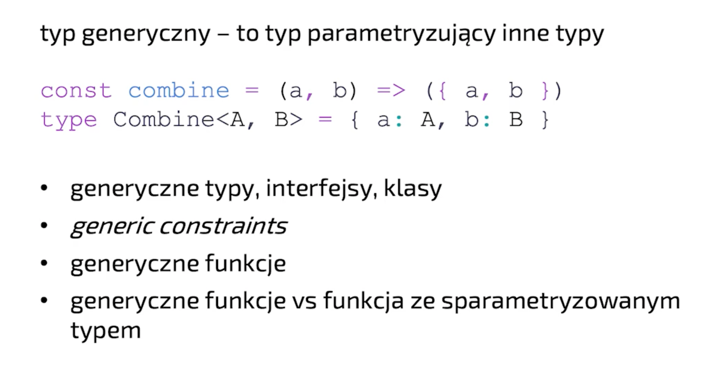

### Generic constraints

`extends`

`T` powinno rozszerzać podany typ

```ts
type Test<T extends {id: number}>;
```

### Generyczne funkcje

Syntax:

```ts
const genericArrow = <T>(a: T, b: T) => ({ a, b })
function combineFn<T>(a: T, b: T){
  return { a, b }
} // return type: { a: T, b: T }
```

Żeby użyć funkcji nie musimy podawać generyka - implicit

```ts
const combinedStrings = combineFn('a', 'b') // type: {a: string, b: string}
```

możemy podać zeby sprawdzić że to co podaliśmy spełnia nasze zamiary

```ts
const combinedNumbers = combineFn<number>(1, '2') // Error: '2' is not a number
```

### Generyczne funkcje vs funkcja ze sparametryzowanym typem

To są dwie zupełnie różne rzeczy

```ts
type GenericFn = <T>(a: T, b: T) => { a: T, b: T }
type ParametrizedFn<T> = (a: T, b: T) => { a: T, b: T }
```

Funkcja ze sparametryzowanym typem przypomina wyglądem generyka - różnica jest taka, że po podaniu argumentu, przestaje być generykiem i zamienia się w zwyczajny typ

```ts
declare let _parametrizedFn: ParametrizedFn // ❌ musi mieć z góry znane T
declare let parametrizedFn: ParametrizedFn<string> // OK, typ: {a: string, b: string}
// to musi być string nie zależnie od wywołania!
declare let genericFn: GenericFn //  nie musi, bo każde wywołanie może mieć inne T

parametrizedFn('ANF', 'ANF') // ✅ miał być string
parametrizedFn(125, 125) // ❌ miał być string
genericFn('ANF', 'ANF') // ✅ cokolwiek
genericFn(125, 125) // ✅ cokolwiek
genericFn('ANF', 125); // ❌ pomieszane typy
```

### Generyki na poziomie klasy vs na poziomie metody

Możemy mieć jeden wspólny generyk na poziomie klasy ORAZ na poziomie każdej metody tej klasy

⚠️ Oba generyki mogą mieć tą samą nazwę, np. `T` - mimo że jest kolizja nazw zostanie użyty generyk najbliższy wywołania, czyli. np w metodzie będzie `T` z generyka tej metody nie z tego co jest dla całej klasy.

```ts
class GenerykiWywolan<T> {
  constructor(
    public data: T
  ){}

  metoda<T>(another: T){
    // T z klasy to nie T z metody!
    return this.data == another
  }
}
```

Wniosek - definiując generyki świadomie decydujmmy:
- czy mają być stałe dla całej klasy
- czy różne dla każdego wywołania

### Typy mapowane

Typy wtórne (budowane na podstawie istniejącego typu)
Mapowanie polega na przeiterowaniu po kluczach typu obiektowego (interfejsu / typu)
Na tej podstawie budujemy nowy typ obiektowy

Działa to analogicznie jak mapowanie po strukturach danych, np. array

> W podobny sposób działa typ wbudowany `Partial<>` - który bierze wszystkie pola i sprawia, że stają się opcjonalne
> `Required<>` - usuwa opcjonalność
> `Pick<>` - stwórz nowy typ, który zawiera tylko wymienione pola
> `Omit<>` - stwórz nowy typ, który zawiera wszystkie pola poza tymi podanymi

Typ `Reveal` - sztuczka, która pozawala na "wyczyszczenie" zbyt złożonych typów.
Po użyciu `Reveal` zostanie nam tylko finalny typ - wynika to z "wnętrzności" TypeScript'a
`Reveal` nic nie zmienia w naszym typie, usuwa tylko podczas wyświetlania typu (np. w VSCode) w jaki sposób został on zbudowany.

```ts
type Reveal<T> = { [P in keyof T]: T[P] }
```

### Typy warunkowe

If-then-else na typach

Jeśli warunek spełniony - typ A, jeśli nie typ B
Odpowiada na pytanie: "Czy podany typ jest podtypem innego?"

Rozłączność unii polega na tym że możemy na każdym z jej elementów zastosować typ warunkowy - np. sprawdzamy czy w unii jest typ null - jeśli jest to wylatuje (zwracamy `never`), a jeśli nie to zostaje (tak działa wbudowany typ `NonNullable`)

`distritutive/naked` - rozdzielność IF-owania (tylko dla typów naked)

**naked types** - typy które występują w warunku samodzielnie, np. `T`
(naked type parametr - parametr generyczny, który w generic constraint występuje samodzielnie jako T)
Takie typy da się zastosować w typie warunkowym - np.

```ts
type OnlyStrings<T> = T extends string ? T : never;
```

Nie da się jednak tego zastować dla typów, które są "opakowane" np. Array'em
Rozłączne (**distributive**) są tylko unie w których T występuje samodzielnie

```ts
type BrokenOnlyStrings<T> = T[] extends string[] ? T : never;
// BrokenOnlyStrings<string | string[]> = never
```

`infer` - pozwala wydobywanie typu z większego typu
Słowo kluczowe infer polega na tym, że jeżeli tworzymy nowy typ z użyciem generic constraint (`T extends ...`) i wszystkie warunki w naszym typie będą się zgadzać, to typ zostanie "wyciągnięty" co pozwala nam go użyć w innym miejscu, np. w typie wartości zwracanej z funkcji

```ts
type FirstArg<T> = T extends (arg: infer A, ...args: any[]) => any ? A : never;
```

Wbudowane typy TSa:
- `Parameters` - wszystkie parametry funkcji
- `ReturnType` - typ zwracany z funkcji

To pozwala nam na stowrzenie nowego typu, bez robienia tego na sztywno (podajemy podale, które chcemy wykliczyć) tylko na podstawie jakiegoś warunku (np. nie mogą być nullable).

#### Przykład `WithoutNullProperties``

```ts
type WithoutNullProperties<T> = Pick<T, {
  [P in keyof T]: null extends T[P] ? never : P
}[keyof T]>

const myObject = {
  text: string;
  date: Date | undefined;
  amount: number | null;
}
```

po kolei:

1. Tworzymy typ warunkowy, który zwraca nam `never` lub nazwę (key) danego pola

```ts
type SomeObject = typeof myObject;

type NullableAsNever = {
  [P in keyof SomeObject]: null extends SomeObject[P] ? never : P;
}

type Result = {
  text: "text";
  date: "date";
  amount: never;
}
```

2. Stosujemy lookup na naszym obiekcie, po to żeby wydobyć nazwy pól (key) które spełniły nasz warunek

```ts
type Lookup = keyof SomeObject; // "text" | "date" | "amount"

type Result = NullableAsNever[keyof SomeObject]

type _Result = "text" | "date" | never; // = "text" | "date"
```

3. Stosujemy `Pick` i podajemy mu jako drugi parametr wynik naszych "obliczeń", w ten sposób usuwamy niechciane pola z obiektu

```ts
type Result = Pick<SomeObject, {
  [P in keyof SomeObject]: null extends SomeObject[P] ? never : P
}[keyof SomeObject]>

type _Result = {
  text: string;
  date: Date | undefined;
}
```

## Type safe-unsafe

Istnieją wyrażenia, które i tak nie gwarantują nam bezpiezceństwa.
Kompilator może mieć "dziury", dlatego że coś jest kosztowne obliczeniowo albo byłaby zbyt upierdliwa w codziennej pracy.

Przykłady:
- array access - `arr[10]`
  - co się stanie jeśli wyjdziemy poza zakres array'a?
  - w JSie będzie undefined ale TypeScript i tak zastosuje dla nas typ jaki przypisaliśmy dla tego Array'a
  - inaczej musiałby być zawsze `T | undefined`
  - możemy to zmienić używając odpowiedniej flagi w TSie
- index signature access - `dict[key]`

```ts
type ItemRecord = Record<string, Value>;
type ItemMap = {
  [key: string]: Value;
}
// ItemRecord i ItemMap działają więc tak samo

declare const map: ItemMap;
declare const record: ItemRecord;

map['elo']; // ✅ ok przechodzi
map[1]; // ⚠️ przechodzi mimo że nie powinno

// analogicznie

record["elo"]; // ✅ ok przechodzi
record[1]; // ⚠️ przechodzi mimo że nie powinno
```

- enum number-based

Jeżeli enum zawiera cyfry jako wartości TypeScript i tak pozwoli przypisać wartość z czapy

```ts
enum MyNumbers = {
  _10 = 10,
  _20 = 20,
}

declare const okAssignmnnt: MyNumbers = 10; //  ✅ ok, działa
declare const assignment: MyNumbers = 2137; //  ⚠️ działa a nie powinno
```

- try...catch (poniżej v4)

TypeScript ma też swoje ograniczenia:
- https://github.com/Microsoft/TypeScript/issues/24275
- https://github.com/microsoft/TypeScript/issues/27711

### Flagi kompilacji

Aby umożliwić stopniową migrację z JSa TS ma flagi kompilacji, co pozwala na "rozluźnienie" typów.
Możemy być bardziej lub mniej strict. Domyślnie **wszystkie uswatione są na false**!

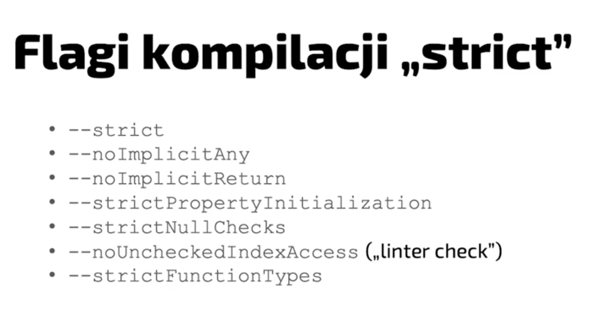

Flagi możemy uruchamiać pojedynczo, albo wszystkie na raz używająć `--strict`

#### noImplicitAny

```ts
function add(arg1, arg2) {
  // nie podaliśmy any explicite = 🚨 błąd
}
```

#### noImplicitReturn

Jeżeli funkcja ma różne ścieżki zwracania kodu (np. ma if'a, albo try-catch) to każda ścieżka musi zwrócić wartość

```ts
function something(): object {
  try {
    doDangerousStuff();
  } catch (e) {
    console.error("oh no! ...anyway"); // 🚨 nic nie zwróciliśmy = błąd
  }
}
```

#### strictPropertyInitialization

Jeżeli tworzymy pole na klasie, to pole musi zostać w jakiś sposób zainicjalizowane

```ts
class DataController {
  private data: number; // 🚨 pole nie zainicjalizowane z wartością, ani w constructor

  constructor() {}

  async initialize() {
    this.data = await getData();
  }
}
```

Jak to naprawić?

1. Jak nie ma, to dajemy `?:` - wtedy to przechodzi

```ts
class DataController {
  private data?: number;
  // ...
}
```

uperdliwe bo musimy za każdym razem sprawdzać czy jest undefined

2. `!` - wyłączamy sprawdzanie TypeScripta, niebezpieczne może się wywalić w runtimie

> "Panie kompilatorze, ja wiem lepiej"

#### strictNullChecks

Po włączeniu tej flagi musimy pisać explicite, że coś może zawierać nulla albo undefined.
Jeżeli coś może zwrócić unfefined. np. `array.find()` to musimy to uwzględnić w typie zmiennej do której do przypisujemy.

```ts
const john: Employee | undefined = employeees.find(e => e.firstName === 'John')
```

Możemy też użyć `!` jeżeli jesteśmy pewni swego, że takie coś musi istnieć

```ts
// ! tutaj piszemy dlaczego jest wykrzyknik
const john: Employee = employeees.find(e => e.firstName === 'John')!
```

W przypadku obiektów możemy ponownie użyć `!` albo optional chaining `?` wtedy undefined zostanie "zpropagowany".
Inną możliwością jest type guard.

#### noUncheckedIndexedAccess

> ⚠️ Ta flaga nie zawiera się w `--strict` musimy ją włączyć osobno

To rozwiązuje wzceśniejszą "dziurę" w TypeScriptcie przy dostępie do `Record` lub `mapped type`.
Od teraz każde odwołanie się z kluczem będzie zawsze zwracało unię podanego typu + undefined.

Ta flaga jest bardzo inwazyjna - wszędzie będziemy musieli sprawdzać tego undefined.
Z drugiej strony bez tej flagi musimy sprawdzać każde miejsce, w którym używamy indexów czy mamy pewność że dany element się tam znajduje.

### Variance

Reguły kompatybilności typów

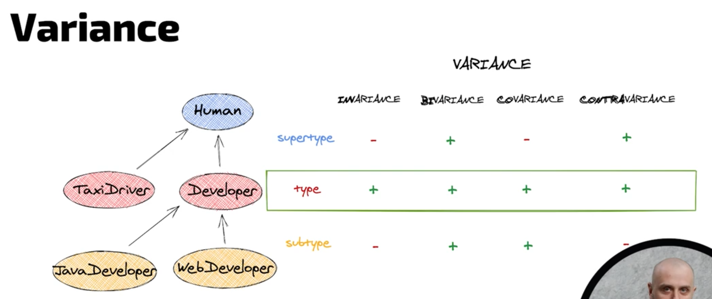

Jakie możemy podstawić wartości przy podanym typie? type / supertype / subtype - na to pytanie odpowiada variance

- **In**variance - nie może być ani `subtype` ani `supertype`
- **Bi**variance - możemy przekazać wszystko: `subtype` oraz `supertype`
  - najmniej bezpieczne rozwiązanie, przepuszcza wszystko
- **Co**variance - przepuszzca typ, oraz jego podtyp
  - każdy developer jest człowiekiem, nie każdy człowiek jest developerem
  - występuje najcześciej, najbardziej intuicyjne
- **Contra**variance - idziemy na wspak, przepuszcza typ oraz jego nadtyp
  - ma to sens w przypadku funkcji

Flaga `strictFunctionTypes`:
  - `false` - parametry funkcji są sprawdzane przez **bivariance**, można przekazać typ, nadtyp, podtyp
  - `true` - parametry funkcji są sprawdzane przez **contravariance**

Pozycja kontrawariancyjna (`contravariant position`) - inaczej zachowuje się przekazywanie parametrów funkcji, a inaczej obiektób w

```ts
function appEngine(
  processFn: (d: Developer) => void,
  dev: Developer
) {
  processFn(dev);
}
```

Obiekt możemy doprecyzować, funkcję możemy tylko uogólnić

Dlaczego to ma sens?
- funkcja, które przyjmuje dane ogólne, nie będziem miała z przetwarzaniem danych bardziej precyzyjnych
- funkcja, która przyjmuje dane precyzyjne, prawdopodobnie nie zadziała z danymi bardziej ogólnymi bo będzie jej brakować pól albo metod

> PROTIP: Jeśli w swoich komunikatach błędów widzisz odwrócenie kolejności typów - to właśnie przeszłaś/edłeś przez pozycję kontrawariancyjną. To powinno dużo podpowiedzieć przy debugowaniu.

W interfejsach jeśli chcemy żeby funkcja korzystała z:
- *bi*wariancji - piszemy ją jako metodę
```ts
interface Test<T> {
  push(value: T): number;
}
```
- *kontra*wariancji - piszemy ją jako arrow function
```ts
interface Test<T> {
  push: (value: T) => number
}
```

Wniosek? Kontrawariancja chroni przed błędami runtime, więc interfejsy na arrowach są bezpieczniejsze, ale mogą rzucać false postivives.

### False positive vs False negative


**False positive** - alam zadziałał, mimo że nie było złodzieja
**False negative** - alarm nie zadziałał, a wpadł złodziej

Musimy odpowiedzieć sobie na pytaniae co jest dla nas lepsze/gorsze? W praktyce TypeScript musi wybrać albo jedno albo drugie - nie zawsze będzie działał idealnie.

#### Soundness

System jest *sound* jeśli wykluczamy `false negative`. To jest upierdliwe, ponieważ system może się czepiać sytuacji poprawnych.

Jeśli kompilator przepuścił to znaczy że system *na pewno* jest poprawny. Bo to udowodnił.

#### Completeness

System jest *complete* jeśli wykluczymy `false positive`. To jest raczej większa "lipa" niż nadwrażliwy alarm. Ponieważ może nie zadziałać kiedy trafi się złodziej.

Kompilator poprawnie działającego kodu nigdy nie odrzuci.

#### Rozstrzygalność

Soundness i completeness nie są przeciwieństwami - to dwie osobne cechy.

Rozstrzygalnośćć - kompilator w skończonym czasie odpowie czy program się wywali czy nie.
Z czegoś trzeba zrezygnować - rozstrzygalność nie podlega dyskusji w TypeScriptcie, ponieważ kompilacja musi się udać. Dlatego możemy wybrać albo sound albo complete.

Jeżeli zrezygnujemy z rozstrzygalności to mamy JavaScript - wszystko musimy sprawdzać sobie sami.

#### Dowodzenie poprawności vs wygoda programistyn

TypeScript robi wyłom od pewnych regół i czasami jest sound a czasami unsound (przepyszcza rzeczy które mogłby być niebezpieczne).
Podważa status quo - ponieważ zakłada, ze kompilator nie ma udowadniać kodu. TS robi wyjątki żeby nie robić problemów tam, gdzie kod i tak jest prawdopodobnie poprawny, ale nie potrafi tego udowodnić.

#### Unsound TypeScript

Bycie unsound to jest główny zarzut stawiany TypeScriptowi - że pozwala na rzeczy, które są potencjalnie niebezpieczne. Na dodatek można to kontrolować flagami.

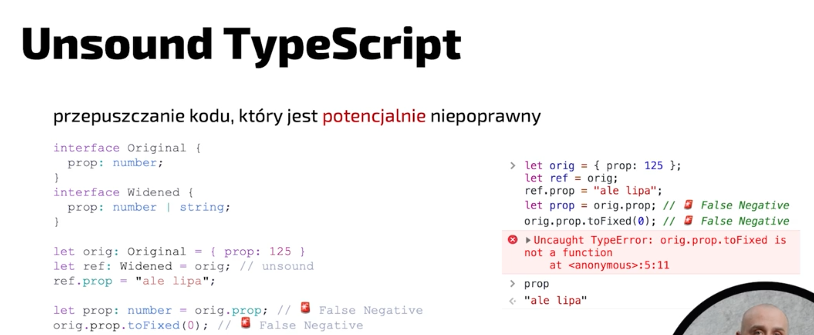
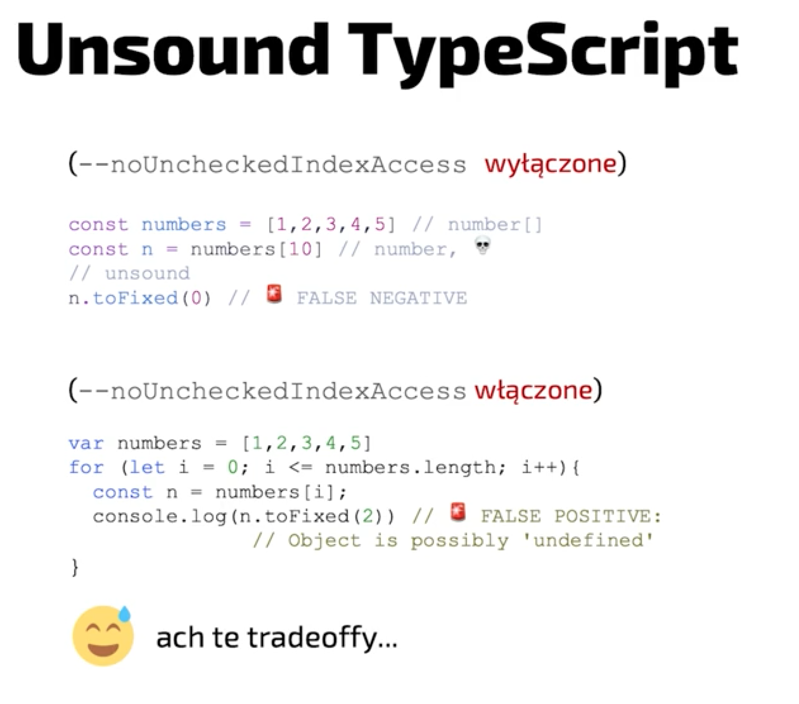

## Wzorce i antywzorce

### Zmiana deklaracji typu


Kluczowy element systemu nie ma swojej reprezentacji, tylko bazuje na primitiv'ie `number` + jest zainline'owany w setkach miejsc.

Single Source of Truth spowoduje propagację zmian. Różnica w kodzie jest minimalna

Oprócz centralnych deklaracji będziemy też potrzebować typów wtórnych - jeśli zmienimy pierwotny typ, to wtórny również się zmieni.

#### Declarative types

- `keyof`
- lookup types

```ts
const tuple = ["PLN", 125, true] as const;
// readonly
```

Tworzy krotkę read-only z typem na każdym indeksie, sprawdza również czy nie wyjdziemy poza zakres array'a. Przydatne jeśli znamy długość

- `typeof`
- `ReturnType`

Single source of truth dla danych zwracanych z funkcji - zamist pisać typ jaki funkcja zwraca używamy `ReturnType`. Po zmianie implementacji wszystkie inne typy będą się aktualizowały

- typy mapowane

### Primitive Obsession

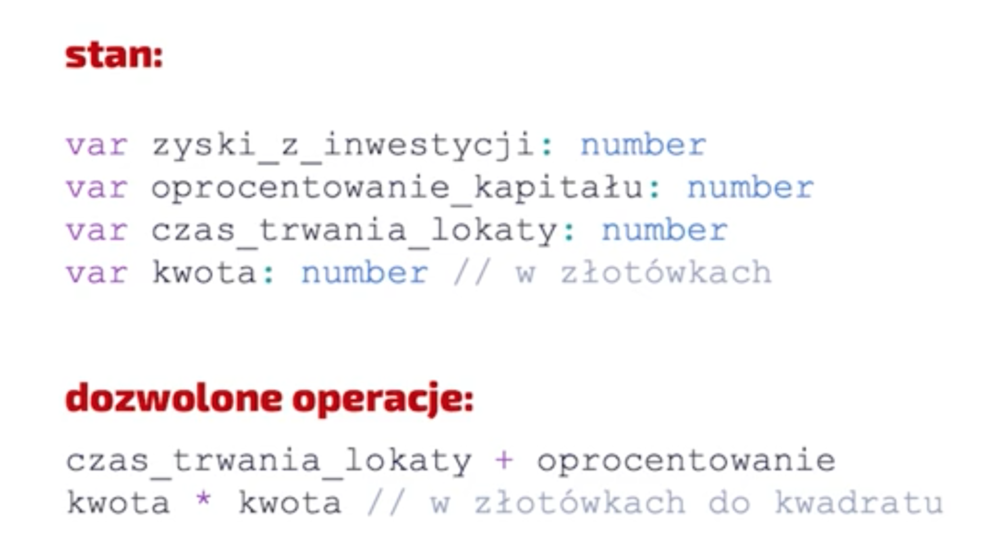

Laczenie danych które nie mają sensu - np. oprocentowania, z czasem trwania. Jeśli się pomylimy to kompilator tego nie wychwyci.

Primitive Obsession jest wtedy, kiedy w systemie mamy konkretny byt (np. osobę, szkodę ubezpieczeniową, itp) - i zamiast stworzyć dla nich osobny typ używamy prymitywów.

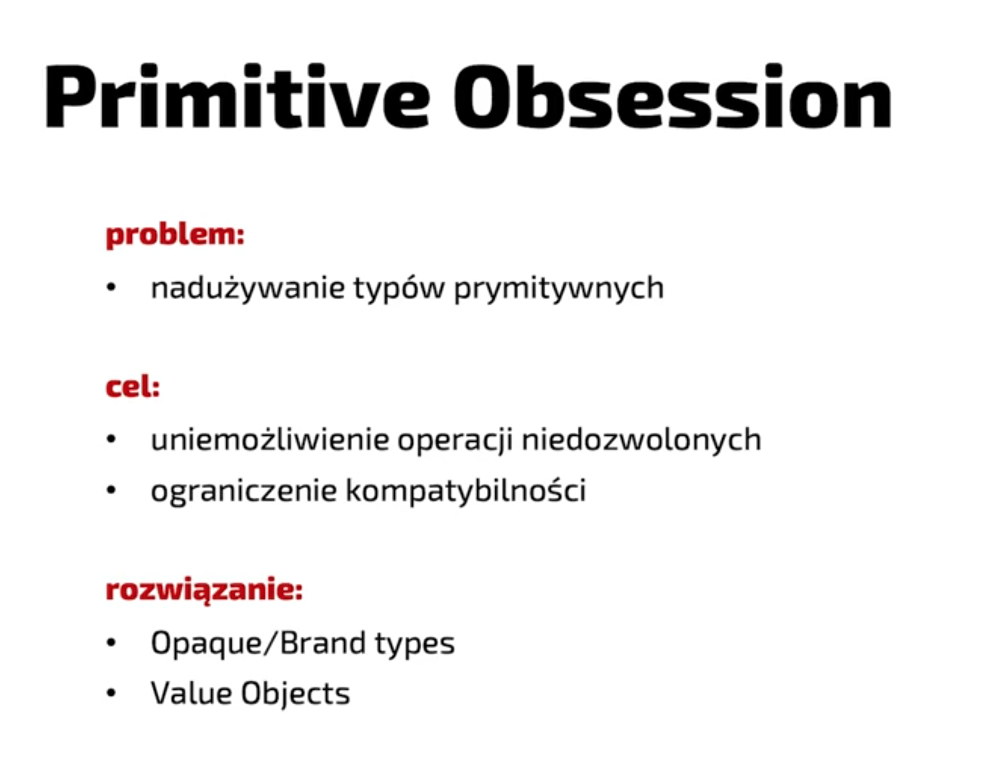

#### Fix

**Opaque / Brand types**

Rozszerzamy interfejs / typ - bez wpływu na wartości w runtime. Cel: blokada kompatybilności.

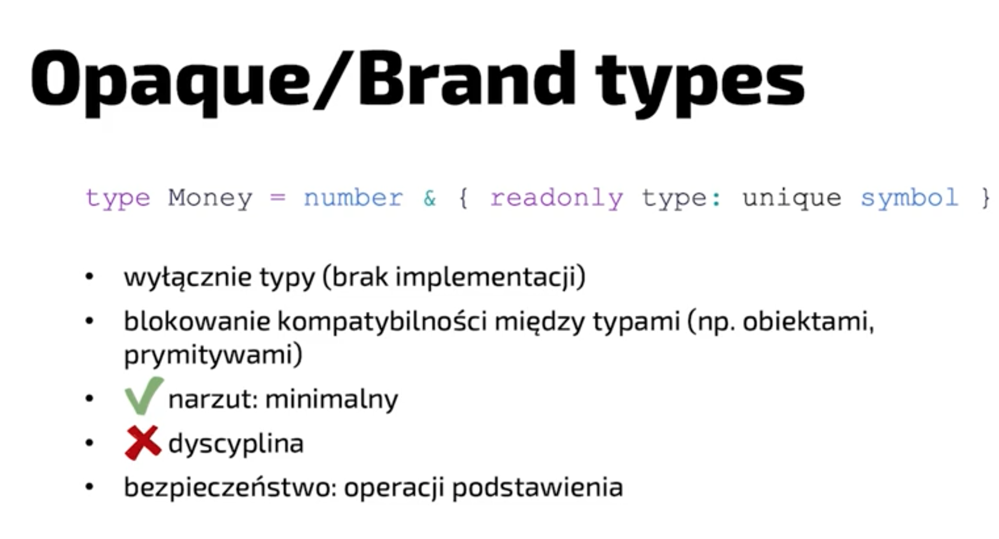

Chroni tylko przed **przypisaniem** niewłaściwego typu

```ts
type Money = number & { readonly type: unique symbol }
declare let m: Money
declare let n: number

m = n //❌ Error: nie można przypisać number do Money
n = m // ✅ W drugą stronę się da
```

**Value Objects (DDD)**

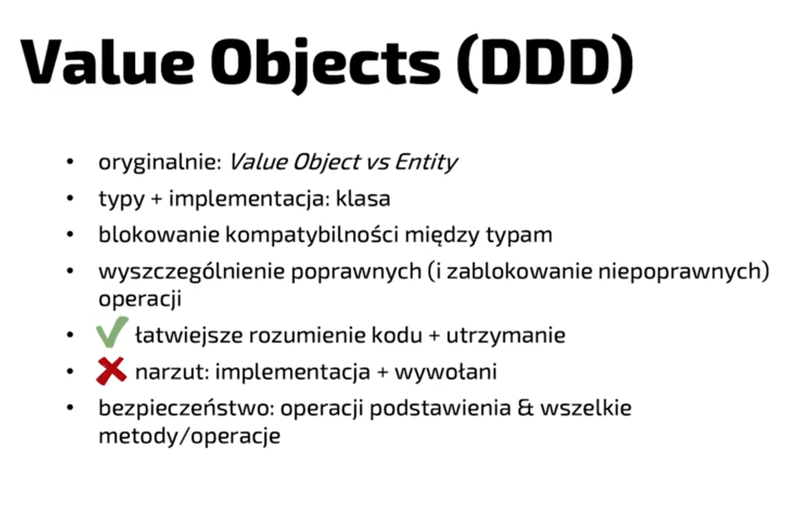

Wpływa na runtime. Dane przestają być prymitivem, a staje się klasą. Specjalne obiekty, które nie mają swojej tożsamości, reprezentują jedynie wartośc.

Sprawdzenie czy dwa takie same value objects nie różnią się odsiebie **nie** odbywa się na podstawie referencji (reference) - bo zawsze byłaby inna. Używamy do tego specjalnej metody, która porównuje wewnętrzny stan dwód Value Object - na tej podstawie określa równość albo różność.

Wszelkie operacje jakie mają być dozwolone są zaimplementowane wprost jako metody klasy.

```ts
class Money {
  private constructor(
    private value: number,
    private currency: Currency,
  ){}

  // prywatny konstruktor & statyczna metoda fabrykująca
  static from(value: number, currency: Currency){
    return new Money(value, currency)
  }

  // możemy mnożyć tylko przez współczynnik (liczbę)
  multiply(factor: number){
    return new Money(this.value * factor, this.currency)
  }

  // chronimy reguł biznesowych:
  // można dodawać tylko pieniądze w tej samej walucie
  add(another: Money){
    if (this.currency != another.currency){
      throw new Error('Cannot add different currencies')
    }
    return new Money(this.value + another.value, this.currency)
  }

  nominalValue(){
    return this.value
  }
}
```

**"Boolean Obsession"**

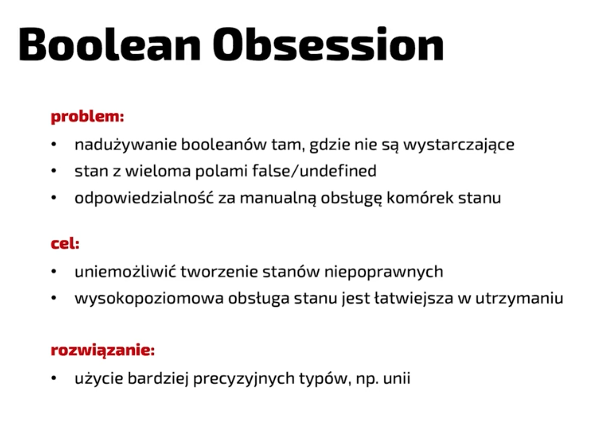

Nadużywanie zmiennych boolowskich + opcjonalne pola (które nie powinny istnieć).
Tworzymy wiele permutacji, które dla TSa są poprawne ale logicznie nie są.

```ts
type State = {
  loading: boolean;
  error?: Error;
  data?: Data;
}

let state: State
state = {loading: true} // ✅
state = {loading: false} // bez sensu - nie ma ani danych, ani errora
state = {loading: true, error: new Error(), data: 123} // wtf?
```

Chcemy uniemożliwić wejścia w niepoprawne stany.

```ts
type StateFixed =
  | {type: "LOADING"}
  | {type: "ERROR", error: Error}
  | {type: "LOADED", data: Data}
```

Umożliwiamy tylko wybrane stany i dane. Nie możemy np. być w loaded i mieć error.
Jeśli podamy za dużo danych dostaniemy `Excessive attribute check error`.

```ts
let n: StateFixed;
n = {type: "LOADED", error: new Error(), data: 123} // error - pole error jest niepotrzebne
```

Inne rozwiązanie: maszyny stanowe (Redux, Context, XState)

### Typowanie żądań HTTP

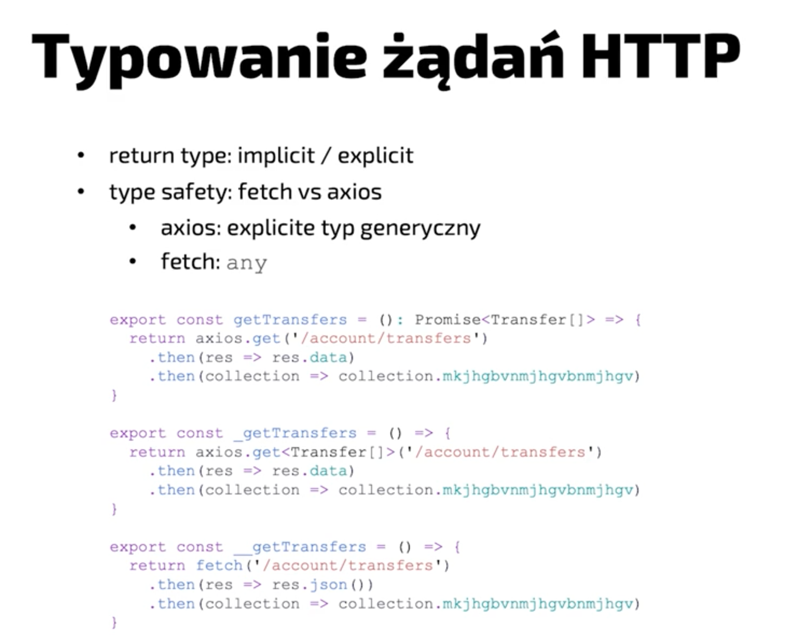

- return type: implicit / explicit
- type safety: fetch vs axios

fetch - używa `Promise<any>`, ma słabe definicje typów

```ts
export const __getTransfers = () => {
  return fetch('/account/transfers')
  .then(res => res.json())
  .then(collection => collection.toNieIstnieje) // ⚠️ powinien być error ale przechodzi bo `any`
}
```

axios - pozwala sparametryzować wywołania get'a

```ts
export const _getTransfers = () => {
  return axios.get<Transfer[]>('/account/transfers')
    .then(res => res.data)
    .then(collection => collection.toNieIstnieje) // 🚨 error
}
```

#### DTO - Data Transfer Objects

DTO'sy są do przekazywania danych między systemami danych

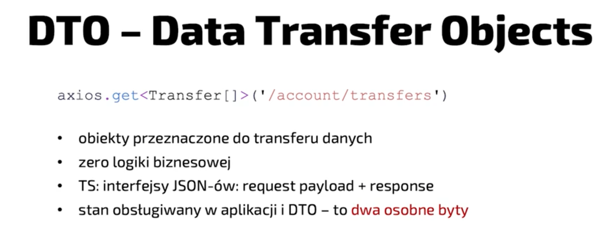

Stan obsługiwany w aplikacji i DTO - to dwa osobne byty

Czy aplikacja powinna być podatna na zmiany kontraktu (DTO)?
- zmiana jednego typu w wielu kopiach 👎
- zmiana jednego DTO - propagacja w projekcie = błędy po każdej zmianie 😬

Jeśi zapożyczymy całe DTO to pójdzie fala zmian po całych użyciach w aplikacji. Aplikacja się nie zmieniła, a kod i tak trzeba zmieniać bo mamy błędy w TSie. Używamy typu który do nas nie należy, a traktujemy jak swój własny.

DTO - traktujemy jako zewnętrzną zależność (mimo że siedzi w repo). Tworzymy osobne modele, które będą wykorzystywane w aplikacji - mapujemy w funkcji HTTP na naszą lokalną strukturę. Zmiany DTO można zaeknapsulować, tak żeby aplikacja tych zmian nawet nie zauważyła.

## Podsumowanie

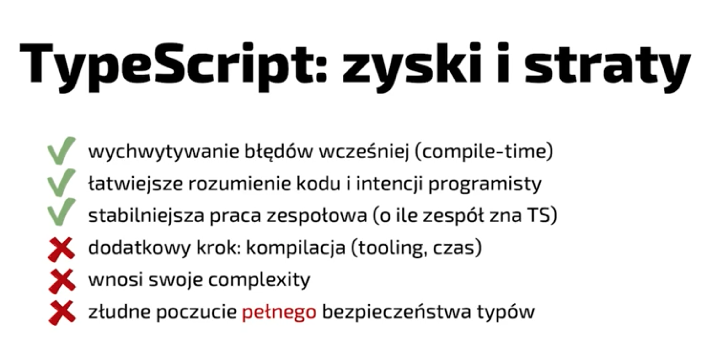
