# TypeScript

## Podstawy

### Dlaczego bezpieczeństwo typów?

- Zapewnia że aplikacja sama w sobie się nie wywali (błędne dane od usera = 500, jest ok)
- beneficjent: my albo ktoś inny za 0.5 roku
- jeśli kod ma zostać przejęty przez kogoś warto zainwestować w typy
- nie ma nic za darmo: trzeba rozumieć komunikaty błędów
- TS nie jest w stanie wszystkieg wyłapać

TS jest najbardziej popularny, lepsze wsparcie od bibliotek, itd.

- Zastępuje unit testy na badanie struktury danych - skupiamy się na funkcjonalnościach
- Typ to podpowiedź dla innego programisty (przekazujemy nasze intencje)
- Mamy zaufanie do kompilatora (wychwyci nasze błędy)

Ograniczenia TS'a

- nie wszystkie typy da się wychwycić (póki nie uruchomimy, nie znamy danych)
  - nie sprawdzimy poprawności JSONa z serwera
  - jeśli TS miałby to robić, to musiałby dorzucić kod do runtime'u
- race condition
- koercja jest przepuszczona (rzutowanie na stringi działa w TSie)
- dzielenie przez 0 xD (dostajemy Infinity) - JS to przepuszcza

TS nie respektuje semver!

- podnośmy wersję TS'a regularnie (dzięki temu zmiany będą łatwiejsze)

### PROTIPy

`declare` - zadeklarować zmienną / funkcję ale bez inicjowania jej początkowej wartości

w TS playground możemy importować moduły z npm'a! (dokładniej importujemy tylko typyp z `@types`), React (z JSX) też działa

## Rodzaje typowania

### Statyczne vs dynamiczne

Statyczne - zmienna musi mieć przypisany typ i on nie może się zmienić

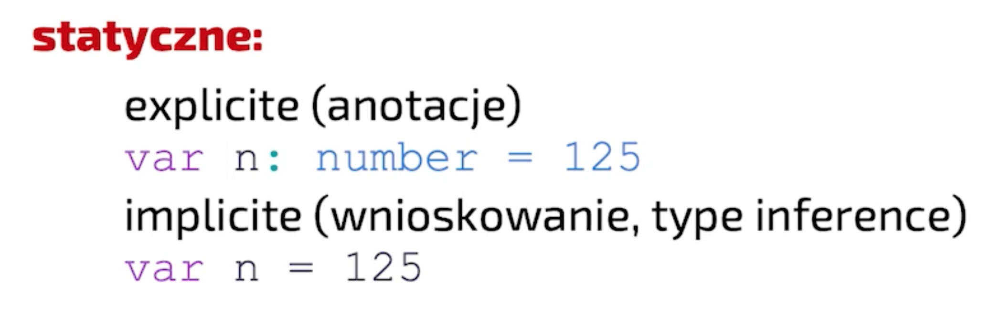

minus: dłużej się pisze
plus: mamy gwarancję typów, wiemy co się wydarzy bez uruchamiania

Dynamiczne - typ zmiennej może się zmienić, jakiś typ jest ale nie musi taki pozostać

Przy przechodzeniu na TSa:
- mniej bugów
- tańsze utrzymanie
- wolniejsze pisanie, typy trzeba przemyśleć i utrzymać

### Silne vs Słabe

Nie ma precyzyjnej definicji jaka jest różnica

Dla niepoprawnych operacji:
- silne - rzucenie błędu
- słabe - program kontynuuje pracę... jakoś
  - coersion w JSie

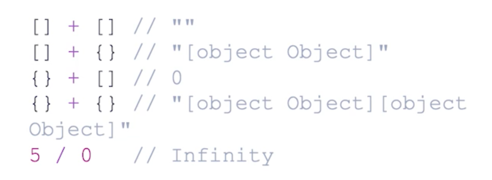

JS coś zwróci ale niekonicznie to mas sens, np. dzielenie przez 0

TypeError - podczas wykonywania
SyntaxError - podczas parsowania

np. JS zwróci SyntaxError jak użyjemy 2 razy `let`

Od ES6 JS jest silniej typowany

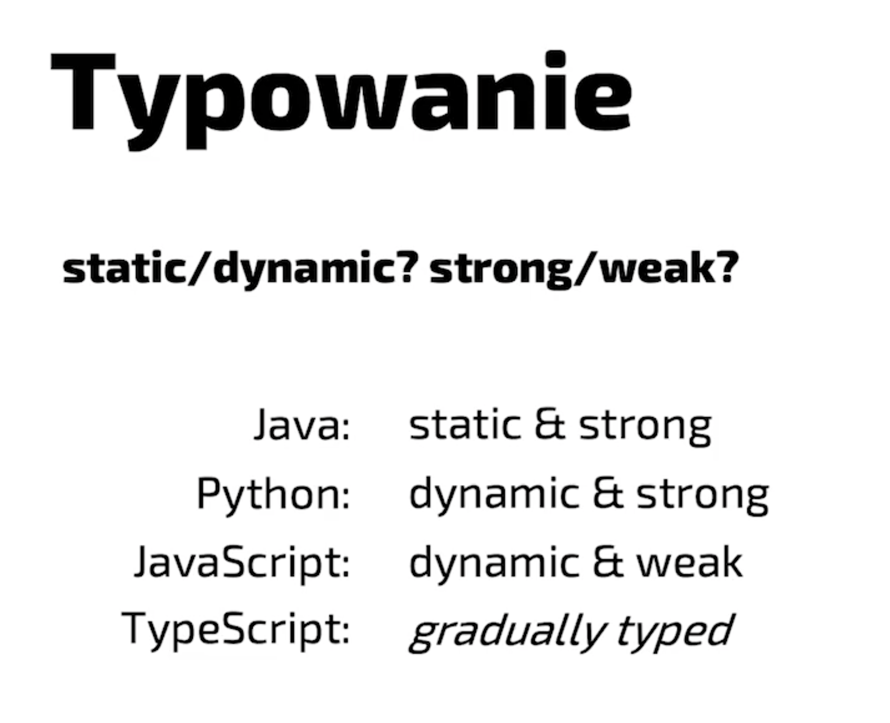

### Jaki jest TS

TS jest gradual typing - opakowuje JSa, pozwala na stopniową migrację z JSa

TS nie jest językiem strongly-typed


Nie ma definicji co to strong, typy znikają przy kompilacji do JSa, a sam JS jest słabo typowany, mamy typ any

### Polimorfizm

Apparent type ("to appear") - jak kompilator to widzi, co kompilator wie
Actual type - czym faktycznie jest

Kompilator ogranicza dostęp do metod i pól mimo że są one w pamięci (actual type). Nasza adnotacja typu pozwala stworzyć inny apparent type - to tego typu będzie używał kompilator do sprawdzania czy w sposób poprawny odwołujemy się do metod i pól.

Przykład:

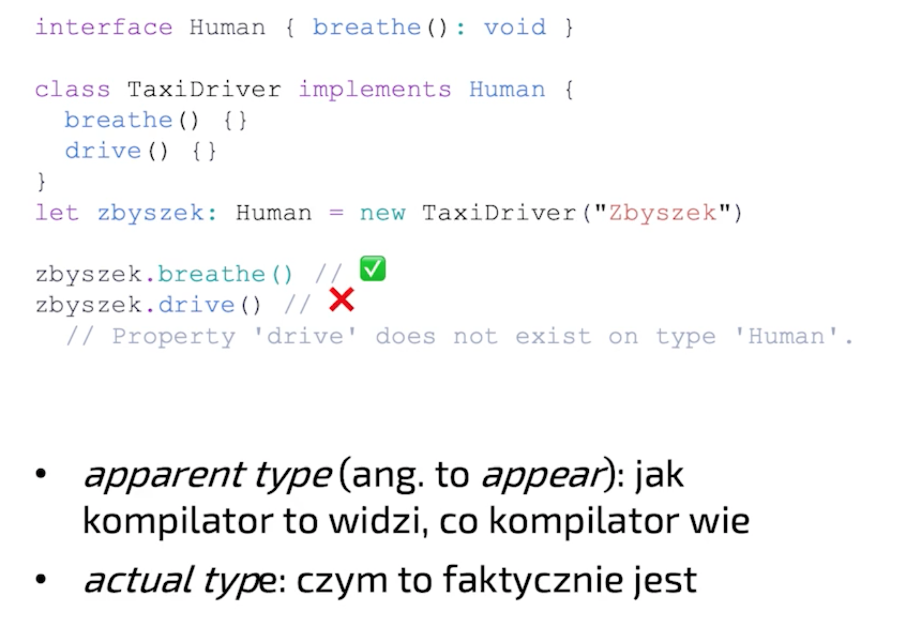

> Tutaj zbyszek ma adnotację Human (apparent type), mimo że to instancja klasy TaxiDriver (actual type)
> Jeśli spróbujemy uzyskać dostęp do metody z TaxiDriver, której nie ma na Human kompilator zgłosi błąd bo zawęziliśmy sobie typ

Rozdzielanie na typy actual i apparent to polimorfizm - zmiana z typu węższego na ogólniejszy

Dzięki temu nie musimy przepisywać kodu kiedy trzeba coś zmienić

z SOLID - D: Dependency Inversion Principle

Zamiast moduł (zależność) -> moduł - bezpośrednia zależność, wydzielamy interfejs - jeden moduł go implementuje, a drugi go wymaga, dzięki temu te dwa moduły mniej o sobie wiedzą

TLDR: jeśli nie musimy używać konkretnych metod, pól zastosujmy polimorfizm tak żeby wiedzieć tylko to co jest konieczne do pracy

### Typowanie strukturalne vs nominalne

Co to znaczy że coś jest kompatybilne z danym interfejsem?
Determinuje to typowanie strukturalne lub nominalne. W TSie jest to typowanie **strukturalne**.

Typowanie nominalne: rozróżniamy po **nazwie** klasy / interfejsu, hierarchii dziedziczenia
- dwie klasy o identycznych strukturach NIE SĄ tożsame / kompatybilne
- polimorfizm oparty o klasę bazowę / interfejs
- liczy się że w łańcuszku dziedziczenia jest jakiś wspólny element, struktura samego obiektu jest bez znaczenia
- języki: Java, C#

Typowanie strukturalne: rozróżniamy po zawartości struktury
- dwie identyczne struktury ŚĄ tożsame
- tożsamy jest nawet object literal (czyli obiekt bez typu który zawiera te same pola)
```ts
let ufo = {
  name: "UFO"
}
```
- polimorfizm strukturalny
- języki: TypeScript

PROTIP: jeśli chcemy akceptować typ danych po których będziemy iterować nie musimy ograniczać się do `Array`, zamiast tego możemy użyć `Iterable` - ten typ jest bardziej generyczny i pozwoli na akceptowanie dowolnego iteratora (ES6) - np. (poza array), Set, Map.values(), itp.

## Anotacje vs asercje

Wnioskowanie - kompilator rozkminia w zależności od tego co przypisujemy do zmiennej
```ts
var expr = value; // <- typ od value
```
Anotacja - podajemy przy deklaracji, explicite, **to jest type safe**
```ts
var expr: T = value;
```
Asercja - mniej bezpieczne, nawet niebezpieczne 🙃
> panie kompilatorze, ja wiem lepiej ta zmienna tak naprawdę jest typu X a nie Y

```ts
var expr = value as T;
```

Dlaczego niebezpieczne? Bo może się okazać że wcale nie wiemy lepiej 😅

Dlaczego istnieją asercje? Wnioskowanie typów ma swoje ograniczenia, kompilator ma pewnie domyślne zachowania (wnioskowanie jest implicite).

Asercję stosuje się jako ostateczność

TLDR:
Anotacje są bezpieczne (na tyle na ile definicje typu są precyzyjne)
A z asercjami trzeba bardzo ostrożnie, bo jeśli się pomylimy, to przepuścimy babole do runtime'u

## Namespace

TS ma dwa namespace'y:
-  przestrzeń zmiennych - przetrwają do kompilacji JSa
```ts
var color = "blue";
```
-  przestrzeń typów - one się ulatniają
```ts
type color = "blue";
```

Możliwe jest stworzenie zmiennej i typu **o tej samej nazwie**. TS nie zgłosi tutaj błędu.
Nie można mieszać tych namespaceów ze sobą - TS będzie się zpodziewał albo wyrażenia albo typu

Przykład:
ReturnType ponieważ jest typem, sam spodziewa się że zostanie mu podany typ. Dlatego jeśli podamy coś z JSowego namespace'u zgłosi błąd

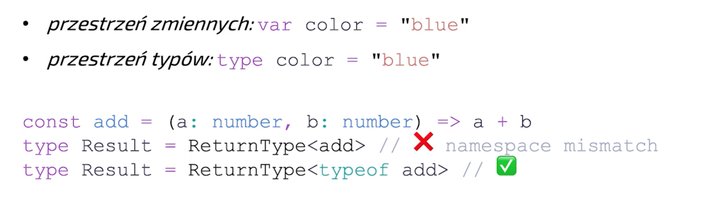

`typeof` z wyrażenia zwraca typ

Note: don't use `cast` when describing the usage of `as` - it's **type assertion**. Cast has an effect in runtime (ex. in C float -> int will round up the number)

## Wnioskowanie typów

### Instrukcja vs wyrażenia

**instrukcje** - nie mają typu

rozkaz, zdanie - czasownik "zrób"

**wyrażenie** - mają typ

przedmiot, rzeczownik, jakaś rzecz
wyrażenie można przypisać do zmiennej

Jeśli mówimy o wnioskowaniu typów - chodzi o wnioskowanie typów wyrażeń

np.
```ts
{name: "John Lenno", age: 40}
```

obiekt jest wyrażeniem, stirng "John Lenno" jest osobnym wyrażeniem, liczba 40 jest kolejnym wyrażeniem. Na każdej z tych rzeczy możemy wnioskować typ, zapisać asercję, itp.

### Primitives

`let` - let może się zmienić, więc typ zostanie rozszerzony do `string`
`const` - nie moze się zmienić, więc będzie miał typ taki jaki do niego przypiszemy

```ts
let napis1 = 'napis'; // type: string
const napis2 = 'napis'; // type: "napis"
const prawda = true; // type: true
const falsz = false; // type: false
```

Możemy rozszerzyć typ `const`'a poprzez adnotację:

```ts
const napisRozszerzonyAdnotacja: string = 'napis'; // type: string
```

### Obiekty

Bez asercji albo adnotacji TypeScript nie ma żadnego powodu żeby zawężać typ

Przykład: mamy typy Currency i Payment
```ts
type Currency = "EUR" | "PLN"

type Payment = {
    amount: number
    currency: Currency
}
```

```ts
const payment1 = {
  amount: 1000500100900,
  currency: "EUR" // type: string, nie ma powodu do zawężenia
}

// trzeba mu powiedzieć
const payment2 = {
  amount: 1000500100900, // reszta jest wywnioskowana
  currency: "EUR" as Currency
}
// albo
const payment3: Payment = {
  amount: 1000500100900,
  currency: "EUR" // automatyczne zawężenie do typu Payment
}
```

### Zagnieżdżone obiekty

```ts

type Order = {
    date: Date
    payment: Payment
}

const obj = {
    date: new Date(),
    payment: {
        amount: 10.56,
        currency: "PLN"
    }
}

const order: Order = obj // TypeErrpr - PLN jest stringiem a nie typu PLN
```

Możemy to rozwiązać na 2 sposoby:

1. Robić asercję za każdym razem na property `payment`

```ts
const obj = {
    date: new Date(),
    payment: {
        amount: 10.56,
        currency: "PLN"
    } as Payment
}
```

2. Użyć `as const`

`as const` powoduje że TypeScript zastosuje najbardziej zawężone wnioskowanie jakie jest możliwe (domyślnie stosuje wnioskowanie szerokie).

```ts
const obj = {
    date: new Date(),
    payment: {
        amount: 10.56, // type: 10.56
        currency: "PLN" // type: "PLN"
    }
} as const

/*
type: {
  readonly date: Date;
  readonly payment: {
    readonly amount: 10.56
    readonly currency: "PLN"
  }
}
*/
```

UWAGA - powoduje to sztywną wartośc dla currency, liczby, wszystkie pola stają się `readonly`

- 👍 Krótkie i zwięzłe
- 👎 zawęzi wszystkie literały
- 👎 doda `readonly` które niekoniecznie może nam pasować

### Literały obiektów

Wnioskowanie dotyczy miejsca deklaracji - kiedy TypeScript widzi nową zmienną musi od razu określić jej typ

```ts
const tuBedaStringi = []; // type: any[]
tuBedaStringi.push(123) // 🚨 niestety przejdzie
```

Fix:
```ts
const tuBedaStringi: string[] = [];
tuBedaStringi.push(123) // ✅ TypeError
```

W `reduce` wnioskowanie accumulatora (czyli wyniku reduce'a) będzie otypowane tak jak drugi parametr

```ts
const items = [
  { key: "A", value: 1 },
  { key: "B", value: 2 },
  { key: "C", value: 3 },
]
const result3 = items.reduce((acc, item) => {
  acc[item.key] = item.value
  return acc
}, {}) // tu jest wnioskowanie - widać jedynie {}
type Result = { [key: string]: number }
```

Fix 1:

```ts
const result3 = items.reduce((acc, item) => {
  acc[item.key] = item.value
  return acc
}, {} as Result)
```

Fix 2:

```ts
const result3 = items.reduce<Result>((acc, item) => {
  acc[item.key] = item.value
  return acc
}, {})
```

bardziej jawne określenie

### Funkcje

Bez konrekstu

```ts
const add = (a, b) => a + b // type: (a: any, b: any) => any
const result1 = [1,2,3,4].reduce(add) // type: any (nadal)
```

Z kontekstem:

```ts
const result2 = [1,2,3,4].reduce((a, b) => a + b) // type: (a: number, b: number) => number; result: number, nmber
```

Czasami TS jest jednak w stanie wywnioskować typ wynikowy:

```ts
const czasamiDaSieOkreslic = (a, b) => '' + a + b; // ReturnType = string
```

string to jest joker - bije wszystkie inne typy, jeśli cokolwiek dodamy do stringa wszystko inne zostanie zrzutowane na stringa w runtimie

### Zewnętrzne źródła danych

Zewnętrzne źródła danych (np. API) nie są kontrolowane przez TSa, dopiero w runtime okaże się jaka będzie odpowiedź z API, zawartość pliku, itp.

Żeby to sprawdzić musimy napisać dodatkowy kod, który zostanie odpalony w runtime.

Native `fetch` nie ma możliwośc parametryzacji odpowiedzi z API przez generyki

```ts
const getSomeData = async (): Promise<object> => {
  const response = await fetch('https://jsonplaceholder.typicode.com/albums')
  const data = await response.json(); // type: any
  // między await a return wszystko może się zdażyć bo `typeof data = any`
  const costam = data.hejaho[1000500100900].Kaboom()[Math.random()].iWszystkoSieZgadza
  return costam
}
// a wynik to i tak Promise<any> 😅
```

Wszystko od `any` to nadal `any`.

## Typy to zbiory

Ten model mentalny pozwala nam wyciągać logiczne wnioski na temat typów

`string, number, boolean ` - to typy niekompatybilne, czyli zbiory rozłączone

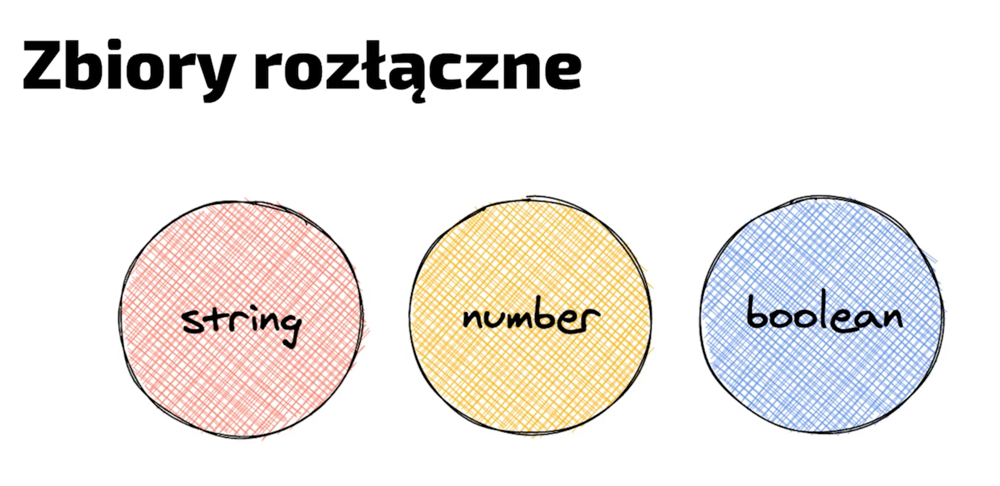

> PROTIP
>
> TS ma typ `PropertyKey` - który zawiera pola (key) możliwe na obiekcie (= `string | number | symbol`)

A co z null i undefined? To jak zostaną potraktowane, zależy od flagi `strictNullChecks`

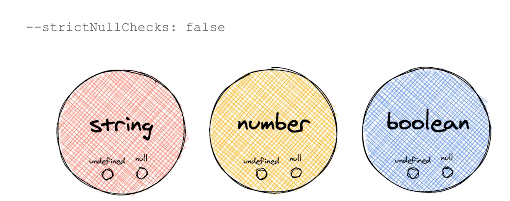

`true` - jesteśmy strict, null i undefined są oddzielnymi typami (oddzielny, rozłączny zbiór)
`false` - undefined i null są wrzucone do każdego typu primitive'a - są elementem każdego z tych zbiorów

### Unie i przecięcia

Unia to suma zbiorów - czyli elementy z każdego zbioru: `A | B`
Przecięcie / część wspólna (intersection) to elementy, które znajdują się w obu zbiorach jednocześnie: `A & B`

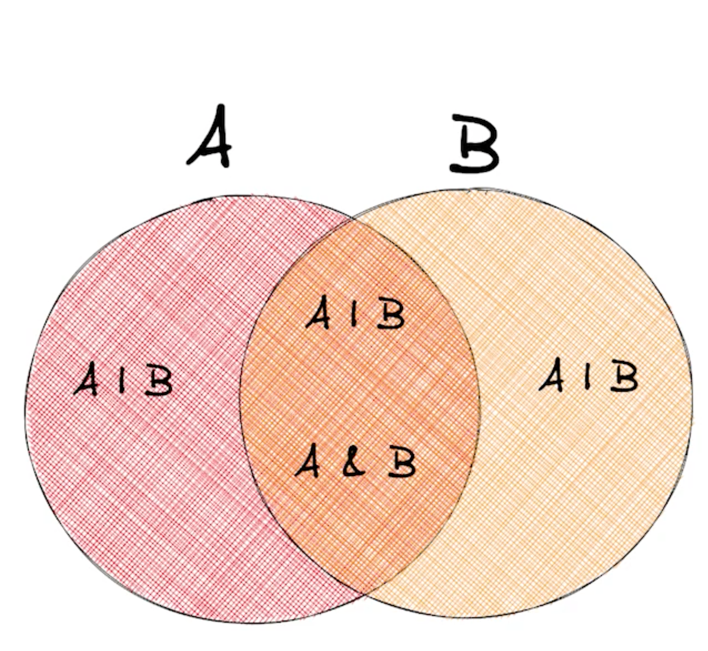
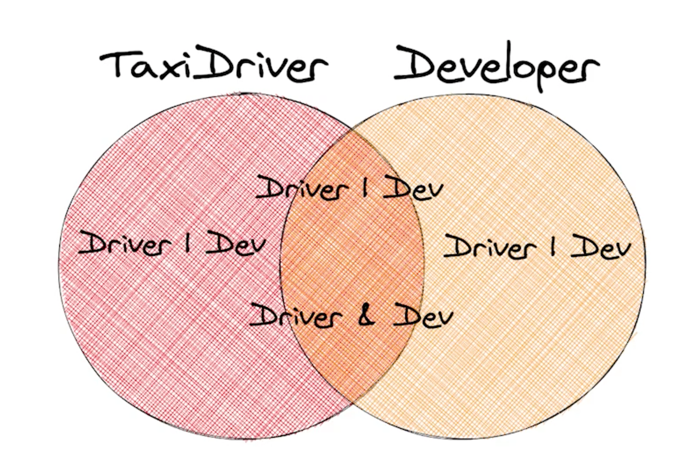

```ts
interface Human {
  name: string
}
declare let someone: Human

interface Developer extends Human {
  languages: string[]
}
declare let developer: Developer

interface TaxiDriver extends Human {
  drive(): void
}
declare let taxiDriver: TaxiDriver

type DriverDeveloperIntersection = Developer & TaxiDriver
```

Intersection będzie miał tylko jedno pole: `.name` - ponieważ Human spełnia wymagania obu interfejsów `Developer` i `TaxiDriver`.

```ts
declare let unionObject: DriverDeveloperIntersection
unionObject.name // 👍
```

Część wspólna (intersection) jest **rozdzielna** względem unii (ang. distributive)

```ts
type Employee = Developer | TaxiDriver
type FlyingEmployee = Employee & { fly(): void }
```

To znaczy że jeśli mamy kilka części składowych unii to zostaną one rozbite, a następnie połączone z częścią wspólną

```ts
// result:
type FlyingEmployee = (Developer & { fly(): void; }) | (TaxiDriver & { fly(): void; })
```

Interfejs lub typ wyraża jedynie **wymagane** pola obiektu - definuje kontrakt, czyli to co musi zostać spełnione
ALE! mogą być dodatkowe pola

#### Zbiory i pod zbiory

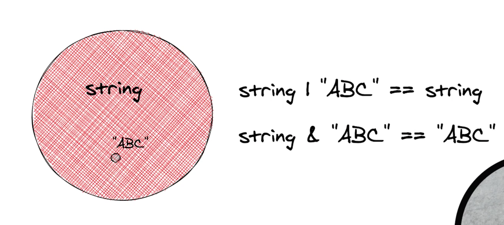

Unia ze `string` i `"ABC"` to `string`
Częśc wspólna ze `string` i `"ABC"` to `"ABC"`

### Unie dysktryminacyjne

To są takie unie w których na każdym obiekcie istnieje określone pole
Dzięki temu TS jest w stanie zagwarantować że takie pole będzie zawsze istnieć (jeśli znajduje się w każdym elemencie unii).
Potem możemy sprawdzić zawartość pola żeby jeszcze bardziej zawęzić typ i zyskać dostęp do pól które znajdują się tylko w tym jednym elemencie unii.

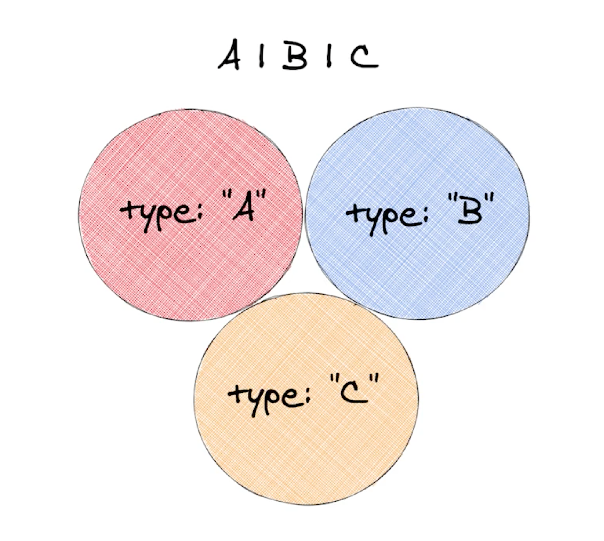

Tak np. działa Redux / reducery

Lookup jest również rozdzielny względem unii - jeśli chcemy dostać typ konkretnego pola z unii dysktryminacyjnej to TypeScript sprawdzi każdy możliwy przypadek i zwróci nam odpowiedni typ

```ts
{
  type A = { type: "A" }
  type B = { type: "B" }
  type C = { type: "C" }
  type Union = A | B | C
  type PropType = Union['type'] // "A" | "B" | "C"
}
```

**UWAGA** jeśli chociarz jeden z elementów unii będzie *nadtypem (nadzbiorem)* pozostałych - to "połknie" pozostałe typy i będziemy mieli typ znacznie szerszy

Dlatego, że `string | "ABC"` = `"string"`

```ts
{
  type A = { type: string }
  type B = { type: "B" }
  type C = { type: "C" }
  type Union = A | B | C
  type PropType = Union['type'] // string
}
```

Jeśli akceptujemy unię typów to możemy dostać się tylko do wartości, które istnieją w obu typach - żeby móc je rozróżnić i uzyskać dostęp do wszystkich pól, możemy dodać "distriminant property" - czyli np. string, który jednoznacznie określi nam z jakim typem mamy do czynienia

```ts
type Invoice = {
  number: string,
  date: Date
  positions: {
    name: string
    price: number
    quantity: number
  }[]
  rebate: number
}

type Bill = {
  date: Date
  totalPrice: number
}

type CompanyPurchase = Invoice | Bill

const getPrice = (purchase: CompanyPurchase): number => {
  // purchase.date - i nic więcej
}
```

Z distriminant property:

```ts
type Invoice = {
  type: "INVOICE",
  number: string,
  date: Date
  positions: {
    name: string
    price: number
    quantity: number
  }[]
  rebate: number
}

type Bill = {
  type: "BILL",
  date: Date
  totalPrice: number
}

type CompanyPurchase = Invoice | Bill

const getPrice = (purchase: CompanyPurchase): number => {
  // purchase.type = "INVOICE" | "BILL"
  if (purchase.type === "INVOICE") {
    // purchase.positions[0].price
  }
  if (purchase.type === "BILL") {
    // purchase.totalPrice
  }
}
```

Exhaustiveness check - TS jest w stanie sprawdzić czy wysyciliśmy unię ze wszystkich jej członków, jeśli tak się stanie to dostaniemy typ `never` - czyli typ w którym nigdy nie powinniśmy się znaleść

```ts
const getPrice = (purchase: CompanyPurchase) => {
  // ...
  // if {} ...
  const x: never = purchase;
}
```

W tym momencie jeśli dodamy kolejny element do naszej unii i tego nie obsłużmy do dostaniemy błąd ponieważ nic nie można przypisać do `never`


### Nadzbiory, podzbiory

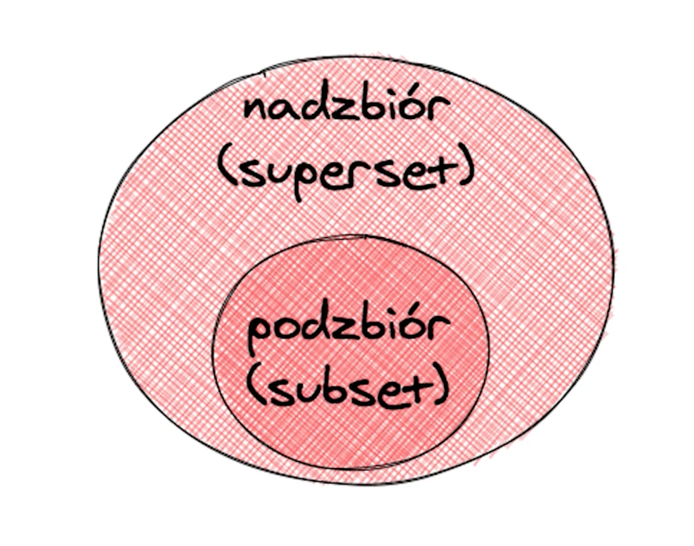
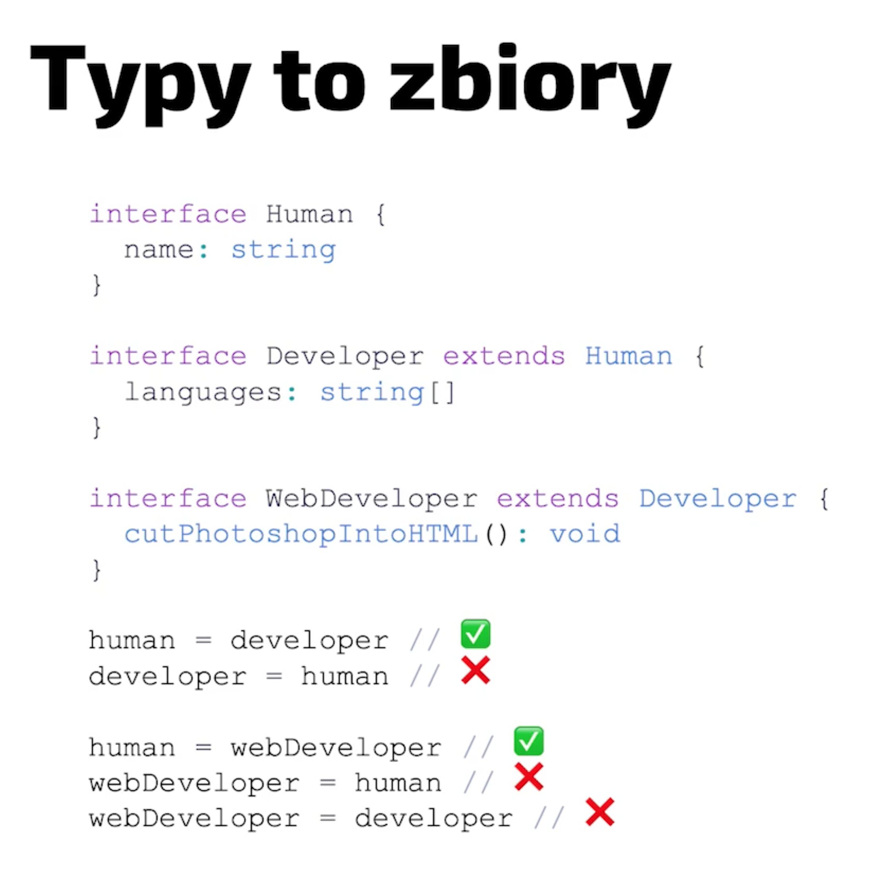
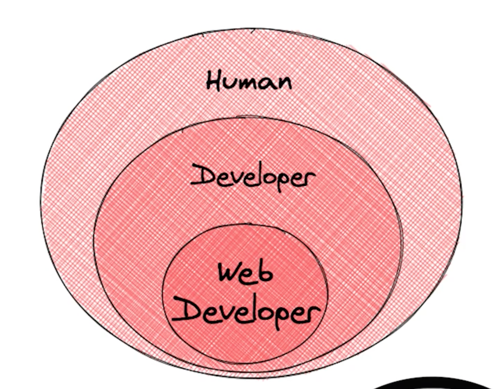

Wśród prymitywów też są podtypy i nadtypy

PropertyKey (string | number | symbol) > string > "PL" | "DE"


### Top i bottom type

Top type - `any` i `unknown`
- oba przyjmują wszystko

`any` można użyć wszędzie, a `unknown` można użyć nigdzie dopóki nie uruchomimy na nim type guarda
- any można użyć wszędzie i to jest bardzo type unsafe
- unknown to coś nieznanego, nie wiemy co to jest, ale skoro nie wiemy co to jest to nie wiemy czy możemy tego użyć
  - możemy zrobić if'a który sprawdzi

Bottom type - `never` - zbiór pusty
  - nie istnieje takie wyrażenie które zaspokoi oba kontrakty, typescript obliczył przecięcie typów i jest to zbiór pusty
  - opisuje fragmenty kodu, które kończą się rzuceniem wyjątku
  - nigdy do tego punktu nie dojdziemy
  - pętle nieskończone
  - exhaustiveness check

#### Kompatybilność typów

Dlaczego nie stosować any?

- Any gubi błędy, bo jest kompatybilne w obie strony (wyjście / wejście)
  - mamy number, rzutujemy na any, a funkcja oczekuje stringa
- wsztstko, co jest wtórne od `any` jest również `any`
- jeśli mamy wiele any to po co nam TypeScript w projekcie?

any jest formą poddania się :D (np. biblioteka)

#### Typy zbliżone do any

- `Function` - typ wszystkich funkcji, bez względu na parametry, ich ilość, zwracany typ - any wśród funkcji
- `Object` (nie `object`) - to object ORAZ PRYMITYWY, wynika z tego jak działa JS
  - `(1).toString()`
  - `"mystring".length`
  - jest koercja oraz autoboxing
  - autoboxing pojawia się kiedy opakujemy prymitywa w `()` i wywołamy metodę typową dla obiektów
- `object` - typ dowolnego obiektu, bez prymitywów


### Excessive attribute check

Wyjątek od typowania strukturalnego

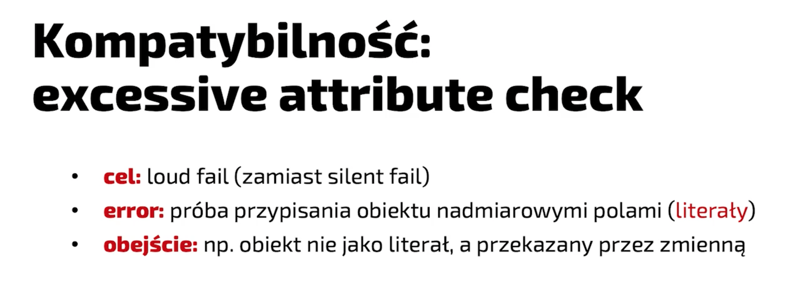

Dlaczego? literały obiektów są stosowane raczej rzadko, np. parametr wywołania funkcji w jakiejś bibliotece, podajemy parametry z wersji 6 a używamy wersji 5.

Wg. typowania strukturalnego to nie byłby błąd - ale prawda jest taka, że chcieliśmy osiągnąć co innego

```ts
// name i language jest kompatybilne
// jak odkomentujemy `address` - to też kompatybilne
const john = {
  name: "John",
  languages: ['js', 'ts'],
  // address: "Liverpool"
}

const dev: Developer = john

// ale jak podstawimy literał, to kaboom ❌
const anotherDev: Developer = {
  name: "John",
  languages: ['js', 'ts'],
  address: "Liverpool" // ❌ Object literal may only specify known properties, and 'address' does not exist in type 'Developer'
}

```

### Weak types

To też jest wyjątek

Weak type to typy, które wszystkie pola mają opcjonalne

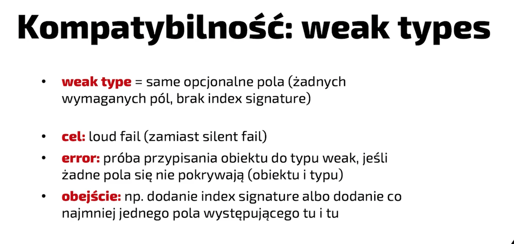

Przez to że każde pole jest opcjonalne to każdy obiekt będzie kompatybilny

TypeScript sprawdza czy między przekazywanym obiektem a oczekiwanym WeakType, jest chociarz jedno pole wspólne

```ts
type PatchParams = {
  name?: string
  languages?: string[]
}

const params = { value: '125' }
function patch(params: PatchParams){}

patch(params) // ❌ has no properties in common with type 'PatchParams'
```

### Type vs interface

Skojarzenie: typy - funkcyjne, interface - obiektowe

Prawda jest taka że w większości miejsc możemy użyć i typów i interfejsów

Podobnieństwa:
- obiekty można otypować jako typy i interfejsy
- oba można rozszerzyć, dziedziczyć i implementować
  - czasami trzeba użyć innej składni np. zmiaast `&` -> `extends`

Różnice:
- declaration merging - tylko interfejsy
  - interfejs o tej samej nazwie jest deklarowany w kilku miejscach w kodzie
  - każde z tych innych miejsc ma inną zawartość, kompulator łączy obie deklaracje w jedną
  - kompatybilność jest sprawdza na podstawie połączonej wersji
  - przydatne do rozszerzania bibliotek (np. redux-thunk, rozszerza intrfejsy dispatch z reduxa w momencie importu obu są łączone)
- interfejsy muszą z góry znać wszystkie pola - nie można użyć unii, typów warunkowych

Perfromance:
- kod z interfejsami może być kompilowany szybciej, dlatego lepiej używać interfejsów
- lepiej stosować interfejsy niż przecięcia (intersection)

Kiedy tworzymy interfejs TS cacheuje jego zawartość, odwołując się do jego nazwy mamy od razu jego zawartość - dlatego że wszystkie pola są z góry znane. W przypadku typów ich zawartość jest obliczana na bierząco.

Jeśli używamy generyków i to jeszcze zagnieżdżonych to nasza kompilacja będzie coraz bardziej zwalniać

