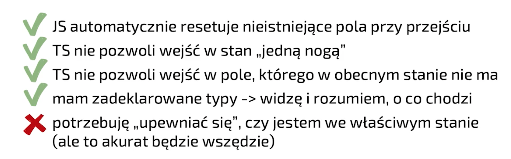
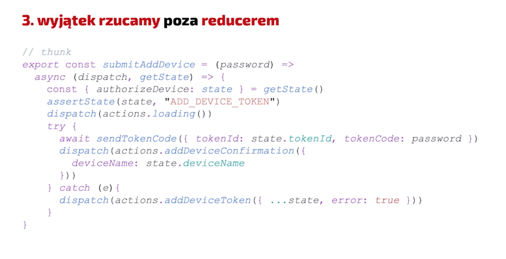

# Maszyny Stanowe

Design first - nie od razu siadamy do implementacji

Musimy najpierw dobrze zrozumieć proces - jeśli źle zrozumiemy proces, źle go zamodelujemy

Primitive Obsession - wrzuć wszystko jako pierdyliard booleanów - powstają zależności między nimi, musimy za każdym razem o nich pamiętać (np. reset token -> wyczyść errory). Nadużywamy primitives zamiast zamodelować dane tak, jak one funkcjonują

## Union State Machine

**Stan bazowany na uniach**

- Pogrupwać komórki stanu - rodzaj stan może być tylko powiązany z komórkami, które w tym stanie istnieją


Twardy replace: podmieniamy cały obiekt ze stanem, wtedy komórki które nie mają sensu są usuwane

Przechodzę między stanami - usuwam śmieci

Zalety / wady




### Assertion functions

Działają podobnie jak Type Guard w TS tylko, że zamiast zwracać true / false rzucają wyjątek jeśli typ nie jest poprawny

```TS
function assertState<TType extends string>(
  state: {type: string},
  expectedType: TType
): asserts state is StateMember<TType> { // <- this is assert function
  if (expectedType !== state.type) {
    throw new Error("...");
  }
}
```

zmienna będzie miała zawężony typ po wywołaniu assert state


Możliwych stanów jest ilość elemenetów unii x2

Porówanie rozwiązań


Zmiana wymagań biznesowych:
- primitive state: TS nic nie wie o tej zmianie
- union state: TS wywali error jeśli zapomnimy dodać nowe property obiektu

Dedykowany stan na error


- boolean: ukryty podstan
- union: inny stan maszyny stanowej

Jeśli coś jest innym stanem (nawet jeśli dane są podobne lub te same) to warto go zamodelować jako osobny stan

Czy robiś stany bez widoku?


- zmieniając stan możemy odpalić sideEffecty (np. useEffect)
- warstwa UI może ale nie musi reagować na ten stan

Podsumowanie Union State


React Hooks jako state machine engine
- implementacja oparta o primitive - NOPE, użyj unii
- rozwiązanie natywne, znane (hooki), brak dodatkowych zaneżności i API do nauczenia
- type-safe
- czytelność: im więcej tym trudniej ogarnąć
- **referential equality**: callbacki trzeba opakowywać w useCallback itd

## Redux state machine


- Redux teoretycznie jest maszyną stanową
  - no ale nie do końca
  - bo trzymamy jeden obiekt, akcje podmieniają nam pola - tak jak w Primitive Obsession
- Można to zrobić ale zazwyczaj implementacja polega na podmienianiu pól
- Note: useReducer nie ma ważnego elementu - side effectów


- nie spreadujemy obiekt statnu tylko go zastępujemy

Różncia między useState / redux:
- hook musi wiedzieć jak zbydować nowy obiekt stanu
- redux: wysyłana jest akcja, reducer będzie wiedział jak zbudować obiekt stanu (inversion of control)

Co jeśli akcja nie ma sensu?
- błąd i tak trzeba poprawić
- niepoprawne przejście jest złamaniem maszyny stanowej
- nie łatwo znaleść taki błąd


Taka implementacja pozwoli wysłać *dowolną* akcję w *dowolnym* momencie (mimo ze to nie ma sensu)
Akcję niskopoziomową do reduxa wysłać można zawsze (nawet jeśli ogarniemy to w thunku)

Solution #2 - Ignorowanie błędnych przejść

Jeśli się nie chronimy przed niepoprawnymi przejściami w maszynie stanowej to mamy buga
Redux nie przewiduje tego w architekturze (niby można customowy middleware ale nikt tego nie robi)

Solution #3 - Rzucanie błędów poza reducerem (middleware)


Testowanie:
- reducery - nuda, mało przydatne
  - może jeśli mamy duże reducery i szybko się rozrastają
  - testy snapshotowe - mało pisania, łatwo usunąć jeśli nie mają wartości
- thunki - czy wysyłają poprawnie akcje (`redux-mock-store`)
  - co daje testowanie akcji?
- integracyjnie - dispatchujemy thunka, sprawdzamy stan, dispatchujemy... itd
  - mimikujemy cały proces
  - wyłapiemy jeśli będzie niepoprawny stan lub jeśli thunki dispatchują nieprawidłową akcję

Podsumowanie


Sam redux nie rozwiązuje problemu niepoprawnych przejść, a jeśli to obsłużymy nasze reducery będą wyglądały dziwnie
(właściwe rozwiązanie nie powinno źle wyglądać - problem architektury reduxa)

## XState Machine

To jest biblioteka dedykowana do maszyn stanowych.

Definiujemy stany - niektóre stany mogą być finalne, oraz mieć side effecty (tak jak useEffect).
Definiujemy również przejścia między tymi stanami - wszystko z góry.

Wydedukuje również które przejścia są poprawne, a które nie - jeśli wyślemy niepoprawną akcję, to XState ją zignoruje tak jak if w reducerze

**Side effecty w XState**

są dwa rodzaje: akcje (fire and forget), invoked effects (żyją własnym życiem, zwrotna komunikacja) - Actor Model

Actor - ktokolwiek kto potrafi przyjmować wiadomości, robić robotę, wysyłać wiadomości innym.
Maszyna komunikuje się z invoked effects zdarzeniami (events).

Hook useMachine odświeży komponent jeśli zajdzie taka potrzeba. Komponent widzi tylko maszynę, NIE obsługuje procesu.

Każda zmiana w XState powinna być modelowana jako przejście do osobnego stanu.

inne tematy: zagnieżdżone stany, kompozycja maszyn, model-based testing,

Podsumowanie XState


Note: najnowsza wersja obsługuje lepsze type-safety między state.value, a state.context

## Podsumowanie

**biblioteka < design**
Jakie cechy będzie miało nasze rozwiązanie? Pewne narzędzia utrudniają złe praktyki.
Ale żadne narzędzie nie zwalania nas z myślenia

Co brać pod uwagę?
- type-safety
- runtime-safe (na ile biblioteka wychwyci podczas runtime'u potencjalne błędy - przejścia, stany, itp)
- czytelność i zrozumienie procesu (devoolsy i visualizer)
- próg wejścia
- koszt wdrożenia narzędzia w projekt