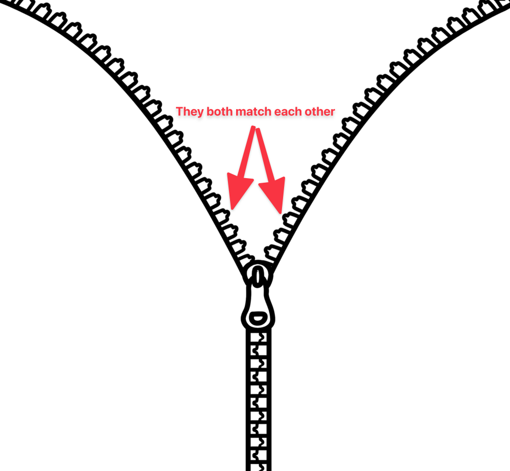
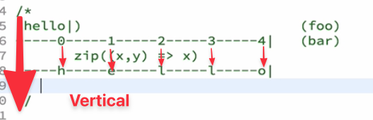

Notes from this course: https://egghead.io/lessons/rxjs-understand-rxjs-operators

# Beyond the basics: Operators

## What is an operator

Operator takes source observable, does something and returns result obserable
`source obserable => result obserable`

ex. map, filter, merge, combineLatest - they don't change source obserable!

each opeartion is immutable (source is untouched)

Subscription chain - each operator subscribes to piped obserable. If we subscribe to the Obserable returned from operator we also subscribe to the observable that was passed to the operator

`source => operator => subscribe`

when we add more operatros:

`source => operator => operator => operator => subscribe`

```js
function multiplyBy(number) {
  return (source) => {
    return new Observable((observer) => {
      return source.subscribe({
        next(x) {
          observer.next(x * number); // multiply each value by 10
        },
        error(err) {
          observer.error(err); // pass-through errors
        },
        complete() {
          observer.complete(); // pass-throguh complete
        },
      });
    });
  };
}

const bar = of(1, 2, 3).pipe(multiplyBy(10));
bar.subscribe(
  (x) => console.log("next" + x),
  (err) => console.log("error", err),
  () => console.log("done")
);
```

## Marble diagrams conventions

- Values: lower-case letters (`a-z`) or numbers (`0-9`)
- Completion: `|`
- Error: `X`

Asnnychronous values delivery look like this:

```
ex. interval(1000)
----1----2----3----4----5--...
```

Syncrhnous values (delivered all at once) look like this:

```
ex. of(1,2,3) + some values after a while
(123)---5---...
```

To represent an operator we provide two timelines separated by the name of the operator

```
foo: --1--2---3-----
      multiplyBy(10)
bar: --10-20--30-------
```

## Most basic operators

### map

Our `multiplyBy` is too specific. We can make is more general by passing a function to call when calculating next value.

```js
function multiplyBy(fn) {
  return (source) => {
    return new Observable((observer) => {
      return source.subscribe({
        next(x) {
          observer.next(fn(10)); // call a function and return a value
        },
        error(err) {
          observer.error(err); // pass-through errors
        },
        complete() {
          observer.complete(); // pass-throguh complete
        },
      });
    });
  };
}
```

We have basically invented `map` operator 😆

```js
const bar = foo.pipe(map((x) => x / 2));
```

### mapTo

If we want to just delivery the same value every time there is another operator for that `mapTo`:

before:

```js
const bar = foo.pipe(map(() => 10));
```

after:

```js
const bar = foo.pipe(mapTo(10));
```

## Utility operators

### tap

Replaced `do` operator.

This operator is used for inspecing behavior (like console.log). Any returned value is simply ignored and the value from obserable is simply passed on

It is equivalent to this:

```js
const result = source.pipe(
  map((x) => {
    console.log("!");
    return x; // this part is done by `tap` operator
  })
);
```

This operator doesn't trigger a subscription. If we don't subscribe the operator won't be run

## Filtering

### filter

Works exactly the same as the `filter` on Arrays (takes predicate function - returns true / false). The filtered-out values are not emitted in the result observable

### take

Specify how many events you want to listen to (take) and after that completes the observable

```
---1---2---3---...
    take(2)
---1---2|
```

### first

Shortcut for `take(1)` - takes one value and completes observable

### ignore

Instead of taking first x values we can ignore them - only after x values were emitted we start to pass them through

```
---1---2---3---...
    ignore(2)
-----------3---....
```

### takeLast

Previous operators refered to beginning of observable, this one refers to the end. `takeLast` emits synchronously last `n` values of an observable.

**🚨 Important 🚨**
It only runs when the observable completes

```
---1---2---3---4---... // infinite
        take(4)
---1---2---3---4|
    takeLast(2)
----------------(34|)
```

### last

Shortcut for `takeLast(1)`

### skipLast

Ignore n last values and return the rest when obserable ends

## Combining values operators

### concat

This operator combines two obserables together sequencially. The second obserable is added after the first is done.

Ex. async observable with sync obserables. When async finishes (done) then all the values from sync are returned at the same time - this way we can append values

```
---1---2---3---4|
(5678)
    concat
---1---2---3---4(5678)|
```

This obserable has 2 usages:

- in pipe `obserable.pipe(concat(anotherObserable))`
- as a static method `Rx.Obserable.concat(observable1, observable2)`

Using concat we can also prepend values:

```
---1---2---3---4...(foo)
(a|)               (prefix)
      concat
(a)-1---2--3---4...(result)
```

We do it this way:

```js
prefix = of("a");
const result = prefix.pipe(concat(foo));
```

### startWith

Shortcut for prefixing values (like using concat with synchronous obserable).

```js
const result = foo.startWith("a");
```

The difference is that we don't have to create the observable that returns just one item ourselves. The operator does that for us.

```
---1---2---3---4...(foo)
     startWith('a')
(a)-1---2--3---4...(result)
```

### merge

Combines two obserables in parallel (in contrary to concat which does that sequentially).
It finishes only when both obserables are done.

> Special case:
> If one obserables emits synchronously multiple values, and the other one emis asyncrhonusly they will be combined into syncrhonously emitted value

```
----0----1----2---(3|)
--0--1--2--3--(4|)
    merge
--0-01--21-3--(24)-(3|)
```

You can think of `merge` operator like `OR` operator in JavaScript - it returns a value from one obserable _OR_ the other one.

### combineLatest

It's like merge but `AND` operator. This operator returns values from **BOTH** obserables whenever they emit a value.

This operator takes a function that accepts parameters for the provided obserables (ex. `(x, y) => outputValue`)

If this operator doesn't have a value from one of the obseravbles then it won't do anything. Once it receives a value from both it will use the last value (if they haven't been emited at the same time)

They's where the _latest_ in the name comes from - it remembers the latest value.

```
-----0----1-----2-----(3|)   (foo)
--0----1-2---3--4(|)         (bar)
     combineLatest((x, y) => x + y)
-----0-1-23--4--(56)--(7|)
```

When it's usefull? When we have two independent sources of data and we want to make a value from them

Ex. BMI - we need weight + height in order to calculate the formula

> ⚠️ Remember
> `merge` - OR style operator
> `combineLatest` - AND style operator

### withLatestFrom

> 💡 PROTIP: If an operator takes a function with 2 arguments then it means it is an `AND` style operator

It maps values from obserable and uses latest value from another obserable so that the result value can be produced:

> The mapping here is implicit, that's why it isn't in the name - `mapWithLatestFrom`

```
-----H-----e------l-----l-----o| (input)
---0-----1-----0-----1-----0|     (condition)
          withLatestFrom - 0 => lowerCase / 1 => upperCase
-----h-----E------l-----L-----o (result)
```

Note that when value is emitted in the `condition` obserable we don't return a new value in the `result`
`condition` is a secondary information, that's by there is not static method for this operator

### zip

Combine _n_'th value of obserable with _n_'th value of other obserable

> First of foo + First of bar => First output
> Second of foo + Second of bar => Second output

This operator waits until both of input obserables have emitted their n'th value and only then emmites an output
If one of the obserables finishes so does the output from `zip` - it is safe to conclude that no other value can be emmited

```
-----0-----1------2-----3-----4| (foo)
----0----1------2------3|        (bar)
       zip((x, y) => x + y)
-----0-----2------4------6|      (result)
```

It's like zipper in clothes! Each "teeth" has to match it's respective parts



#### When not to use

```
-----0-----1------2--x--3-----4| (foo)
----0----1------2------3|        (bar)
       zip((x, y) => x + y)
-----0-----2------4----!!|      (result)
```

This case would create inconcistency (if an unexpected value would be returened by one of obserables) - that's why most commonly used should be `withLatestFrom` and `combineLatest` not `zip`...

#### When to use

When we want to combine async + sync obserables into one and "spread" the syncrhonous obserable over time.

```
(hello|)
---1----0----1----0|
        zip
---H----e----L----l|
```

## Horizontal operators

All of those combination operactors are "vertical combination operators" - meaning they take value when they are emitted and do something with them:



> THINK `.map`

The horizontal combination operators take value from single Obserable

> THINK `.reduce`

### scan

This works like reduce - we provide a `seed` for an initial value and an accumulator function that takes the last returned value and current value

```js
.scan((acc, value) => /** return something */, seed)
// ex
.scan((acc, value) => acc + value, '')
```

```
(hello|)                          (foo)
-----0-----1-----2-----3-----4|   (bar)
       zip((x,y) => x)
-----h-----e-----l-----l-----o|
  scan((acc, x) => acc+x, '')
-----h-----(he)--(hel)-(hell)(hello|)
```

Scan is like a reverse of merge

#### Example

Counter of clicks: take an obserable of click events, map them to `1` and then use scan to get the sum of amount of clicks

### buffer

What if we want to aggregate only _some_ of the values from the past. That's where the `scan` operator comes in.

There are different types of buffer:

- buffer
- bufferCount
- bufferTime
- bufferToggle
- bufferWhen

The difference in those buffer operators is the condition in which the buffer is **"closed"** (emit + clear)

#### bufferCount

Specify the size of buffer (array of items that this operator should remember). When the amount specified is met (buffer is sorting now 2 items) the value is emitted. After emitting the value, the buffer it is cleared so that next value can come in.

The buffer can also be emitted, even if the size limit wasn't met, when the observable completes.

For example aggregate only last `2` values:

```
-----h-----e-----l-----l-----o|       (foo)
      bufferCount(2)
-----------([h,e])-----([l,l])-([o]|)
```

#### bufferTime

Close the buffer after x miliseconds time

#### buffer (custom)

In this version of buffer we can completly customize the closing condition by providing closing obserable - it will tell when to close the buffers

For example to recreate the `bufferTime(900)` we can do this:

```js
const foo = /* some observable */;
const bar = interval(900).pipe(take(3));
const result = foo.pipe(buffer(bar));
```

## delay

Dalay return of the values from obserable by some time

```
--1--2--3--4|
  delay(500)
----1--2--3--4|
```

aka. wait 500 seconds then return the events of the obserable with timespan they've come in (the delay happens only at the start)

delay also accepts dates - `delay(new Date(new Date().getTime() + 1000))`

### delayWhen

It takes a function that receives value from obserable and should return new obserable that would tell how much each value should be delayed by.

```
--1--2--3--4|
  delayWhen(x => -------0|)
----1--2--3--4|
```

This allows giving variable amount of delay

```
--0--1--2--3--4|
 delayWhen(x => -----0|)
-------0-------1--...
```

```js
let result = foo.pipe(delayWhen((x) => interval(x * x * 100).pipe(take(1))));
```

Use case: Wait with requests for a while before making it

### debounce
