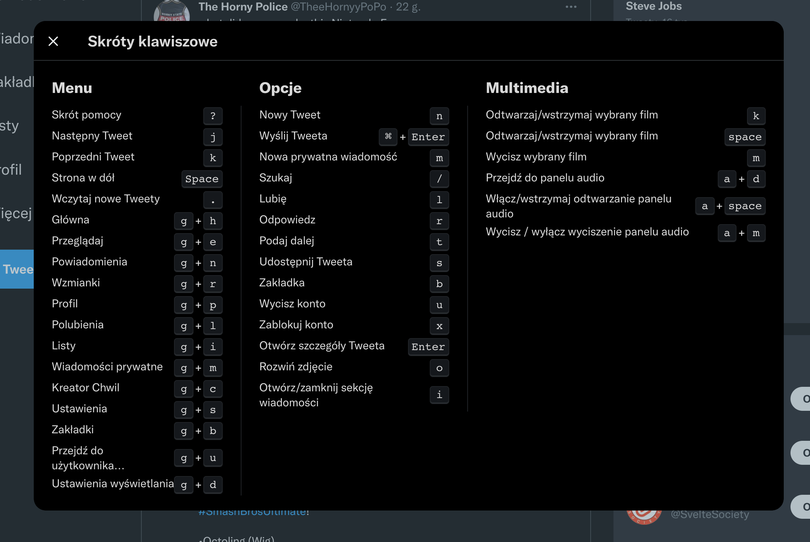

# Accessibility Training - FE Masters

[Front-end Masters Link](https://frontendmasters.com/courses/accessibility-v2)
[Github Repo](https://github.com/jkup/learn-a11y)

Web in itself is accessible (standards are well thought out and include a11y out of the box) - **we** break it by adding CSS and JS.

[The first website](http://info.cern.ch/hypertext/WWW/TheProject.html) is accessible - it's just HTML.

## Stats

- 26 percent (one in 4) of adults in the United States have some type of disability.
- 2 in 5 adults age 65 years and older have a disability
- 20 percent of people in the US (48 million people) report some degree of hearing loss, and 29 million of them could benefit from using hearing aids.
- 2.3 percent of people in the US (7 million people) report having a visual disability, and 1 million people in the US are legally blind.
- 16 percent of people in the US (39 million people) have difficulties with their physical functioning. 17.1 million people would find it very difficult or impossible to walk unassisted for a quarter mile.
- Roughly 8 million people in the US have an intellectual disability, including 425,000 children.

## Ways people use the Web

- Keyboard only
  - Are our elements available just by using keyboard (tabbable)
  - Can we easily scroll to the bottom of the page (moust = scroll)
- Head wand
  - We want users to press the keyboard as little as possible
- Mouth stick
- Single switch
  - Literally just one button
  - Press once - select keyboard row, select second - select a single keyboard key
- Screen reader
  - Non-visual way of interactig with the web
  - Will read out any stuff you're accessing

There is no API to crearly determine if user is using screen reader. We can use other tricks to make our websites easier to use (ex. link that is in the HTML but hidden visually)

**Curb cut effect** - When building websites that are easier to use by users with disabilities we almost always make it easier to use for everyone (for example power users using keyboard shortcuts)

WCAG is the standard. WebAIM distills it into a [nice checklist](https://webaim.org/standards/wcag/checklist)

## Alternative Text

- Default: screen reader will read the file name (if no `alt` is provided)
- Alt is provided: screen reader will read the text from `alt` attribute
- Alt is empty (`alt=""`): Screen reader will skip that image (won't be read)

Alternative approach: Make a paragraph that's visually hidden (visible to screen readers, but hidden on the website for vision users).

## Accessible HTML

Some elements provide just a semantic meaning:

- aside
- footer
- header

Some elemnets provide a lot of built-in functionality:

- button
- input
- textarea

### Labels

Only some elements can have labels:

- button
- input
- keygen
- meter
- output
- progress
- select
- textarea

If you need to label an element that can't have label use `aria-label`. It can be added to anything. The label will be read only if the element can be navigated to by screen reader.

### Visually hidden

```css
.visuallyhidden {
  position: absolute;
  left: 0;
  top: -500px;
  width: 1px;
  height: 1px;
  overflow: hidden;
}
```

Using this trick we can communicate directly with screen reader users. Example from Twitter: They've added a paragraph with text on keyboard shortcuts that was added before any HTML element ("Press ? for information about keyboard shortcuts") - that was hidden from everyone except screen reader users.



### Making div behave like a button

Option 1: just use a button

Option 2: make a div that works like a button (pain)

1. Start with a div (onclick event)
2. Give it a ARIA role (let's screen reader users know it's clickable): `role="button"`
3. Give it a tabindex - so that keyboard users can tab into it: `tabindex="0"`
4. Make it clickable by keyboard users - add `onKeyUp` event (listen to only ENTER) - `onkeyup="..."`
5. Give screen reader users a context on why they would like to click a button - `aria-label="..."`

## ARIA

[MDN Docs](https://developer.mozilla.org/en-US/docs/Web/Accessibility/ARIA)
[W3C Spec](https://www.w3.org/TR/html-aria/#aria-table)

What's the difference between `aria-labelledby` and `aria-descibedby`?

A label provides essential information about an object, while a description provides extended information that the user might need.

### Roles, states and properties

[List of ARIA roles](https://developer.mozilla.org/en-US/docs/Web/Accessibility/ARIA/ARIA_Techniques)

80/20 rule - it's better to just add some ARIA roles in our app than just leave it like is, it won't be perfect - but it'll be a lot better than nothing

### Live Regions

Alerting users that something has changed

Just put a `aria-live` - when the insides of the HTML element changes it will be re-read for the user

It has 3 "politness" settings:

- `assertive` - no matther what your're doing screen reader, stop it, and READ THIS
- `polite` - let the screen reader finish, when it hits idle cycle read this
- `off` - like if `aria-live` wasn't added at all (changes won't be read)

It's an interupttion - don't go overboard with it and don't overwhelm users

## Focus management

Spec requirements:

- When element receives focus that can't change the page dramatically (popup on focus)
- Same with inputs

Skip links: skip really large navigation (or other content) that's the same on every page (users will have to tab 21 times to get to main content)
