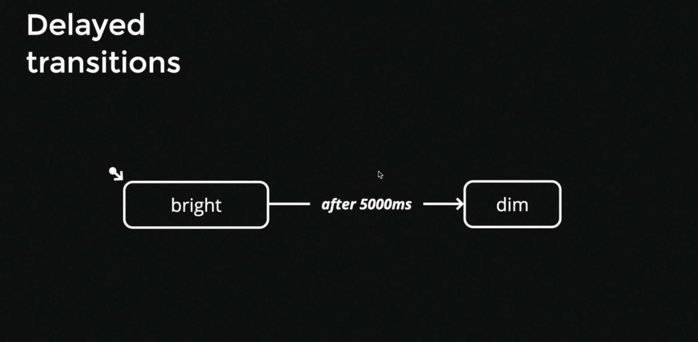

# XState course

[Repo](https://github.com/davidkpiano/frontend-masters-xstate-workshop)
[Slides](https://static.frontendmasters.com/resources/2020-05-14-state-machines-xstate/state-machine-xstate.pdf)
[Slides - Interactive](https://slides.com/davidkhourshid/xstate-workshop?token=NuUhf7a4#/53)

Bottom up approach - jump state into the code, without modeling

```js
el.addEventListener("click", () => {
  // do something...
})
```

This isn't very maintainable - imageine if we have a fetch inside that handler, if user clicks more than 1 time we make multiple requests. We don't want that button to be clickable

Instead of having one central palce for our logic we'll have it scattered througout event handlers

The code that is bottom up is:
- difficult to test
- diffitcult to understand
- will contain bugs
- difficult to enhance
- more features make it worse
  - combinatorial explosion: 2 choices = 4 scenario, 3 choices = 8 scenarios (2^3)
  - exponential more ways that the app can work

## Why use state charts?

Curiosity Rover - programmed using state charts


diagrams - describe every single state and every single transition - it's excatly what code will enable.

we would like to predict everything that could happen (we don't usually know every single possible state at the very beginning just like the rover on Mars).

## Graph theory

Applications are structured as graphs
- node (or vertecies)
- edges

Each node is connected by an edge

Directed graphs: each node has a direction


Source node - no incoming edges
Sink node - no outgoing edges (no exit)
Transfer nodes - every other node - allows going in-between nodes

Finite State Machines ARE directed graphs

FSM are considered a quintuple - have 5 important parts.

Finite states (mode / status)
You can only exist in one state at a time


State don't describe "extended" state - stuff that might be infinite (weight, age, etc.)

Transitions


Events


Every FSM has initial state - there is only 1 initial state


We have a pseudotransition marked on the state diagram.

Final states - once you reach them, FSM considers itself as done
(also called Accepting states)

> Example: RegExp - once you reach the end you can consider it as a final state - we know if the string is accepted or rejected.

## Writing state machines in Vanilla JS

When writing state machines we don't start with events - we start with states.

By using switch statements:


Think of "what is the behaviour of my app when it is in *this* state" - what my app is doing in "idle" state?

By splitting our app by all the possible states we can prevent "impossible transitions" - transtions that should never, ever happen. However even if we're sure, we'll still have to do something when unexpected impossible transtion happens - in the example, we just return the state (silent fail).

By using objects


### Interpreting state machines

Takes a state machine, it will take care of keeping the state so that whenever you send events to it it's just going to internally update the current state.

Example:
```js
// Keep track of the current state
let currentState = machine.initial;

// Receive events
function send(event) {

  // Determine the next state
  const nextState =
    transition(currentState, event);

  // Update the current state
  currentState = nextState;
}

// Send some event
send("CLICK");
```

We can then use this `send` function in our event handler. Thanks to this we reduce the purpose of event handlers to just emitting events - our state machine will take care of them.

### Interpreting

If we would add external side effects to the interpreter it gets a little bit more difficult to manage - that's where the XState comes in.

## XState

XState stores each state as a separate object: `StateNode`.


### Transitions

To make transitions there are 2 syntaxes for that:

```js
states: {
  question: {
    on: {
      // action: sibling_state
      CLICK_GOOD: 'sibling_state'
    }
  }
}
```

or

```js
states: {
  question: {
    on: {
      CLICK_GOOD: {
        target: 'sibling_state'
      }
    }
  }
}
```

### What's inside the state object?

- value: what state are we currently on
- event: internal XState data for handling events
  - initial event has `type: xstate.init`

### Event

Can be a plain string, or an object.

```
{
  type: 'CLICK_GOOD'
}
```

it looks like redux actions.

We can also pass payload for the event - it will be stored inside the `event` object.

To run the transition:

```js
const clickGoodEvent = {
  type: "CLICK_GOOD",
  // payload goes here
};

const nextState = feedbackMachine.transition(
  feedbackMachine.initialState,
  clickGoodEvent
);
```

This is what we get from the transition function (next state):


If we don't want to pass anything as payload we can just use the event as string

```js
const nextState = feedbackMachine.transition(
  feedbackMachine.initialState,
  "CLICK_GOOD"
);
```

### Interpret Function

Services keep the state for us, so that we don't have to use the `.transition` all the time.

XState language:
- **machine** - blueprint of how it's supposed to work (class)
- **service** - working instance of a machine (object / instance)
  - we can thing of it as a singleton

Machine doesn't hold any state. It's not a mutable object. In other words - fancy JSON object.

To listen to actual changes inside the interpreted machine (service is the interpreter) we use `onTransition`.

Services don't start immediately - we have to start it manually `service.start()`

```js
import { createMachine, interpret } from 'xstate';

const feedbackMachine = createMachine({
  // ...
});

// Create a "service" instance
const feedbackService = interpret(feedbackMachine);

// You can add a listener that receives
// the current state on every transition
feedbackService.onTransition(state => {
  console.log(state);
});

// At first, the service didn't start yet...
// So start it!
feedbackService.start();
```

To send an event:

```js
feedbackService.send({
  type: 'CLICK_GOOD'
})
```
(it's equivalent to `.transition` - except it mutates the state inside the service)

#### Closing service

When we're not using service anymore it's good to call `service.stop()`

It's going to:
- dispose of all listeners registered to the service
- dispose of any ongoin activities, actions or invoked services

(it's like the return function inside `useEffect`)

## Actions

**Actions** in State Machines are a side effect

Types of action:
- on exit - run whenever the state is moved out
- on entry - run whenever the state is entered
- on transtion


Action order example


1. Exit actions
2. Transition actions
3. Entry actions


We don't want to depend on that order too much - if you start to depend inside action on another action then you should probably remodel that into separate states.

In XState:


Multiple actions: provide an array (actions will be run at the same time).

We can override the actions that were used inside the state machine by providing second argument to createMachine:

```jsx
const machine = createMachine(
  {
    initial: "idle",
    states: {
      idle: {
        on: {
          mousedown: {
            // Add your action here
            // ...
            target: "dragging",
            actions: setPoint,
          },
        },
      },
      dragging: {
        on: {
          mouseup: {
            target: "idle",
          },
        },
      },
    },
  },
  { actions: { setPoint: () => {console.log('overridden')} } }
);
```

Instead of running the function that was provided inside our action it will run the one provided inside the config object (`console.log('overridden')`). That's good for testing if we want to mock our actions.

Start off with transition actions, once you start noticing that a lot of actions are being repeated in transtions (that go to the same state, exit the same state) it's a sign that we could reafactor that into exit and entry actions instead.

Note: moire machines vs mealy machines

### State charts

Invented by David Harel - http://www.inf.ed.ac.uk/teaching/courses/seoc/2005_2006/resources/statecharts.pdf

UML - has adopted many of the syntaxes from that paper

Statecharts are more than state machines - they have depth (states inside states), orthogonality, broadcast communication (state machines talking to each other)

Statecharts can be transformed into state machines (don't introduce anything outside).

Finite state - qualitative data, it's either on or off. It describes the behaviour. (Lightbulb behaves differently based on wether it's turned on or off).
**Extended states** - quanitative data, it's potentially infinite

Combination of both qualitative and quanitative data makes the overall state.

In XState it's *context* that's the extended state.

Assignment to extended state is a side effect. Ideally the assign functions are pure functions


Assign action can be written in 2 ways:
- object to assign (static assignment)

```jsx
assign({
  message: "Hello"
})
```

- based on context
  - function that taks context + event

```jsx
assign({
  count: (context, event) => context.count + event.value
})
```

(this one is better)

or

```jsx
assign((context, event) => {
  return {
    message: 'Hello',
    count: context.count + event.value
  }
})
```

If we use the object syntax XState will know what properties we are assiging to and will show that on the state chart:


`assign()` is a pure function that returns an object - object that matches internal XState definition for assignment

```js
{
  assignment: {
    // ...
  },
  type: 'xstate.assign'
}
```

We can check if our finate state changed or if any side effects occured (assignment / other action) in `state.changed` (no deep or shallow check - we can only change the context inside the assign action).

Dots in event names are a way of specifying what a particular event means (ex. `keyup.escape`) - everything with keyup is related to keyboard, after dot we add more information (ex. keyup.shift, keyup.arrowup)

## Guarded transitions

Transtions that have a conditional guard (cond). This guard tells us wether we're allowed to take that transition.

If it result is falsey then the transtion cannot be taken.


(ex. checking payload in the event, context satisfies criteria)

Inside the trensition:

```ts
{
  target: 'loading',
  // ...
  cond: (context, event) => {
    return context.retries < 5;
  }
}
```

To make the cond appear nice in the visualizer we can serialise it:

```ts
{
  target: 'loading',
  cond: 'noExceededRetries'
}
// ...
, // second argument to createMachine
{
  guards: {
    noExceededRetries: (context, event) => {
      return context.retries < 5;
    }
  }
}
```

## Transient transitions

They happen on `null` events (or no event at all)... They are automatically taken when you enter the state.

They're most usefull when working with conditionals - if you have a guarded transition you can immediately choose where to go next.


Transient state - has no event based transitions (only transient transitions)

> TIP: everything in brackets on diagrams is transition guard

In XState:

```ts
import { createMachine } from 'xstate';

const isAuthorized = (context, event) => {
  return !!context.user;
}

const appMachine = createMachine({
  initial: 'checkingAuth',
  context: {
    user: null
  },
  states: {
    checkingAuth: {
      on: {
        '': [ // <- transient transition
          {
            target: 'dashboard',
            cond: isAuthorized
          },
          { target: 'login' }
        ]
      }
    },
    login: {},
    dashboard: {}
  }
});
```

## Delayed transitions

Transition happen in 0 time, always.
When we make a transition to another state we can always assume that it will take 0 time.
Transitions are never asynchronous.



In order to do that:


Special `delay` action - it says to interpreter (XState interpreter) to send machine a special action: `xstate.after.xxx` after specified delay.
If we change state while the delay hasn't finished we need to cancel that event - and XState takes care of that


XState syntax:
```tsx
myState: {
  after: {
    5000: {
      actions: () => {
        console.log("it happened after 5000ms");
      },
      target: 'afterDelay'
    }
  }
}
```

Note - when we leave the state XState sends another special action: `xstate.cancel`. So that the action won't happen (even if we re-render the same state).

Parametrised delays:

```ts
myState: {
  after: {
    TIMEOUT: {
      // ...
    }
  }
},
// ...
// xstate options
{
  delays: {
    TIMEOUT: 5000
  }
}
```

## Hierarchical States

You can nest states in each other like russian dolls

Before:


After:


If our nested state machine doesn't handle the event, we check it's parent - it works like events inside the DOM (bubbling up)
We go from deepest child to the parent state.

In XState we provide our state with `initial` and `states` properties just like in the root of `createMachine`:
```ts
const displayMachine = createMachine({
  initial: 'hidden',
  states: {
    hidden: {},
    visible: {
      initial: 'light',
      states: {
        light: {},
        dark: {}
      }
    }
  }
})
```

State value in that case will be an object instead of the string

```js
{
  // ...
  value: {
    visible: "light"
  }
}
```

Thanks to this in nested states we can override only selected actions if we want to

```ts
{
  states: {
    nestedState: {
      on: {
        mousemove: () => {
          // overriden implementation
        }
      }
    }
  },
  on: {
    mousemove: () => {
      // ...
    }
  }
}
```

### History states


Instead of always going to "light" when we "TURN_ON" we'd like to remember our choice - that's what history states are for


This state means - go to the last visited child staate of this parent state

History states are not used to go back and forth between different states - that's what context is for.
History state is about last visited child of a parent state.

"pseudostate"

```js
{
  myState: {
    initial: 'one',
    states: {
      one: {},
      two: {},
      hist: {
        type: 'history' // <- this is how we define the history state
      }
    }
  }
}
```

Set the `target` of the history state to set the default target when there is no history. Without this, the machine will just go to the initial state of the parent state, which works for most use-cases.

How it works?
History is kept inside the `historyValue` object of state machine - it stores last state + last state of any nested state

```ts
{
  historyValue: {
    current: {visible: 'dark'},
    states: {
      hidden: undefined,
      visible: {
        current: 'dark',
        states: {
          dark: undefined,
          hist: undefined,
          light: undefined
        }
      }
    }
  }
}
```

### Paralel states


Isn't it a paradox to state machines that have a single state? 🤔

Another name: **orthogonal states**

It doesn't divert from state machine - it simplifies the common editorial explosion of states which are otherwise orthogonal to each other

In this example there are 4 state combinations inside "visible" nested state. The more states you add it grows exponentialy (editorial explosion). By representing those states as orthogonal regions we don't have a mess of defining combinations of states.

It's not multiple states at the same time - it represents combination of states (or regions) it simpler way than writing each possible combination explicitely.

```
LightBright
LightDimm
DarkBright
DarkDimm

=>

{
  light:  'light/dark',
  brightness: 'dimm/bright'
}
```

XState - on the parent set `type: parellel` - it means that each child state is going to be active at the same time.

```ts
{
  visible: {
    type: 'parallel',
    states: {
      // ... nested states go here
    }
  }
}
```

> PROTIP: `state.toStrings()` will output an array of strings that represent the current state.
> In the case of paralell states it will output all the active paralell states

## Actor Model

It's not directly related to State Machines and state charts - but it works really well together


Actor is an entity tha can do one of 3 things:
- send a message to another actor
- create new actors (have child actors)
- change its behavior in response to a message

We cannot read the actor state - ON PURPOSE, it's private and local.
The actor can eventually send the message back to the parent

Invoke in XState allows to invoke (it's a property inside the machine object) a promise, callback, obserable, another machine (it can send messages to the original machine)

All of our previous actions were call and forget - actor on the other hand is spawned and can send back messages to the parent.

When to use invoke? When we might call the machine back with an event (instead of running the action)

`src` - it creates a thing that can be invoked
`onDone` and `onError` - just a regular transition

```js
{
  state: {
    invoke: {
      src: (context, event) => {
        return randomFetch();
      },
      onDone: () => {
        target: 'resolved'
      },
      onError: () => {
        target: 'rejected'
      }
    }
  }
}
```

this translates roughtly to:
```ts
{
  on: {
    'done.invoke.xxx': 'resolved'
  }
}
```

This whole invoke object is just a syntactic sugar to what XState interpreter is doing internally but to the machine itself it's just another action

Invokations will be cleared out as soon as we leave the state that invoked it.
Internally the XState is still going to let the prommise run, but it will discard whatever result will come back (it doesn't use AbortController).

### with callbacks

For callbacks XState expects a function that accepts two arguments: `sendBack` and `receive` - sendBack is for sending messages from the callback, `receive` is for responding to messages from machine

How to send messages from machine to actor? 🤔

We have to create new action that uses special function `send` from XState and specify which actor it will send this message to.

```ts
on: {
  SEND_IT_ALREADY: {
    actions: send(
      {
        type: 'SEND_IT_ALREADY'
      },
      {
        to: 'child'
      }
    )
  }
},
invoke: {
  id: 'child',
  src: (context, event) => (sendBack, receive) => {
    receive(event => {
      if (event.type === 'SEND_IT_ALREADY') {
        sendBack({
          type: 'I_AM_DONE'
        })
      }
    })
  }
}
```

### spawn vs invoke

Invoked actors are immediately stopped whenever you exit the states.
Spawned actors can be spawned at any time (ex. due to evetns) they are alive for indefinite period of time - until machine is stopped.

Prefer invoke over spawn

Spawn is more for dynamic number of actors that you would like to spawn.
Invoke is for single actor or set number of actors that are working only within the specified states.

## vs Redux

Event driven moddeling - Redux is chatty, because every single update that happens to it is going to tell everyone "Hey! I have some new state".

Actor model naturally separates state into separate actors. Parent state just spawns new actors. Parent will never know that the actor updated the context unless it explicitely calls an event.

Redux - change value = send event about change
XState (or FSM) - change valie != send event about change

If you *can* separate the behavior into separate actor you probably *should* do it. Unltimately though this is a modeling problem (if we want our app to be in one state chart or multiple).

> You can thing about this in terms monolyths vs microservices

## Using with React

> TIP: You can use machine as a plain reducer that doesn't emit any side-effects

Just use the useMachine hook. This hook works kinda like `useReducer`

```tsx
const [current, send] = useMachine(/* ... */);
```

XState machines are not framework dependant - we can copy-paste it into Vue / Angular / etc. and it will still work

### With context

You can put service in context and it won't cause re-renders - because service **never** changes.

We can subscribe to the service, but the service instance itself never changes - `useService`

## Using with RxJS

The interpreted machine (service) is an obserable (it implements an obserable interface).

## Final notes

Why aren't state machines more commonly used?


(state machine is simpler than state chart)

FSM are not complex when we have little states, but as soon as we start adding more states it grows in complexity, exponentially. Then it becomes more complex than regular "bottom-up" programming.

Statecharts have more steep learning curve at the beginning but once our app gets to high level of complexity we're going to see how well they deal with complexity.

With bottom-up we would have to check every instance of our event handler, pice of code that might touch that state when we change something (linear growing complexity).

State charts are not used so commonly because of that seep learning curve.

XState is like redux but more rigid - becase we now have a rules for how to move around our state.

Plot twist - XState doesn't introduce anything new - it's directly based on SCXML (it even uses the same algorithms SCXML uses). It means that XState is standardised, it's based on a spec.

More to explore:
- XState 5
- [Model-based testing](https://saucelabs.com/blog/the-challenges-and-benefits-of-model-based-testing)
- Automatically generating analytics from state transitions
- Predicting which states can be traveled to depending on the user

More links:
- [World of Statecharts](https://statecharts.dev/)
- [Github Community](https://github.com/statecharts/statecharts/discussions)