# CSS

## Interesting properties

- [overflow-anchor](https://css-tricks.com/almanac/properties/o/overflow-anchor/) - do not repaint when content loads and you've scrolled down the page
- [touch-action](https://developer.mozilla.org/en-US/docs/Web/CSS/touch-action) - disable touch screen actions (zoom, pan, etc.)
- [CSS Containment](https://developer.mozilla.org/en-US/docs/Web/CSS/CSS_Containment) - speed up paint?!
- [scroll-snap](https://css-tricks.com/practical-css-scroll-snapping/) - mobile app like websites (scrolling left / right)

## Selectors

**WARNING** When using multiple selectors separated by `,` if one of the selectors is invalid then the whole thing is thrown out of the window.

Example:
```css
.menu:hover, .menu:focus-within {
  color: red;
}
```

This is a problem if we're supporting older browsers like IE that don't support pseudoclass `:focus-within`

In that case we have to write to separate selectors:
```
.menu:hover {
  color: red;
}
.menu:focus-within {
  color: red;
}
```

## Fonts
### rem vs px

This isn't a big issue for accessibility since user can increase size of the page by using CMD + `+`.

However if we use the `rem` then our page will respect default browser font-size that the user can change (so they don't have to fiddle with settings on per page basis).

### font-weight

If we provide named weights (bold, light, etc) but not the specific version of the font the browser will create this font weight to make it appear bold (it sucks). Providing just the number, ex. `700` disables this behavior.

## Fun facts

Chrome default browser-agent styles: https://source.chromium.org/chromium/chromium/src/+/master:third_party/blink/renderer/core/html/resources/html.css

[List of inheritable properties](https://www.sitepoint.com/css-inheritance-introduction/#list-css-properties-inherit)

[CSS Mistakes by CSSWG](https://wiki.csswg.org/ideas/mistakes)

## Rendering logic

### Cascade

This is how the **cascade algorithm** would be written in JS:

```js
const appliedStyles = {
  ...inheritedStyles,
  ...tagStyles,
  ...classStyles,
  ...idStyles,
  ...inlineStyles,
  ...importantStyles
}
```

### Cardinality

Content is structured along a block axis (top to bottom) and an inline axis (left to right)

- *Block direction* is like lego blocks: they stack together one on top of the other.
- *Inline direction* is like people standing in-line; they stand side by side, not one on top of the other.

[CSS writing modes for other languages](https://24ways.org/2016/css-writing-modes)

#### logical properties

[MDN Docs](https://developer.mozilla.org/en-US/docs/Web/CSS/CSS_Logical_Properties)

Use start and end of *block* (top / bottom) and *inline* (left / right) elements instead of the default cardinal (left, right, top, bottom) directions. Usefull when we plan to use languages that aren't LTR (RTL like Arabic)

## Box model

### content-box vs border-box

Two values for property `box-sizing`. Content-box is the default behavior

```css
section {
  width: 150px;
}

p {
  width: 100%;
  padding: 16px;
  border: 2px solid;
}
```

The width of the paragraph will be: 150px + (2 * 16px) + (2 * 2 px) = 186px;

The dimension of child: padding and border will be **ADDED** to the base dimension. The content space provided by parent is taken as is (width: 150 is 150, padding and border isn't taken into account) because its own width and height will grow not changing the internal content space.

If we provide the `box-sizing: border-box;` the algorythm is flipped: the final width will be 150px - the content box (blue in Chrome Dev Tools) of the element will be shrunk in order to preserve that 150px width.

The dimension of child: padding and border will be **SUBTRACTED** from the base dimension. The content space provided by parent is calculated by subtracting its padding and border. However if the dimension is 0 then padding doesn't add new height

To summarize:
content-box => don't change internal content space provided by width and height, grow outwards if needed
border-box => shrink internal content space to fit width and height

Another example:

```CSS
section {
  width: 500px;
  height: 400px;
  padding: 30px;
}
.box {
  width: 100%;
  height: 100%;
  border: 1px solid black;
}
```

Boxes width and height will be 470 px x 370 px as the padding subtracts available space from our element


#### Set border-box to every element

```css
*,
*:before,
*:after {
  box-sizing: border-box;
}
```

### padding

**GOTCHA** - `%` padding is *always* calculated based on width (height doesn't matter) even for top / bottom padding.

#### shorthand order

Many CSS properties support shorthand for top, right, bottom, left. The best way to remember the order is to imagine a clock:

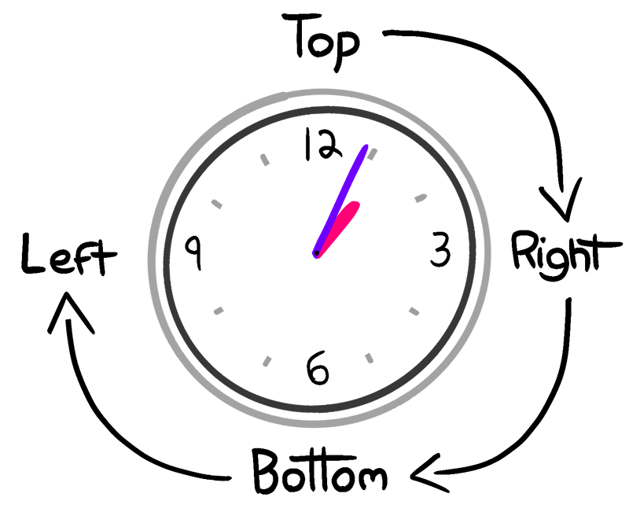

When fewer than 4 values are passed, it "fills in the gaps". If you pass it two values, it mirrors the top to the bottom, and the right to the left. With only 3 values, it fills the final remaining value (left) with the supplied value for the right.

A similar pattern is used for properties that affect corners, like border-radius; the pattern is top-left, top-right, bottom-right, bottom-left. It follows a clockwise pattern starting from the top-left.

"Long-form" properties can overwrite the relevant value in shorthand properties. The effect is the same, but it's a bit more semantic; instead of a random string of numbers, we're declaring that we want 32px of padding, hold the bottom.

```CSS
.box {
  padding: 48px;
  padding-bottom: 0;
}
```

### border

Default border color is the text color if not specified. We can be also explicit about it by providing `currentColor` as the value:

```CSS
.box {
  color: hotpink;
  border: 1px solid currentColor;
  box-shadow: 2px 2px 2px currentColor;
}
```

#### border vs outline

They're simmilar, except *outline doesn't affect layout*. It's more like box-shadow - it doesn't change the elements size.

Outlines are stacked outside border, thus can be used for second border effect.

```css
.double-border {
  border: 4px solid darkviolet;
  outline: 4px solid deeppink;
}
```

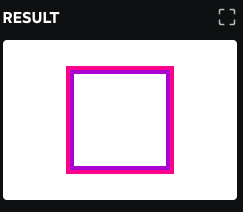

Outlines have a special `outline-offset` property. It allows you to add a bit of a gap between the element and its outline.

### margin

[Negative margins](https://www.quirksmode.org/blog/archives/2020/02/negative_margin.html)

Negativ margins:
- can pull element outside parent (margin-top)
- can pull sibling closer (margin-bottom)
- affect all siblings (margin-top moves all following elements)

#### auto

Setting `auto` margin value for left and right centers the elmenet.

It only works if the elmenent has *fixed width*.

If the width isn't explicitly set, the element will fill the whole space, and there will be no leftover space.

## Flow layout

### inline

#### Inline elements don't want to make a fuss
Therfeore setting width, height won't work.

> You can picture inline elements as go-with-the-flow-type folks. They don't want to inconvenience anyone by pushing any boundaries. They're like polite dinner-party guests who sit exactly where they're assigned.

> You can shift things in the inline direction with margin-left and margin-right, but you can't change its width or height. And in terms of the block direction, an inline element is where it is, and that's the end of the story.

Exception: *replaced elements*
It's a an element that embeds foreign object (image, video, canvas). These elements are technically inline but can be given width, height, margin-top (unlinke regular inline elements).

> I like to pretend that it's a foreign object within an inline wrapper. When you pass it a width or height, you're applying those properties to the foreign object. The inline wrapper still goes with the flow.

There are also **buttons** - they work simmilarly to replaced elements.

#### "magic space"

Inline elements have "magic space" to align with text. Browser treats it like typography and you don't want text lines to clash into each other...

This can be a problem for images though. To fix the issue:
- use `disply: block`
- set `line-height` to `0`

Another magic space is from HTML itself. HTML is space-sensitive. Browser can't tell the difference between space in code (for asthetic purposes) and space in text. So if we have bunch of images with spacing in HTML they will have this akward space:

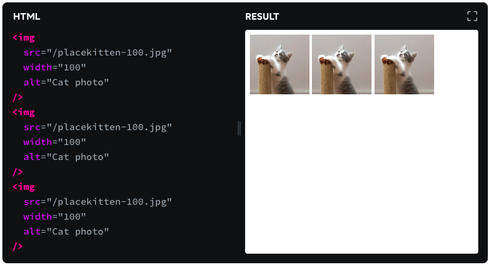

#### line wrap

Inline elements are one shape

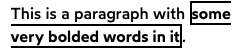


### block

Block elmenets expand to fit all width. We can disable this by using `width: fit-content`;

### inline-block

It's an element that *internally* acts like a **block** element, but *externally* acts like an **inline** element

Inline-block doesn't line-wrap.

### width

By default every block element has width: auto - the element will take as much width as possible but not more (ex. if the element has margin then it won't overflow the page).

It will respect contstraints.

In contrary the width: 100% will always take 100% of parent's width *no matter what* - this can cause an overflow if we have some margin

#### min-content

The element will take as little width as possible for its children.

This value is known as an **intrinsic** value, while measurements and the auto keyword are **extrinsic**

The distinction is based on whether we're focusing on the element *itself*, or the space made available by the element's *parent*.

#### max-content

It never adds line-breaks to the text. The width will be the smallest value to fit all text in one line.

It doesn't respect any contstraint

Unlike with auto, max-content **doesn't fill the available space**. If we want to add a background color only around the letters, this would be a neat way to do it!

#### fit-content

If we can fit everything in one line (in parent): behave like `max-content` - don't add line breaks

If we can't fit everything in one line: behave like `auto` - add line breaks so everything fits

### height

Elements will take as little height as possible by default (like width min-content).

#### 100% viewport

Setting min-height: 100% on element itselt won't work, because `<body>` (percentage is based on parent) doesn't have any height by default, instead it fallbacks to the "take as little space" behavior.

> In other words, we have an impossible condition: we're telling the `<section>` to be a percentage of the `<body>`, and the `<body>` wants to base its size off of the `<section>`. They're both looking to each other for guidance.

Fix:
- put `height: 100%` on every element before (html and body)
- put `min-height: 100%` on the wrapper
- don't use % based heights inside the wrapper

When we set height to 100% on html and body they take the whole viewport size.

Why not `vh`? Because freaking mobile browsers.

When you scroll on a mobile device, the address bar and footer controls slide away, yielding their space to the content.

To avoid flickering UI issues, browsers like iOS Safari and Chrome Android will set `vh` equal to the maximum viewport height, *after scrolling* - so when the page first loads the height will be a bit bigger than the viewport

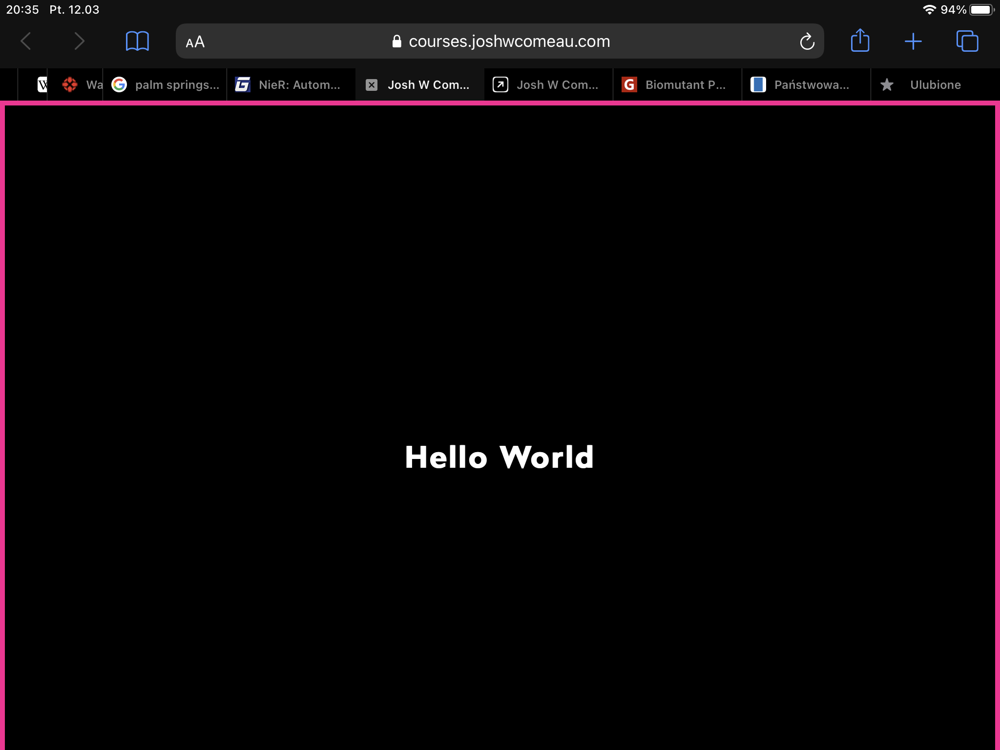

## Margin collapse

Margin is meant to increase the distance between **siblings**. It is not meant to increase the *gap* between a child and its parent's bounding box; that's what **padding** is for.

Margin will always try and increase distance between siblings, even if it means **transferring margin to the parent element!**

This works if:
- No other elements in-between (see earlier rule, about the <br>).
- The parent element doesn't have a height set.
- The parent element doesn't have any padding or border along the relevant edge.

You can think of padding/border as a sort of wall; if it sits between two margins, they can't collapse, because there's a wall in the way. The width doesn't matter, either; even 1px of padding will interfere with margin collapse.

**0px margin is still a collapsible margin.**

#### Negative margin + positive margin

They are added together

-75 px + 75px = 0

What if we have more than 2?

- Find the highest positive margin
- Find the highest negative margin (absolute values)
- Add those numbers together

> Margin is like putting glue on something before you’ve decided what to stick it to, or if it should be stuck to anything.

## Relative positioning

Default position is `static`

Just setting `position: relative;` enables some properties + it constraints certain children

Properties:
- top
- left
- right
- bottom

Changing these values enables us to move out the element out of the default layout without changing position of other elements

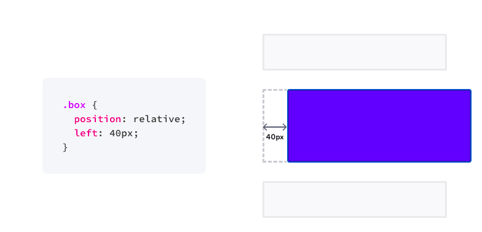

Unlinke margin we don't move other elements:

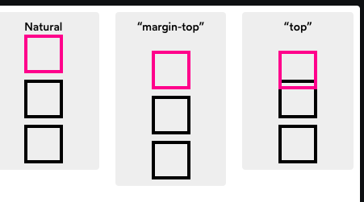

Unlinke margin it doesn't change the dimensions of the element (if we don't provide specific dimensions like width)

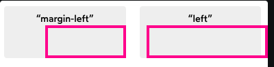

> Sometimes you want to shift an item around independently, and sometimes you'll want it to remain "context-aware".

It works both for `inline` and `block` elements.

## Absolute positioning

It sticks out the element regardless of its position in the DOM.

Absolutely-positioned elements are adjusted based on their container, not based on their in-flow position.

When we set position absolute we pull them out of the regular flow. When the browser is laying out elements, it effectively pretends that absolutely-positioned elements don't exist.

### collapsing parent

If we use absolute positioned element inside another element it trets it as if it was empty - the parrent collapses its height and width.

### line wrapping

Absolute elements behave more like inline elements - they take as little space as needed (they won't fill the width as block elements do)

Absolute positioned elements will try its best to *not* overflow and will line-wrap

If we provide a dimension (right / left) then it will keep that distance, but if it won't be able to line-wrap then the content will overflow.

If we don't provide the dimension then the box will expand in size to fit the content (although the scroll on the page will show)

### single axis

If we don't provide values for one axis (top-bottom / left-right) then it will use the default "in-flow" position

Example:
```css
 .active {
    position: absolute;
    left: -10px;
    background: deeppink;
    width: 20px;
    height: 20px;
    border-radius: 50%;
  }
```
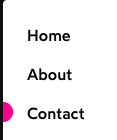

What about moving the item within that "in-flow" position?

We can't specify top/bottom beceuse the element will be bound to the page itself. Instead we can use **margins**!

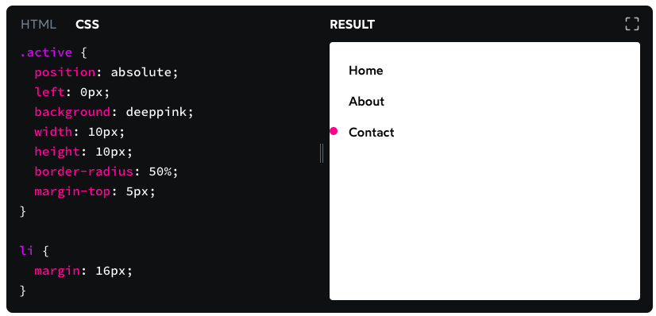


The margins will keep the element in flow and won't cause any changes to outside elemenents

### centering

We can't be specific both for absolute positioning (top/bottom/left/right) and element dimensions (width / height) - the dimensions will always win and the positioning will just be ignored

However if we provide `0` as the position value, specified element dimensions and `margin: auto`?
The element gets centered **horizontally** and **vertically**!

The requiremenets:
- `position: absolute`
- All 4 cardinal directions (top/left/right/bottom) set to `0px`
- An explicit width and height
- `margin: auto`

That's great for modals!

## Containing blocks

**Only non-static elements can constrain absolutely-positioned children.**

> Here's how the algorithm works: When deciding where to place an absolutely-positioned element, it crawls up through the tree, looking for a non-static parent (any element that has a position other than the default value of static).

> - If it finds one, that element becomes the **containing** block, and the absolute child will be anchored to that element.
> - If it doesn't find one, it'll be anchored based on the *"initial containing block"*, a box the size of the viewport at the very top of the document.

Our absolute positioned element only pays attetion to the closes non-static element.

> It doesn't matter how many parent elements are wrapping the child, it will ignore all of them until it finds a position. It doesn't have to be relative, as seen here, but it has to be set to something; it can't be the default value of static.

The absolute elements ignore any padding of its parent.

## Stacking context

Elements are laid out by the order they have been placed in DOM.

Absolute positioned elements are laid out separately after everything. They are compared against each other.

> We can think of rendering in this case as two-stage: for a given set of siblings, it first paints the static items (based on their DOM order), and then paints the non-static items (based on their DOM order). If we set both boxes to be position: relative, for example, we see the original behaviour again; because they're both part of the same "stage", the second box is stuck on after the first box.

We can use z-index to break out of this and change the order.

### Creating stacking context

We create new stacking context by combining:
- non static positioning (`relative` or `absolute`)
- `z-index`

Other properties that create new stacking context:
- Setting `opacity` to a value less than `1`
- Setting `position` to `fixed` or `sticky` (No z-index needed for these values!)
- Applying a `mix-blend-mode` other than `normal`
- Adding a z-index to a child inside a `display: flex` or `display: grid` container
- Using `transform`, `filter`, `clip-path`, or `perspective`
- Explicitly creating a context with `isolation: isolate`

[Full list](https://developer.mozilla.org/en-US/docs/Web/CSS/CSS_Positioning/Understanding_z_index/The_stacking_context)

### Comparing z-indexes

Z-index affect elements within the same stacking context. It's like semantic versioning:

```css
.header {
  position: relative;
  z-index: 2
}

.main {
  position: relative;
  z-index: 1
}
```

```jsx
<body>
  <header /> // 2.0 (z-index: 2)

  <main> // 1.0 (z-index: 1)
    <tooltip /> // 1.999999 (z-index: 99999)
  </main>
</body>
```

In this example no matter how much we increase the z-index of tooltip it will always be beneath the header because the comparison is between `<header>` and `<main>` not `<header>` and `<tooltip>`. Thats beecause header and main create each a stacking context. We don't compare items that are children of stacking contexts.

### Reducing z-index

**When possible, rely purely on DOM order, not z-index.**

**However!** If a DOM swap causes the tab order to be confusing, *it isn't worth it*; you should use some of the z-index management strategies...

### Isolated context

When we use z-indexes inside isolated component we want to be just that - isolated.

We don't want any of our effects to affect other parts of the page.

In order to do just that we can create a new **stacking context** for our component. This way the component will behave exactly like any other element of page (later = on top).

We don't pick up any z-index either! This is the first step in the dreaded *z-index war*.

Instead we use `isolation: isolate;`. That's it.

*NOTE* If we have to support IE we can use other methods of creating stacking context (however this one is the most explicit)

#### Portal

The same trick works with portals!

If we mess with `z-index` in our app and use portals (for ex. modals) then that modal expects to work by beeing the last thing in the DOM.

To fix this problem we can add `isolation: isolate` to the main React (or any framework) node.

## Fixed position

Elements with `position: fixed` are positioned relative to the viewport.

They aren't bound to any non-static parent like `position: absolute`.

### Breaking fixed position

Fixed position breaks if the element is contained in parent that uses `transform`

```css
.container {
  margin: 50px;
  border: solid hotpink;
  /*
    This property breaks
    fixed positioning on
    ALL descendants:
  */
  transform: translate(1px, 1px);
}

.fixed {
  position: fixed;
  top: 0;
}
```

It doesn't matter how much nested is the element - if any of its parent, grandparent, etc. has this property - the position fixed will not work.

Instead it will be positioned as it would have property: `position: absolute`

## Overflow

macOS with trackpad hides the visible scrollbar by default

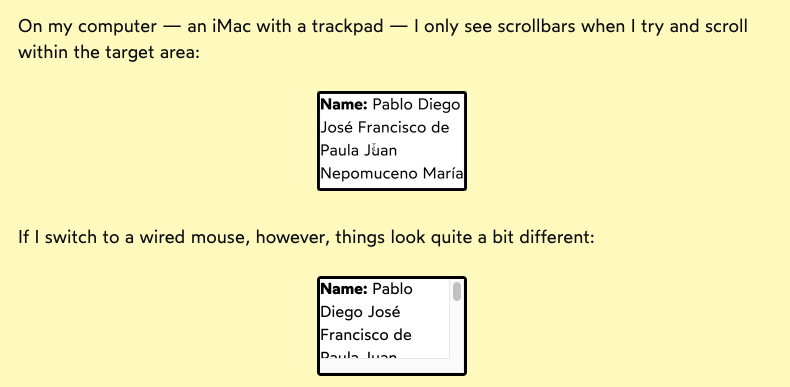

Most often if we want element to have a scrollbar we should use `overflow: auto` - if it fits - no scrollbar, if it doesn't - scrollbar

There's one caveat though! When content changes and suddenly requires scrollbar the content box width will shrink by ~15px to accomodate the scrollbar.

> This can be a bit jarring, so if you know that a container will need to scroll, using overflow-y: scroll can make for a smoother experience.

> An example might be any UI with a "Load more" button. If we know that the additional content will not fit in our container, I like to start with the scrollbar. The sudden appearance of a scrollbar will cause content to shift (depending on the browser/OS).

Hiding overflow can be good as well - if we want to prevent the scroll and expect elements to overflow (too long text, decorative elements)

> Adding detailed comments when using `overflow: hidden` is absolutely critical. Otherwise, you'll never remember why you set the property. If you refactor this property away, it won't be immediately obvious that you've broken something; it only causes problems on mobile, and this is primarily a desktop application.

### Horizontal scroll

If we want elements to have horizontal scroll we have to use `white-space: nowrap` - because by default block and inline elements will wrap to new line to fit.

Why not `no-wrap`?! That's a mistake in the language xD

> Here's an easy way to remember this peculiarity: it's like the word “nonsense”. It's not “non-sense”, after all.

## Position sticky

When not scrolled - positioned relative
When scrolled - position fixed

Sticky elements stay in their parent. If the parent scrolls out of viewport so does the element.

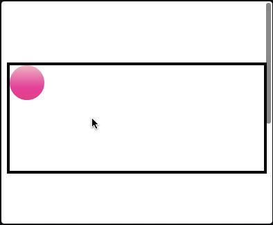

Summary:
- With relative positioning, the element is shifted from its natural, in-flow position
- With absolute positioning, the element is distanced from its containing block's edge
- With fixed positioning, the element is adjusted based on the viewport
- With sticky positioning, the value controls the minimum gap between the element and the edge of the viewport while the container is in-frame.

Sticky elements are like relative or static elements in this regard; they're laid out in-flow. They take up real space, and that space remains taken even when the element is stuck to an edge during scrolling.

> *Note*: Chrome and Edge support sticky positioning on th elements, but not on thead or tr. If you want to have sticky table rows, you might be out of luck.

Sticky element won't stick if:
- parent is too small
- one of its children has overflow set to `hidden`, `scroll` or `auto`

## Hidden content

### `display: none`

> It is considerably **faster** for the browser to show or hide an element with `display: none` than it is for React (or similar) to reconcile, and for the browser to create and append a chunk of HTML. The flip-side is that an element that is hidden with `display: none` still **hogs memory**, just like an element that is fully visible. An un-rendered element truly doesn't exist, and so it consumes no memory.

### `visibility: hidden`

It's like a cloak of invisibility - the item can't be seen, but it's still there, taking up space.

It can be selectively undone by children.

```CSS
<style>
  section {
    visibility: hidden;
  }

  .button.two {
    visibility: visible;
  }
</style>

<section>
  <button class="button one">
    First Button
  </button>
  <button class="button two">
    Second Button
  </button>
  <button class="button three">
    Third Button
  </button>
</section>
```

will show Second button

### `opacity`

With 0 opacity:
- Buttons can still be clicked
- Text is still selectable
- Form elements can still be focused

Opacity is helpful when:
- An item needs to be semi-visible
- An item needs to be faded in or out

### Button for screen readers

[React component code snippet](https://www.joshwcomeau.com/snippets/react-components/visually-hidden/)

We can use this CSS to make a Button thats great for screen-reader users.

```CSS
.visually-hidden {
  position: absolute;
  overflow: hidden;
  clip: rect(0 0 0 0);
  height: 1px;
  width: 1px;
  margin: -1px;
  padding: 0;
  border: 0;
}
```

This way a text inside a button won't be visible, but will be read out by screen readers

```jsx
<button>
  <span className="visually-hidden">Contact support</span>
  <HelpCircle />
</button>
```

This CSS is battle tested to work for many browsers. We can also use aria-label attribute... but:
> Using aria effectively is no small task: it's estimated that most aria attributes are incorrect. There are likely subtleties to using aria-label that I'm not experienced enough to identify.

## Pseudoclass

### :before and :after

Technically should be written with `::` but nowadays browsers accept both syntaxes

The content is added *within* the content box (not before/after the element)

These elements are unselectable by default - this makes it great for decorative elements like quotation marks in quote component

### Smart quotes

Provide `quote` property for the element

```css
blockquote {
  quotes: "“" "”" "‘" "’";
}
```

Then use the before and after

```css
blockquote::before {
  content: open-quote;
}
blockquote::after {
  content: close-quote;
}
```

This has the added benefit that if we nest quotes the second pair from `quotes` property will be used

### Hanging punctuation

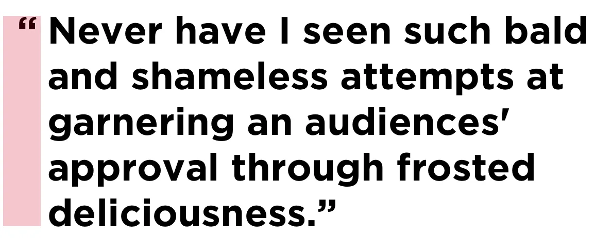

Use negative `text-indent` or `hanging-punctuation` property if available

```css
/* Fallback */
blockquote {
  text-indent: -0.45em;
}

/* If there's support, erase the indent and use the property instead */
@supports ( hanging-punctuation: first) {
  blockquote {
    text-indent: 0;
    hanging-punctuation: first;
  }
}
```

## Global styles

When using CSS-in-JS it is important to keep the global styles for our elements to minimum, so that we can remember it all.

When to use global styles:
- [CSS reset](https://piccalil.li/blog/a-modern-css-reset)
- Baseline defaults
- 3rd party overrides
- CSS Variables

[Older CSS reset by Eric Meyer](https://meyerweb.com/eric/tools/css/reset)