# React

## Reconciliation

[React Docs](https://reactjs.org/docs/reconciliation.html)

aka: how to effectively update the UI when state changes and render function returns different tree of elements

Checking the full tree changes with super-duper optimized algorythm would have complexity of `O(n^3)` (!!). React instead uses heuristic alghorithm (`O(n)`):

1. Two elements of different types will produce different trees.
2. The developer can hint at which child elements may be stable across different renders with a key prop.

Those assumptions are valid for most cases - so it's good enoguh (better than making billions of comparisons)etc.

### Eleemnts of different types

When type of element changes from for example `a` => `img` or `Article` => `Comment` everything below will be unmounted (destroy DOM nodes, unmount components) and then new elements will be inserted (componentWillMount, componentDidMount). Any state is lost. When parent changes _ALL_ children are destroyed even if they are the same component:

```jsx
<div>
  <Counter />
</div>

<span>
  <Counter />
</span>
```

This will unmount and remount `Counter`.

### DOM Elements of the same type

React looks at what attributes changed and applies them to the underlaying DOM node (ex. changes in `className` or `style`)

### Component Elements of the same type

Instance stays the same, state stays the same, props are updated, `render()` is run. The algorythm recurses inside what the `render` returned

### List of elements

When added to the end - no problemo
When added at the start - re-render everything (oh, no)

To fix this - use `key` attribute
Protip: if you don't have anything to use as key, you can add new ID property to the model or hash some parts of content to generate a key. It has to be unique with the siblings (no globally).

Using index when iterating works as long as you don't re-order the elements (then re-render everything on every change). It has other problems so don't do it at all cost

### Other notes

This reconciliation is just an implementation detail (it can change over time to optimize new use-cases).

Also if the assumptions are not met - the app performance will suffer:

1. The algorithm will not try to match subtrees of different component types. If you see yourself alternating between two component types with very similar output, you may want to make it the same type. In practice, we haven’t found this to be an issue.
2. Keys should be stable, predictable, and unique. Unstable keys (like those produced by Math.random()) will cause many component instances and DOM nodes to be unnecessarily recreated, which can cause performance degradation and lost state in child components.

## Fiber - Illustrated

[Presentation](https://www.youtube.com/watch?v=ZCuYPiUIONs)

It's the newest reconciliation algorithm from React 16.

It was created so that React could be used not only on the web but also for: hardware (VR), mobile apps (React Native). This created a difference between _reconciler_ and the _renderer_.

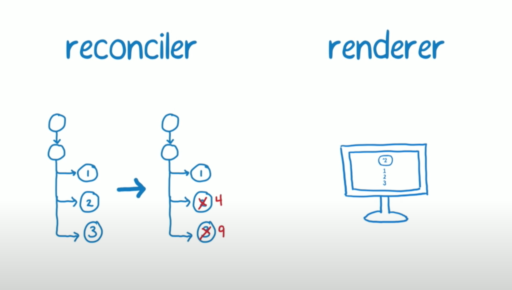

Renderer can be provided by community to target other platforms outside the DOM. There is only **one** reconciliation alg.

_Analogy_
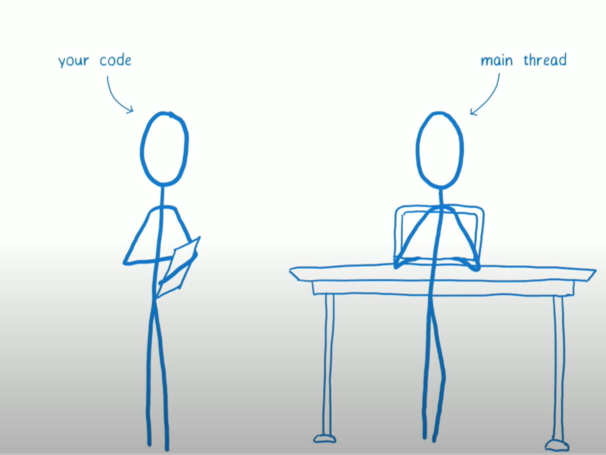

Our code is like PM in a project - giving stuff to do
And it has only one team member - main thread (kinda like Full Stack dev) - it does all the things (JS, CSS animation, paint.
If it's stuck on one thing then, it can't do anything else (that's where the dropped frames come from)

There comes react:
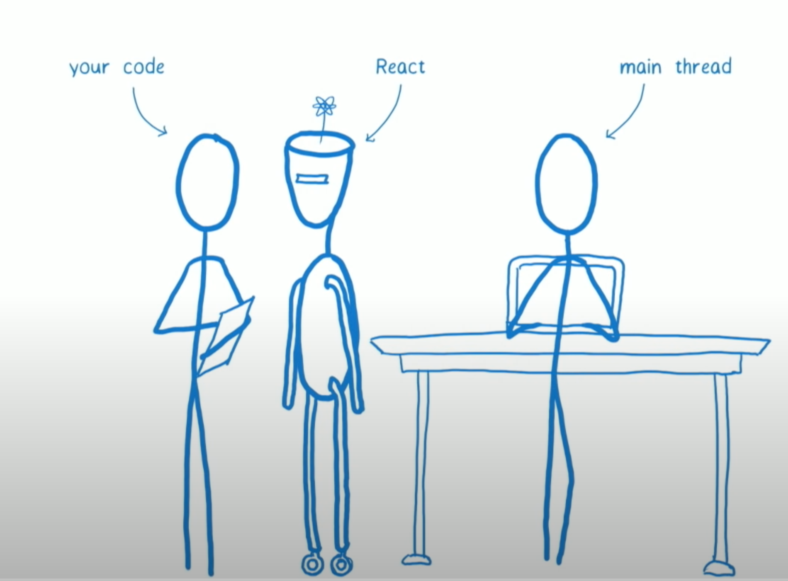

React comes to project as Tech Lead and it knows how to optimize the work done by the main thread. It makes it more efficient by minimizing DOM changes.


React has skills that help them do that: split chunks of work, has a watch to look how much time has passed

### Previous reconciler (stack reconciler)

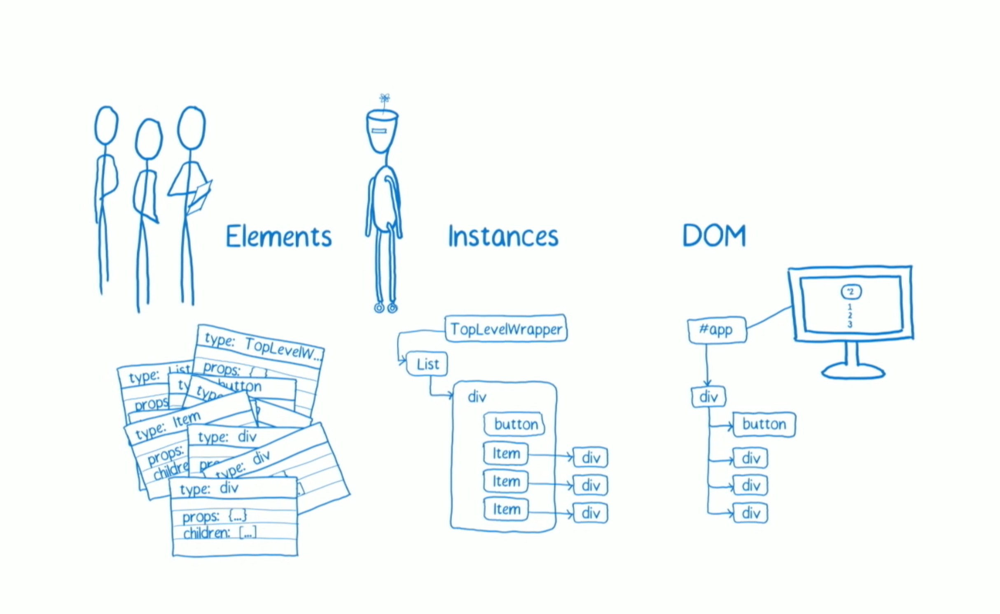

It does work layer, by layer. Create element => Create instance => Create DOM node (or update).

It does this work until it goes to the bottom of the tree.


There are high-priority updates (user typing) and low-priority updates (updates from fetch)

### What fiber does

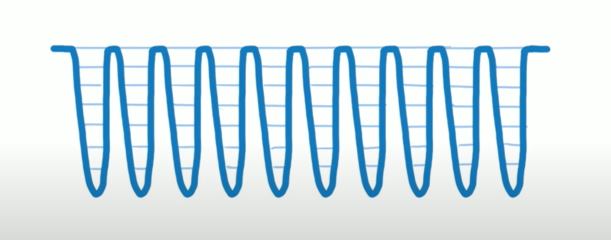
It makes it possible for main thread to compute a bunch of fork on the tree, come back up to see if it has other work to do:
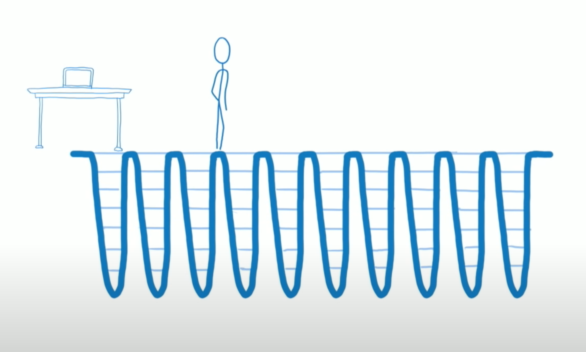

The way it keeps track of where it is in the tree is by fiber nodes

### Fiber nodes

Each node has `stateNode`. #todo

First fiber is `HostRoot` - it corresponds to the container that the React tree was injected into (`ReactDOM.render()`).
It's first child is the root App component that we've also passed to the `ReactDOM.render`.

Both nodes have a relationship by using `child` and `return` properties:
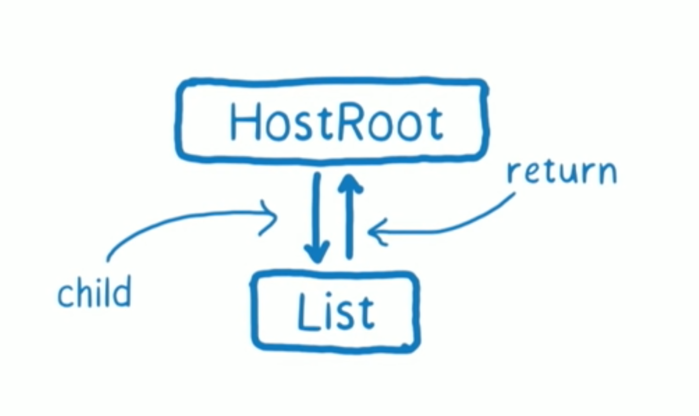

When there are multiple elements inside an element fiber nodes use `sibling` to represent that relationship. Eeach sibling point to the next one

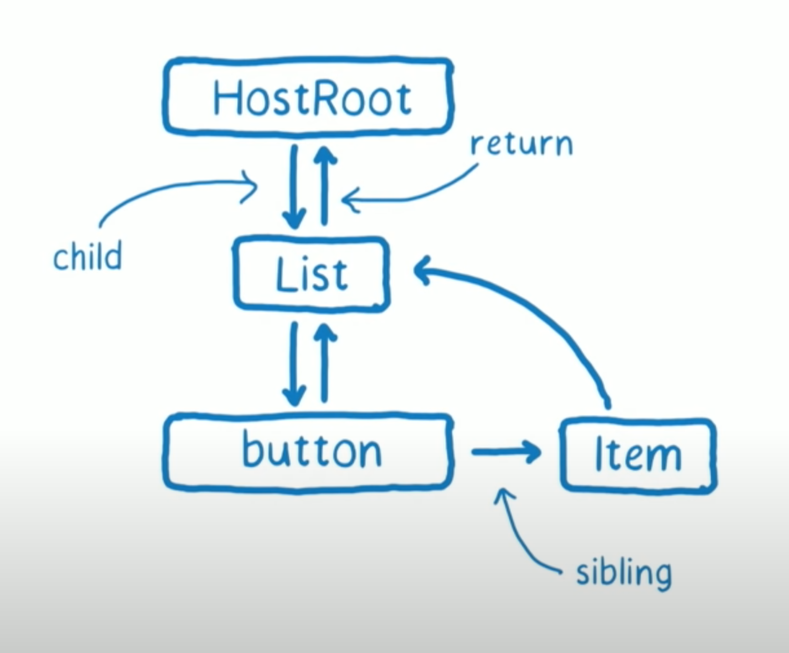

**Current** fiber tree is constructed during the initial render

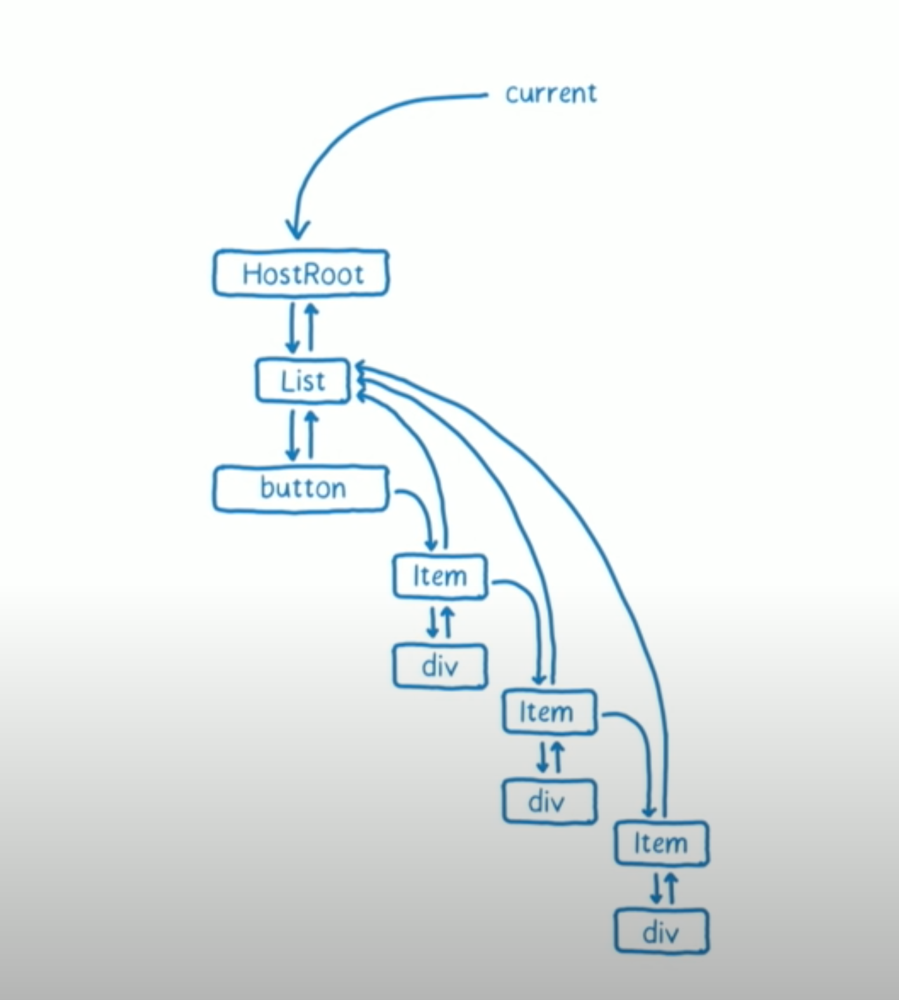

There's also a **workInProgress** tree.
Why we need it? We don't want to make changes in the DOM while we're computing changes in the tree.

The previous reconciler while it was working on the changes it also made the changes to the DOM immediately:
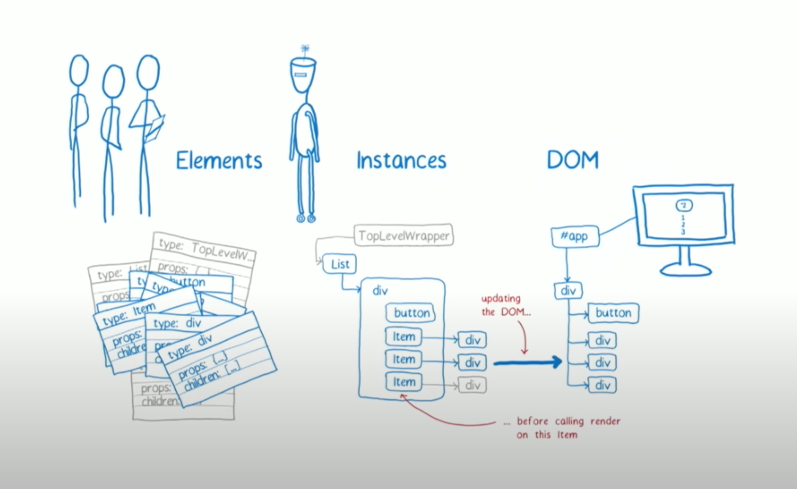

This works if working synchronously. But when we stop making those changes browser will make a paint (it'll flush the changes onto the screen) so our UI will look inconsistent.

#### Phases

To combat that Fiber introcuted phases:

1. render / reconciliation -> figure out what needs to change (interruptible)
2. commit -> actually make changes to the DOM (not interruptible)

#### Example

When called `setState` this action is added to update queue. Then the work is scheduled (to make this a reality).

To request action that doesn't need to happen immediately React uses `requestIdleCallback`


> React: Hey, Main Thread! Let me know when you have spare time to do this work

After that main thread will respond and tell React how much time it has to spare (13-15 ms)


### Work loop

It allows react to do some computation, interrupt and let work to happen in the main thread.

To do this:

1. Next unit of work
2. Time remaining within the main thread (got by `requestIdleCallback`)

React will start copying stuff from `current` tree to `workInProgress` as it is happening.

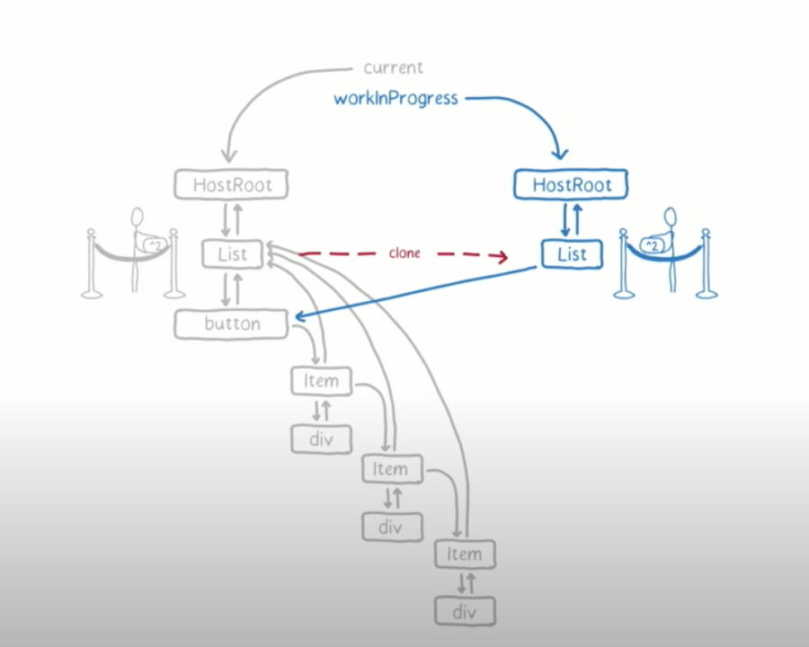

The update queue will be copied as well. After that react checks if it still has time in the main thread. If it does it looks at the update queue, calls the **updater** function and updates the state.

This fiber in **workInProgress** will have a tag attached - it means that there's need to be change to be made in the DOM tree.

When state changed react will call render to get list of children elements.

It will then compare if the items from the current tree match the items from the list returned by the render function.

- If they match they'll be just cloned from the **current** tree

After that react goes into another unit of work - which means checking if it still has time on the main thread (this goes on, and on recuricively)

If the element doesn't have any children and there isn't anything that needs a change in the DOM - React will just **complete the unit of work**.

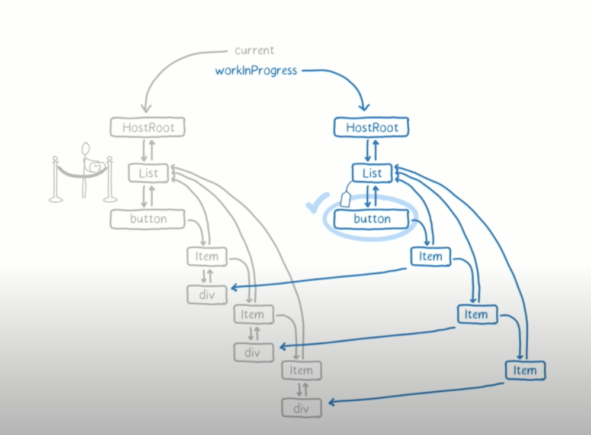

#### shouldComponentUpdate

\* for functional components `React.memo()` can be used instead


If `shouldComponentUpdate` returns false then the unit of work is completed.

#### children changes

Fiber node keeps track of all the changes underneath it (in it's children or siblings).

When children needs to have a change it will push all of it's changes to the parent's **effect list**

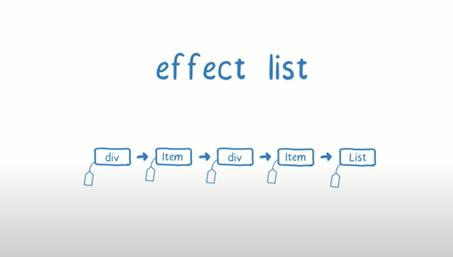

#### TL;DR

The algorythm

1. Unit of work started.
2. Clone thing from working tree
   1. Has update queue? Do the updates - add them to the effects list
   2. Has children? Render them, compare with working tree
      1. If the same = clone from working tree
      2. If not the same = add to workInProgress and mark it to render
3. Add own effect list to the parent
4. Return next unit of work (child or sibling)
5. Check if we still have the time on the main thread

### workInProgress tree finished

When the workInProgress tree is finished React marks it as **pendingCommit**. This is the end of the first Page.

### commiting changes to the DOM

React will check it's deadline - if it has time it will do it now, if not then it'll use `requestIdleCallback` again. After it receives control it will make the commit.

React will go throguh the effect list starting with the first fiber (deepest in the tree).

After the changes will be made the now **current** tree would be outdated - to reflect this change React will switch pointers between **current** and **workInProgress** (efectively swapping them).

This is called **double buffering** - it saves time on memory allocation and garbage collection.

### after commited the changes

React will go through the effect list once again and:

- call the lifecycle hooks
  
- re-attach refs (they would have been de-attached during commit phase)
- handle error boundaries

After everything - we've finished the commit

## Priority

Each update has priority assigned:

1. Synchronous (works the same as stack reconciler)
2. Task - before next tick of event loop
3. Animation - before next frame
4. High - pretty soon
5. Low - ex. data fetching
6. Offscreen - hidden, prepare for display scroll

This means that if high priority work would appear then it'll jump up ahead of low priority update even if it has started! - that's why we need Fiber

When that happens it throws out any work that has been done to handle the priority update. It'll start again creating workInProgress tree from `HostRoot`.

## Lifecycle hooks

The order they might fire is not the one we might expect. Some of them are called in Phase 1 - render / reconcilation, some of them in Phase 2 - commit:

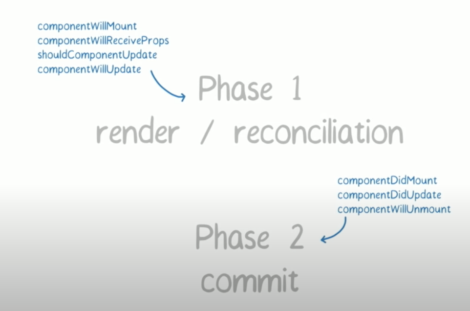

The order could be:

- (update 1) componentWillUpdate
- (update 2) componentWillUpdate, componentDidUpdate
- (update 3) componentWillUpdate, componentDidUpdate

## Starvation


This happens when the high prio updates keep jumping in fornt of lower priority updates the queue so that the low prio update never happens.

How React handles that? Re-uses work when it can. When low prio work was done and high prio didn't touch that part of the tree then React can re-use that work which was made for low priority update.

(there might be more solutions to this)

## cooperative scheduling

**cooperative scheduling** - it's basically what the Fiber is doing - breaking work into smaller units of work, that can be paused so the main thread is free to do other important stuff

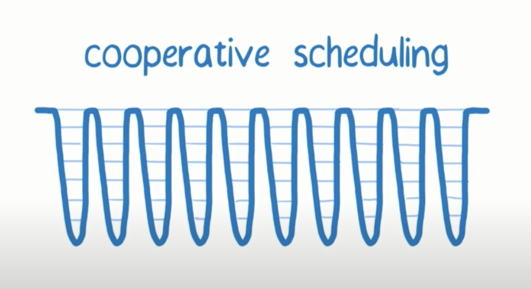

## Fiber in more depth

[Blog](https://indepth.dev/posts/1008/inside-fiber-in-depth-overview-of-the-new-reconciliation-algorithm-in-react)

Activities that are performed during the reconciliation are called "work" in the Fiber architecture.
Other "work" that wasn't described in the #reconcilation:

- calling lifecycle methods
- updating refs

The work depends on type of React element (component / functional / portal / host components (dom nodes)). The element type is defined by first parameter passed to the `createElement` function.

The call to the `createElement` returns internal data structure used by React:

```jsx
[
    {
        $$typeof: Symbol(react.element),
        type: 'button',
        key: "1",
        props: {
            children: 'Update counter',
            onClick: () => { ... }
        }
    },
    {
        $$typeof: Symbol(react.element),
        type: 'span',
        key: "2",
        props: {
            children: 0
        }
    },
    {
      $$typeof: Symbol(react.element),
      key: null,
      props: {},
      ref: null,
      type: ClickCounter
    }
]
```

`$$typeof` property is added to objects to uniquely identify them as React elements

### Fiber notes

During reconciliation this data is merged into tree of fiber nodes. Every React element has a tree of fiber nodes. Unlike the elements (returned by render function) the fiber nodes are not re-created on every render. The element is turned into corresponding fiber node type (dom element / class component / etc.)

**You can think of a fiber as a data structure that represents some work to do or, in other words, a unit of work. Fiber’s architecture also provides a convenient way to track, schedule, pause and abort the work.**

The list of activities performed for existing fiber nodes is visible in the [ChildReconciler](https://github.com/facebook/react/blob/95a313ec0b957f71798a69d8e83408f40e76765b/packages/react-reconciler/src/ReactChildFiber.js#L239) function

Fiber nodes are connected through #linked_list by properties:

- child
- sibling
- return

* these:

- alternate (points to `current` tree or `workInProgress` tree counter part - see below)
- effectTag (see #side_effects)

### Different trees

After render we have _current_ tree.
When working on updates to be flushed on screen we have _workInProgress_ tree.

Why 2 trees? Because we don't want to show changes until we work them out.

React goes throguh the _current_ tree, it creates an alternate node in _workInProgress_ tree. The nodes are created from the data returned by render function. Once the tree is rendered to the screen it becomes the _current_ tree.

### Side effects

#side_effects

`UI = fn(state)`

Every other activity (mutating DOM, calling lifecycle methods, etc.) are considered as side-effects. They can affect other components and can't be done during rendering.

Applying side-effects is work, so they are represented by fiber nodes.

- For DOM elements => add, update or remove element
- For class components => update refs, call lifecycle methods

React builds linear list of fibers with effects for quick iteration by adding `nextEffect` property. This way when processing updaes it can go fast throguh linear list instead of a tree:


## React Fiber Linked Lists

#todo

[Blog](https://indepth.dev/posts/1007/the-how-and-why-on-reacts-usage-of-linked-list-in-fiber-to-walk-the-components-tree)
