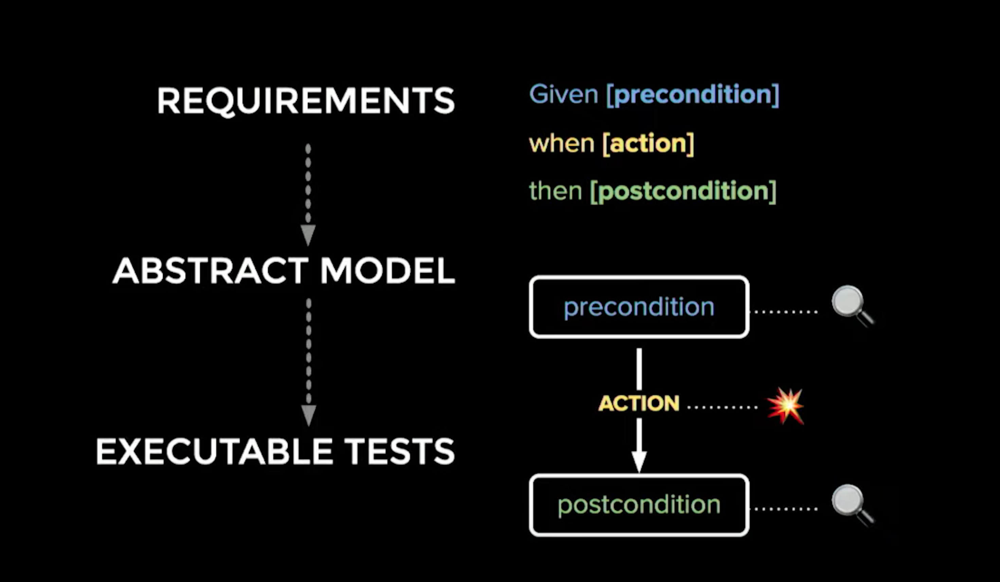
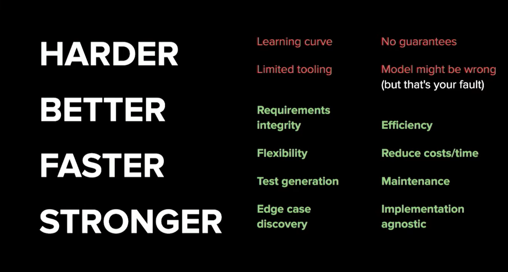

# Testing

## Model based testing

#MBT

Requirements can be represented as a state machine - we can turn that state machine into executable tests by adding assertions on each of the preconditions and postconditions and action mechanism (ex. clicks)

1. Create model of the application
2. Generate abstract tests - it's pathfinding
3. Make them real - assosiate actions with something that should happen
4. Execute the tests
  - Our model is wrong (and doesn't test the app)
  - Or app is broken 😬

When we change our model it will re-generate our tests for us = PROFIT

time-travel debugging - in the future (we can see all future possible events)

It's harder than regular testing - learning curve, limited tooling, model might be wrong 🤷‍♂️

However:
- we'll have more tests than any QA could write in their lifetime
- faster - no longer need to update and write tests, just update the model
  - different framework - just update the model
- we can fine-tune the test-coverage (skip some tests to cut running time)